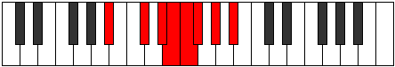

# Mode Stathian

## Links

- [Documentation](index.md)
- [Scales Index](Scales.md)
- [Modes Index](Modes.md)
- [Chords Index](Chords.md)

## Parent Scale

[Stathian](ScaleStathian.md)

## Number

[1513](https://ianring.com/musictheory/scales/1513)

## Perfection

- 5 Perfect notes
- 2 Perfect notes

## Perfection Profile

[true true true false false true true]

## Permutations

| Tonic | Notes | Signature | Illustration | Audio |
|-------|-------|-----------|--------------|-------|
| [C](ModeCNaturalStathian.md) | C, D#, E#, **F#**, **G**, Ab, Bb, C | C |  | [midi](ModeCNaturalStathian.mid) [ogg](ModeCNaturalStathian.ogg) |
| [C#](ModeCSharpStathian.md) | C#, D##, E##, **F##**, **G#**, A, B, C# | C |  | [midi](ModeCSharpStathian.mid) [ogg](ModeCSharpStathian.ogg) |
| [Db](ModeDFlatStathian.md) | Db, E, F#, **G**, **Ab**, Bbb, Cb, Db | C |  | [midi](ModeDFlatStathian.mid) [ogg](ModeDFlatStathian.ogg) |
| [D](ModeDNaturalStathian.md) | D, E#, F##, **G#**, **A**, Bb, C, D | C |  | [midi](ModeDNaturalStathian.mid) [ogg](ModeDNaturalStathian.ogg) |
| [D#](ModeDSharpStathian.md) | D#, E##, F###, **G##**, **A#**, B, C#, D# | C |  | [midi](ModeDSharpStathian.mid) [ogg](ModeDSharpStathian.ogg) |
| [Eb](ModeEFlatStathian.md) | Eb, F#, G#, **A**, **Bb**, Cb, Db, Eb | C |  | [midi](ModeEFlatStathian.mid) [ogg](ModeEFlatStathian.ogg) |
| [E](ModeENaturalStathian.md) | E, F##, G##, **A#**, **B**, C, D, E | C |  | [midi](ModeENaturalStathian.mid) [ogg](ModeENaturalStathian.ogg) |
| [F](ModeFNaturalStathian.md) | F, G#, A#, **B**, **C**, Db, Eb, F | C |  | [midi](ModeFNaturalStathian.mid) [ogg](ModeFNaturalStathian.ogg) |
| [F#](ModeFSharpStathian.md) | F#, G##, A##, **B#**, **C#**, D, E, F# | C |  | [midi](ModeFSharpStathian.mid) [ogg](ModeFSharpStathian.ogg) |
| [Gb](ModeGFlatStathian.md) | Gb, A, B, **C**, **Db**, Ebb, Fb, Gb | C |  | [midi](ModeGFlatStathian.mid) [ogg](ModeGFlatStathian.ogg) |
| [G](ModeGNaturalStathian.md) | G, A#, B#, **C#**, **D**, Eb, F, G | C |  | [midi](ModeGNaturalStathian.mid) [ogg](ModeGNaturalStathian.ogg) |
| [G#](ModeGSharpStathian.md) | G#, A##, B##, **C##**, **D#**, E, F#, G# | C |  | [midi](ModeGSharpStathian.mid) [ogg](ModeGSharpStathian.ogg) |
| [Ab](ModeAFlatStathian.md) | Ab, B, C#, **D**, **Eb**, Fb, Gb, Ab | C |  | [midi](ModeAFlatStathian.mid) [ogg](ModeAFlatStathian.ogg) |
| [A](ModeANaturalStathian.md) | A, B#, C##, **D#**, **E**, F, G, A | C |  | [midi](ModeANaturalStathian.mid) [ogg](ModeANaturalStathian.ogg) |
| [A#](ModeASharpStathian.md) | A#, B##, C###, **D##**, **E#**, F#, G#, A# | C |  | [midi](ModeASharpStathian.mid) [ogg](ModeASharpStathian.ogg) |
| [Bb](ModeBFlatStathian.md) | Bb, C#, D#, **E**, **F**, Gb, Ab, Bb | C |  | [midi](ModeBFlatStathian.mid) [ogg](ModeBFlatStathian.ogg) |
| [B](ModeBNaturalStathian.md) | B, C##, D##, **E#**, **F#**, G, A, B | C |  | [midi](ModeBNaturalStathian.mid) [ogg](ModeBNaturalStathian.ogg) |
