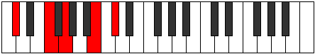
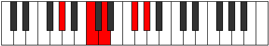

# Mode Stathic

## Links

- [Documentation](index.md)
- [Scales Index](Scales.md)
- [Modes Index](Modes.md)
- [Chords Index](Chords.md)

## Parent Scale

[Stathic](ScaleStathic.md)

## Number

[1105](https://ianring.com/musictheory/scales/1105)

## Interval Pattern

4, 2, 4, 2

## Chord Pattern

## Perfection

- 0 Perfect notes
- 4 Perfect notes

## Perfection Profile

[false false false false]

## Permutations

| Tonic | Notes | Signature | Illustration | Audio |
|-------|-------|-----------|--------------|-------|
| [C](ModeCNaturalStathic.md) | **C**, **E**, **F#**, **A#**, **C** | C |  | [midi](https://github.com/edipermadi/music/blob/main/docs/ModeCNaturalStathic.mid?raw=true) |
| [C#](ModeCSharpStathic.md) | **C#**, **F**, **G**, **B**, **C#** | C |  | [midi](https://github.com/edipermadi/music/blob/main/docs/ModeCSharpStathic.mid?raw=true) |
| [Db](ModeDFlatStathic.md) | **Db**, **F**, **G**, **B**, **Db** | C |  | [midi](https://github.com/edipermadi/music/blob/main/docs/ModeDFlatStathic.mid?raw=true) |
| [D](ModeDNaturalStathic.md) | **D**, **F#**, **G#**, **C**, **D** | C |  | [midi](https://github.com/edipermadi/music/blob/main/docs/ModeDNaturalStathic.mid?raw=true) |
| [D#](ModeDSharpStathic.md) | **D#**, **G**, **A**, **C#**, **D#** | C |  | [midi](https://github.com/edipermadi/music/blob/main/docs/ModeDSharpStathic.mid?raw=true) |
| [Eb](ModeEFlatStathic.md) | **Eb**, **G**, **A**, **Db**, **Eb** | C |  | [midi](https://github.com/edipermadi/music/blob/main/docs/ModeEFlatStathic.mid?raw=true) |
| [E](ModeENaturalStathic.md) | **E**, **G#**, **A#**, **D**, **E** | C |  | [midi](https://github.com/edipermadi/music/blob/main/docs/ModeENaturalStathic.mid?raw=true) |
| [F](ModeFNaturalStathic.md) | **F**, **A**, **B**, **D#**, **F** | C |  | [midi](https://github.com/edipermadi/music/blob/main/docs/ModeFNaturalStathic.mid?raw=true) |
| [F#](ModeFSharpStathic.md) | **F#**, **A#**, **C**, **E**, **F#** | C |  | [midi](https://github.com/edipermadi/music/blob/main/docs/ModeFSharpStathic.mid?raw=true) |
| [Gb](ModeGFlatStathic.md) | **Gb**, **Bb**, **C**, **E**, **Gb** | C |  | [midi](https://github.com/edipermadi/music/blob/main/docs/ModeGFlatStathic.mid?raw=true) |
| [G](ModeGNaturalStathic.md) | **G**, **B**, **C#**, **F**, **G** | C |  | [midi](https://github.com/edipermadi/music/blob/main/docs/ModeGNaturalStathic.mid?raw=true) |
| [G#](ModeGSharpStathic.md) | **G#**, **C**, **D**, **F#**, **G#** | C |  | [midi](https://github.com/edipermadi/music/blob/main/docs/ModeGSharpStathic.mid?raw=true) |
| [Ab](ModeAFlatStathic.md) | **Ab**, **C**, **D**, **Gb**, **Ab** | C |  | [midi](https://github.com/edipermadi/music/blob/main/docs/ModeAFlatStathic.mid?raw=true) |
| [A](ModeANaturalStathic.md) | **A**, **C#**, **D#**, **G**, **A** | C |  | [midi](https://github.com/edipermadi/music/blob/main/docs/ModeANaturalStathic.mid?raw=true) |
| [A#](ModeASharpStathic.md) | **A#**, **D**, **E**, **G#**, **A#** | C |  | [midi](https://github.com/edipermadi/music/blob/main/docs/ModeASharpStathic.mid?raw=true) |
| [Bb](ModeBFlatStathic.md) | **Bb**, **D**, **E**, **Ab**, **Bb** | C |  | [midi](https://github.com/edipermadi/music/blob/main/docs/ModeBFlatStathic.mid?raw=true) |
| [B](ModeBNaturalStathic.md) | **B**, **D#**, **F**, **A**, **B** | C |  | [midi](https://github.com/edipermadi/music/blob/main/docs/ModeBNaturalStathic.mid?raw=true) |
