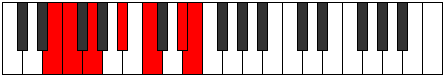

# Mode Stathimic

## Links

- [Documentation](README.md)
- [Scales Index](Scales.md)
- [Modes Index](Modes.md)
- [Chords Index](Chords.md)

## Parent Scale

[Ionacrimic](ScaleIonacrimic.md)

## Number

[2379](https://ianring.com/musictheory/scales/2379)

## Transposition

1, 2, 3, 2, 3, 1

## Chord Pattern

V

## Perfection

- 4 Perfect notes
- 2 Perfect notes

## Perfection Profile

false, true, false, true, true, true

## Permutations

| Tonic | Notes | Signature | Illustration | Audio |
|-------|-------|-----------|--------------|-------|
| [C](ModeCNaturalStathimic.md) | **C**, Db, **Eb**, F#, G#, A##, **C** | C |  | [midi](https://github.com/edipermadi/music/blob/main/docs/ModeCNaturalStathimic.mid?raw=true) |
| [C#](ModeCSharpStathimic.md) | **C#**, D, **E**, F##, G##, A###, **C#** | C |  | [midi](https://github.com/edipermadi/music/blob/main/docs/ModeCSharpStathimic.mid?raw=true) |
| [Db](ModeDFlatStathimic.md) | **Db**, Ebb, **Fb**, G, A, B#, **Db** | C |  | [midi](https://github.com/edipermadi/music/blob/main/docs/ModeDFlatStathimic.mid?raw=true) |
| [D](ModeDNaturalStathimic.md) | **D**, Eb, **F**, G#, A#, B##, **D** | C |  | [midi](https://github.com/edipermadi/music/blob/main/docs/ModeDNaturalStathimic.mid?raw=true) |
| [D#](ModeDSharpStathimic.md) | **D#**, E, **F#**, G##, A##, B###, **D#** | C |  | [midi](https://github.com/edipermadi/music/blob/main/docs/ModeDSharpStathimic.mid?raw=true) |
| [Eb](ModeEFlatStathimic.md) | **Eb**, Fb, **Gb**, A, B, C##, **Eb** | C |  | [midi](https://github.com/edipermadi/music/blob/main/docs/ModeEFlatStathimic.mid?raw=true) |
| [E](ModeENaturalStathimic.md) | **E**, F, **G**, A#, B#, C###, **E** | C |  | [midi](https://github.com/edipermadi/music/blob/main/docs/ModeENaturalStathimic.mid?raw=true) |
| [F](ModeFNaturalStathimic.md) | **F**, Gb, **Ab**, B, C#, D##, **F** | C |  | [midi](https://github.com/edipermadi/music/blob/main/docs/ModeFNaturalStathimic.mid?raw=true) |
| [F#](ModeFSharpStathimic.md) | **F#**, G, **A**, B#, C##, D###, **F#** | C |  | [midi](https://github.com/edipermadi/music/blob/main/docs/ModeFSharpStathimic.mid?raw=true) |
| [Gb](ModeGFlatStathimic.md) | **Gb**, Abb, **Bbb**, C, D, E#, **Gb** | C |  | [midi](https://github.com/edipermadi/music/blob/main/docs/ModeGFlatStathimic.mid?raw=true) |
| [G](ModeGNaturalStathimic.md) | **G**, Ab, **Bb**, C#, D#, E##, **G** | C |  | [midi](https://github.com/edipermadi/music/blob/main/docs/ModeGNaturalStathimic.mid?raw=true) |
| [G#](ModeGSharpStathimic.md) | **G#**, A, **B**, C##, D##, E###, **G#** | C |  | [midi](https://github.com/edipermadi/music/blob/main/docs/ModeGSharpStathimic.mid?raw=true) |
| [Ab](ModeAFlatStathimic.md) | **Ab**, Bbb, **Cb**, D, E, F##, **Ab** | C |  | [midi](https://github.com/edipermadi/music/blob/main/docs/ModeAFlatStathimic.mid?raw=true) |
| [A](ModeANaturalStathimic.md) | **A**, Bb, **C**, D#, E#, F###, **A** | C |  | [midi](https://github.com/edipermadi/music/blob/main/docs/ModeANaturalStathimic.mid?raw=true) |
| [A#](ModeASharpStathimic.md) | **A#**, B, **C#**, D##, E##, Cbbb, **A#** | C |  | [midi](https://github.com/edipermadi/music/blob/main/docs/ModeASharpStathimic.mid?raw=true) |
| [Bb](ModeBFlatStathimic.md) | **Bb**, Cb, **Db**, E, F#, G##, **Bb** | C |  | [midi](https://github.com/edipermadi/music/blob/main/docs/ModeBFlatStathimic.mid?raw=true) |
| [B](ModeBNaturalStathimic.md) | **B**, C, **D**, E#, F##, G###, **B** | C |  | [midi](https://github.com/edipermadi/music/blob/main/docs/ModeBNaturalStathimic.mid?raw=true) |
