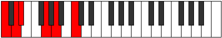
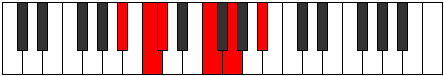

# Mode Stathitonic

## Links

- [Documentation](index.md)
- [Scales Index](Scales.md)
- [Modes Index](Modes.md)
- [Chords Index](Chords.md)

## Parent Scale

[Gathitonic](ScaleGathitonic.md)

## Number

[653](https://ianring.com/musictheory/scales/653)

## Perfection

- 3 Perfect notes
- 2 Perfect notes

## Perfection Profile

[true true false true false]

## Permutations

| Tonic | Notes | Signature | Illustration | Audio |
|-------|-------|-----------|--------------|-------|
| [C](ModeCNaturalStathitonic.md) | C, D, **D#**, G, **A**, C | C |  | [midi](ModeCNaturalStathitonic.mid) [ogg](ModeCNaturalStathitonic.ogg) |
| [C#](ModeCSharpStathitonic.md) | C#, D#, **E**, G#, **A#**, C# | C |  | [midi](ModeCSharpStathitonic.mid) [ogg](ModeCSharpStathitonic.ogg) |
| [Db](ModeDFlatStathitonic.md) | Db, Eb, **E**, Ab, **Bb**, Db | C |  | [midi](ModeDFlatStathitonic.mid) [ogg](ModeDFlatStathitonic.ogg) |
| [D](ModeDNaturalStathitonic.md) | D, E, **F**, A, **B**, D | C |  | [midi](ModeDNaturalStathitonic.mid) [ogg](ModeDNaturalStathitonic.ogg) |
| [D#](ModeDSharpStathitonic.md) | D#, F, **F#**, A#, **C**, D# | C |  | [midi](ModeDSharpStathitonic.mid) [ogg](ModeDSharpStathitonic.ogg) |
| [Eb](ModeEFlatStathitonic.md) | Eb, F, **Gb**, Bb, **C**, Eb | C |  | [midi](ModeEFlatStathitonic.mid) [ogg](ModeEFlatStathitonic.ogg) |
| [E](ModeENaturalStathitonic.md) | E, F#, **G**, B, **C#**, E | C |  | [midi](ModeENaturalStathitonic.mid) [ogg](ModeENaturalStathitonic.ogg) |
| [F](ModeFNaturalStathitonic.md) | F, G, **G#**, C, **D**, F | C |  | [midi](ModeFNaturalStathitonic.mid) [ogg](ModeFNaturalStathitonic.ogg) |
| [F#](ModeFSharpStathitonic.md) | F#, G#, **A**, C#, **D#**, F# | C |  | [midi](ModeFSharpStathitonic.mid) [ogg](ModeFSharpStathitonic.ogg) |
| [Gb](ModeGFlatStathitonic.md) | Gb, Ab, **A**, Db, **Eb**, Gb | C |  | [midi](ModeGFlatStathitonic.mid) [ogg](ModeGFlatStathitonic.ogg) |
| [G](ModeGNaturalStathitonic.md) | G, A, **A#**, D, **E**, G | C |  | [midi](ModeGNaturalStathitonic.mid) [ogg](ModeGNaturalStathitonic.ogg) |
| [G#](ModeGSharpStathitonic.md) | G#, A#, **B**, D#, **F**, G# | C |  | [midi](ModeGSharpStathitonic.mid) [ogg](ModeGSharpStathitonic.ogg) |
| [Ab](ModeAFlatStathitonic.md) | Ab, Bb, **B**, Eb, **F**, Ab | C |  | [midi](ModeAFlatStathitonic.mid) [ogg](ModeAFlatStathitonic.ogg) |
| [A](ModeANaturalStathitonic.md) | A, B, **C**, E, **F#**, A | C |  | [midi](ModeANaturalStathitonic.mid) [ogg](ModeANaturalStathitonic.ogg) |
| [A#](ModeASharpStathitonic.md) | A#, C, **C#**, F, **G**, A# | C |  | [midi](ModeASharpStathitonic.mid) [ogg](ModeASharpStathitonic.ogg) |
| [Bb](ModeBFlatStathitonic.md) | Bb, C, **Db**, F, **G**, Bb | C |  | [midi](ModeBFlatStathitonic.mid) [ogg](ModeBFlatStathitonic.ogg) |
| [B](ModeBNaturalStathitonic.md) | B, C#, **D**, F#, **G#**, B | C |  | [midi](ModeBNaturalStathitonic.mid) [ogg](ModeBNaturalStathitonic.ogg) |
