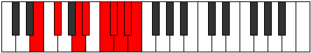

# Mode Stathyllic

## Links

- [Documentation](README.md)
- [Scales Index](Scales.md)
- [Modes Index](Modes.md)
- [Chords Index](Chords.md)

## Parent Scale

[Stacryllic](ScaleStacryllic.md)

## Number

[3941](https://ianring.com/musictheory/scales/3941)

## Luminosity

6

## Transposition

2, 3, 1, 2, 1, 1, 1, 1

## Chord Pattern

II, viii

## Perfection

- 4 Perfect notes
- 4 Perfect notes

## Perfection Profile

false, true, true, false, false, false, true, true

## Permutations

| Tonic | Notes | Signature | Illustration | Audio |
|-------|-------|-----------|--------------|-------|
| [C](ModeCNaturalStathyllic.md) | **C**, D, F, **F#**, **G#**, **A**, A#, B, **C** | C |  | [midi](https://github.com/edipermadi/music/blob/main/docs/ModeCNaturalStathyllic.mid?raw=true) |
| [C#](ModeCSharpStathyllic.md) | **C#**, D#, F#, **G**, **A**, **A#**, B, C, **C#** | C |  | [midi](https://github.com/edipermadi/music/blob/main/docs/ModeCSharpStathyllic.mid?raw=true) |
| [Db](ModeDFlatStathyllic.md) | **Db**, Eb, Gb, **G**, **A**, **Bb**, B, C, **Db** | C |  | [midi](https://github.com/edipermadi/music/blob/main/docs/ModeDFlatStathyllic.mid?raw=true) |
| [D](ModeDNaturalStathyllic.md) | **D**, E, G, **G#**, **A#**, **B**, C, C#, **D** | C |  | [midi](https://github.com/edipermadi/music/blob/main/docs/ModeDNaturalStathyllic.mid?raw=true) |
| [D#](ModeDSharpStathyllic.md) | **D#**, F, G#, **A**, **B**, **C**, C#, D, **D#** | C |  | [midi](https://github.com/edipermadi/music/blob/main/docs/ModeDSharpStathyllic.mid?raw=true) |
| [Eb](ModeEFlatStathyllic.md) | **Eb**, F, Ab, **A**, **B**, **C**, Db, D, **Eb** | C |  | [midi](https://github.com/edipermadi/music/blob/main/docs/ModeEFlatStathyllic.mid?raw=true) |
| [E](ModeENaturalStathyllic.md) | **E**, F#, A, **A#**, **C**, **C#**, D, D#, **E** | C |  | [midi](https://github.com/edipermadi/music/blob/main/docs/ModeENaturalStathyllic.mid?raw=true) |
| [F](ModeFNaturalStathyllic.md) | **F**, G, A#, **B**, **C#**, **D**, D#, E, **F** | C |  | [midi](https://github.com/edipermadi/music/blob/main/docs/ModeFNaturalStathyllic.mid?raw=true) |
| [F#](ModeFSharpStathyllic.md) | **F#**, G#, B, **C**, **D**, **D#**, E, F, **F#** | C |  | [midi](https://github.com/edipermadi/music/blob/main/docs/ModeFSharpStathyllic.mid?raw=true) |
| [Gb](ModeGFlatStathyllic.md) | **Gb**, Ab, B, **C**, **D**, **Eb**, E, F, **Gb** | C |  | [midi](https://github.com/edipermadi/music/blob/main/docs/ModeGFlatStathyllic.mid?raw=true) |
| [G](ModeGNaturalStathyllic.md) | **G**, A, C, **C#**, **D#**, **E**, F, F#, **G** | C |  | [midi](https://github.com/edipermadi/music/blob/main/docs/ModeGNaturalStathyllic.mid?raw=true) |
| [G#](ModeGSharpStathyllic.md) | **G#**, A#, C#, **D**, **E**, **F**, F#, G, **G#** | C |  | [midi](https://github.com/edipermadi/music/blob/main/docs/ModeGSharpStathyllic.mid?raw=true) |
| [Ab](ModeAFlatStathyllic.md) | **Ab**, Bb, Db, **D**, **E**, **F**, Gb, G, **Ab** | C |  | [midi](https://github.com/edipermadi/music/blob/main/docs/ModeAFlatStathyllic.mid?raw=true) |
| [A](ModeANaturalStathyllic.md) | **A**, B, D, **D#**, **F**, **F#**, G, G#, **A** | C |  | [midi](https://github.com/edipermadi/music/blob/main/docs/ModeANaturalStathyllic.mid?raw=true) |
| [A#](ModeASharpStathyllic.md) | **A#**, C, D#, **E**, **F#**, **G**, G#, A, **A#** | C |  | [midi](https://github.com/edipermadi/music/blob/main/docs/ModeASharpStathyllic.mid?raw=true) |
| [Bb](ModeBFlatStathyllic.md) | **Bb**, C, Eb, **E**, **Gb**, **G**, Ab, A, **Bb** | C |  | [midi](https://github.com/edipermadi/music/blob/main/docs/ModeBFlatStathyllic.mid?raw=true) |
| [B](ModeBNaturalStathyllic.md) | **B**, C#, E, **F**, **G**, **G#**, A, A#, **B** | C |  | [midi](https://github.com/edipermadi/music/blob/main/docs/ModeBNaturalStathyllic.mid?raw=true) |
