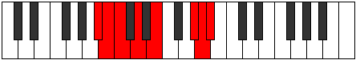

# Mode Stocrian

## Links

- [Documentation](index.md)
- [Scales Index](Scales.md)
- [Modes Index](Modes.md)
- [Chords Index](Chords.md)

## Parent Scale

[Stanian](ScaleStanian.md)

## Number

[3159](https://ianring.com/musictheory/scales/3159)

## Perfection

- 3 Perfect notes
- 4 Perfect notes

## Interval Pattern

1, 1, 2, 2, 4, 1, 1

## Perfection Profile

[false false false true true false true]

## Permutations

| Tonic | Notes | Signature | Illustration | Audio |
|-------|-------|-----------|--------------|-------|
| [C](ModeCNaturalStocrian.md) | **C**, **Db**, **Ebb**, Fb, Gb, **A#**, B, **C** | C |  | [midi](https://github.com/edipermadi/music/blob/main/docs/ModeCNaturalStocrian.mid?raw=true) |
| [C#](ModeCSharpStocrian.md) | **C#**, **D**, **Eb**, F, G, **A##**, B#, **C#** | C |  | [midi](https://github.com/edipermadi/music/blob/main/docs/ModeCSharpStocrian.mid?raw=true) |
| [Db](ModeDFlatStocrian.md) | **Db**, **Ebb**, **Fbb**, Gbb, Abb, **B**, C, **Db** | C |  | [midi](https://github.com/edipermadi/music/blob/main/docs/ModeDFlatStocrian.mid?raw=true) |
| [D](ModeDNaturalStocrian.md) | **D**, **Eb**, **Fb**, Gb, Ab, **B#**, C#, **D** | C |  | [midi](https://github.com/edipermadi/music/blob/main/docs/ModeDNaturalStocrian.mid?raw=true) |
| [D#](ModeDSharpStocrian.md) | **D#**, **E**, **F**, G, A, **B##**, C##, **D#** | C |  | [midi](https://github.com/edipermadi/music/blob/main/docs/ModeDSharpStocrian.mid?raw=true) |
| [Eb](ModeEFlatStocrian.md) | **Eb**, **Fb**, **Gbb**, Abb, Bbb, **C#**, D, **Eb** | C |  | [midi](https://github.com/edipermadi/music/blob/main/docs/ModeEFlatStocrian.mid?raw=true) |
| [E](ModeENaturalStocrian.md) | **E**, **F**, **Gb**, Ab, Bb, **C##**, D#, **E** | C |  | [midi](https://github.com/edipermadi/music/blob/main/docs/ModeENaturalStocrian.mid?raw=true) |
| [F](ModeFNaturalStocrian.md) | **F**, **Gb**, **Abb**, Bbb, Cb, **D#**, E, **F** | C |  | [midi](https://github.com/edipermadi/music/blob/main/docs/ModeFNaturalStocrian.mid?raw=true) |
| [F#](ModeFSharpStocrian.md) | **F#**, **G**, **Ab**, Bb, C, **D##**, E#, **F#** | C |  | [midi](https://github.com/edipermadi/music/blob/main/docs/ModeFSharpStocrian.mid?raw=true) |
| [Gb](ModeGFlatStocrian.md) | **Gb**, **Abb**, **Bbbb**, Cbb, Dbb, **E**, F, **Gb** | C |  | [midi](https://github.com/edipermadi/music/blob/main/docs/ModeGFlatStocrian.mid?raw=true) |
| [G](ModeGNaturalStocrian.md) | **G**, **Ab**, **Bbb**, Cb, Db, **E#**, F#, **G** | C |  | [midi](https://github.com/edipermadi/music/blob/main/docs/ModeGNaturalStocrian.mid?raw=true) |
| [G#](ModeGSharpStocrian.md) | **G#**, **A**, **Bb**, C, D, **E##**, F##, **G#** | C |  | [midi](https://github.com/edipermadi/music/blob/main/docs/ModeGSharpStocrian.mid?raw=true) |
| [Ab](ModeAFlatStocrian.md) | **Ab**, **Bbb**, **Cbb**, Dbb, Ebb, **F#**, G, **Ab** | C |  | [midi](https://github.com/edipermadi/music/blob/main/docs/ModeAFlatStocrian.mid?raw=true) |
| [A](ModeANaturalStocrian.md) | **A**, **Bb**, **Cb**, Db, Eb, **F##**, G#, **A** | C |  | [midi](https://github.com/edipermadi/music/blob/main/docs/ModeANaturalStocrian.mid?raw=true) |
| [A#](ModeASharpStocrian.md) | **A#**, **B**, **C**, D, E, **F###**, G##, **A#** | C |  | [midi](https://github.com/edipermadi/music/blob/main/docs/ModeASharpStocrian.mid?raw=true) |
| [Bb](ModeBFlatStocrian.md) | **Bb**, **Cb**, **Dbb**, Ebb, Fb, **G#**, A, **Bb** | C |  | [midi](https://github.com/edipermadi/music/blob/main/docs/ModeBFlatStocrian.mid?raw=true) |
| [B](ModeBNaturalStocrian.md) | **B**, **C**, **Db**, Eb, F, **G##**, A#, **B** | C |  | [midi](https://github.com/edipermadi/music/blob/main/docs/ModeBNaturalStocrian.mid?raw=true) |
