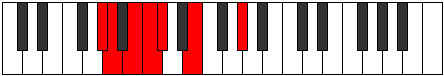

# Mode Stodimic

## Links

- [Documentation](index.md)
- [Scales Index](Scales.md)
- [Modes Index](Modes.md)
- [Chords Index](Chords.md)

## Parent Scale

[Syrimic](ScaleSyrimic.md)

## Number

[315](https://ianring.com/musictheory/scales/315)

## Perfection

- 3 Perfect notes
- 3 Perfect notes

## Perfection Profile

[false true false false true true]

## Permutations

| Tonic | Notes | Signature | Illustration | Audio |
|-------|-------|-----------|--------------|-------|
| [C](ModeCNaturalStodimic.md) | **C**, Db, **Eb**, **Fb**, Gbb, Ab, **C** | C |  | [midi](ModeCNaturalStodimic.mid) [ogg](ModeCNaturalStodimic.ogg) |
| [C#](ModeCSharpStodimic.md) | **C#**, D, **E**, **F**, Gb, A, **C#** | C |  | [midi](ModeCSharpStodimic.mid) [ogg](ModeCSharpStodimic.ogg) |
| [Db](ModeDFlatStodimic.md) | **Db**, Ebb, **Fb**, **Gbb**, Abbb, Bbb, **Db** | C |  | [midi](ModeDFlatStodimic.mid) [ogg](ModeDFlatStodimic.ogg) |
| [D](ModeDNaturalStodimic.md) | **D**, Eb, **F**, **Gb**, Abb, Bb, **D** | C |  | [midi](ModeDNaturalStodimic.mid) [ogg](ModeDNaturalStodimic.ogg) |
| [D#](ModeDSharpStodimic.md) | **D#**, E, **F#**, **G**, Ab, B, **D#** | C |  | [midi](ModeDSharpStodimic.mid) [ogg](ModeDSharpStodimic.ogg) |
| [Eb](ModeEFlatStodimic.md) | **Eb**, Fb, **Gb**, **Abb**, Bbbb, Cb, **Eb** | C |  | [midi](ModeEFlatStodimic.mid) [ogg](ModeEFlatStodimic.ogg) |
| [E](ModeENaturalStodimic.md) | **E**, F, **G**, **Ab**, Bbb, C, **E** | C |  | [midi](ModeENaturalStodimic.mid) [ogg](ModeENaturalStodimic.ogg) |
| [F](ModeFNaturalStodimic.md) | **F**, Gb, **Ab**, **Bbb**, Cbb, Db, **F** | C |  | [midi](ModeFNaturalStodimic.mid) [ogg](ModeFNaturalStodimic.ogg) |
| [F#](ModeFSharpStodimic.md) | **F#**, G, **A**, **Bb**, Cb, D, **F#** | C |  | [midi](ModeFSharpStodimic.mid) [ogg](ModeFSharpStodimic.ogg) |
| [Gb](ModeGFlatStodimic.md) | **Gb**, Abb, **Bbb**, **Cbb**, Dbbb, Ebb, **Gb** | C |  | [midi](ModeGFlatStodimic.mid) [ogg](ModeGFlatStodimic.ogg) |
| [G](ModeGNaturalStodimic.md) | **G**, Ab, **Bb**, **Cb**, Dbb, Eb, **G** | C |  | [midi](ModeGNaturalStodimic.mid) [ogg](ModeGNaturalStodimic.ogg) |
| [G#](ModeGSharpStodimic.md) | **G#**, A, **B**, **C**, Db, E, **G#** | C |  | [midi](ModeGSharpStodimic.mid) [ogg](ModeGSharpStodimic.ogg) |
| [Ab](ModeAFlatStodimic.md) | **Ab**, Bbb, **Cb**, **Dbb**, Ebbb, Fb, **Ab** | C |  | [midi](ModeAFlatStodimic.mid) [ogg](ModeAFlatStodimic.ogg) |
| [A](ModeANaturalStodimic.md) | **A**, Bb, **C**, **Db**, Ebb, F, **A** | C |  | [midi](ModeANaturalStodimic.mid) [ogg](ModeANaturalStodimic.ogg) |
| [A#](ModeASharpStodimic.md) | **A#**, B, **C#**, **D**, Eb, F#, **A#** | C |  | [midi](ModeASharpStodimic.mid) [ogg](ModeASharpStodimic.ogg) |
| [Bb](ModeBFlatStodimic.md) | **Bb**, Cb, **Db**, **Ebb**, Fbb, Gb, **Bb** | C |  | [midi](ModeBFlatStodimic.mid) [ogg](ModeBFlatStodimic.ogg) |
| [B](ModeBNaturalStodimic.md) | **B**, C, **D**, **Eb**, Fb, G, **B** | C |  | [midi](ModeBNaturalStodimic.mid) [ogg](ModeBNaturalStodimic.ogg) |
