# Mode Stogian

## Links

- [Documentation](index.md)
- [Scales Index](Scales.md)
- [Modes Index](Modes.md)
- [Chords Index](Chords.md)

## Parent Scale

[Saptian](ScaleSaptian.md)

## Number

[1931](https://ianring.com/musictheory/scales/1931)

## Perfection

- 4 Perfect notes
- 3 Perfect notes

## Interval Pattern

1, 2, 4, 1, 1, 1, 2

## Perfection Profile

[true true true false true false false]

## Permutations

| Tonic | Notes | Signature | Illustration | Audio |
|-------|-------|-----------|--------------|-------|
| [C](ModeCNaturalStogian.md) | C, Db, Eb, **F##**, G#, **A**, **Bb**, C | C | 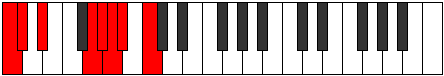 | [midi](https://github.com/edipermadi/music/blob/main/docs/ModeCNaturalStogian.mid?raw=true) |
| [C#](ModeCSharpStogian.md) | C#, D, E, **F###**, G##, **A#**, **B**, C# | C | 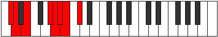 | [midi](https://github.com/edipermadi/music/blob/main/docs/ModeCSharpStogian.mid?raw=true) |
| [Db](ModeDFlatStogian.md) | Db, Ebb, Fb, **G#**, A, **Bb**, **Cb**, Db | C |  | [midi](https://github.com/edipermadi/music/blob/main/docs/ModeDFlatStogian.mid?raw=true) |
| [D](ModeDNaturalStogian.md) | D, Eb, F, **G##**, A#, **B**, **C**, D | C | 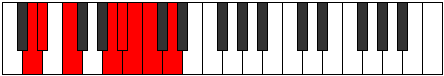 | [midi](https://github.com/edipermadi/music/blob/main/docs/ModeDNaturalStogian.mid?raw=true) |
| [D#](ModeDSharpStogian.md) | D#, E, F#, **G###**, A##, **B#**, **C#**, D# | C | 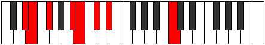 | [midi](https://github.com/edipermadi/music/blob/main/docs/ModeDSharpStogian.mid?raw=true) |
| [Eb](ModeEFlatStogian.md) | Eb, Fb, Gb, **A#**, B, **C**, **Db**, Eb | C |  | [midi](https://github.com/edipermadi/music/blob/main/docs/ModeEFlatStogian.mid?raw=true) |
| [E](ModeENaturalStogian.md) | E, F, G, **A##**, B#, **C#**, **D**, E | C | 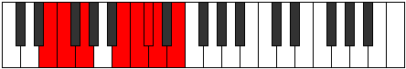 | [midi](https://github.com/edipermadi/music/blob/main/docs/ModeENaturalStogian.mid?raw=true) |
| [F](ModeFNaturalStogian.md) | F, Gb, Ab, **B#**, C#, **D**, **Eb**, F | C | 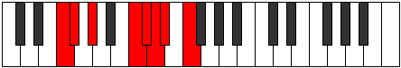 | [midi](https://github.com/edipermadi/music/blob/main/docs/ModeFNaturalStogian.mid?raw=true) |
| [F#](ModeFSharpStogian.md) | F#, G, A, **B##**, C##, **D#**, **E**, F# | C | 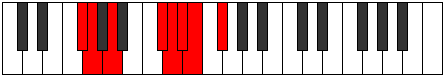 | [midi](https://github.com/edipermadi/music/blob/main/docs/ModeFSharpStogian.mid?raw=true) |
| [Gb](ModeGFlatStogian.md) | Gb, Abb, Bbb, **C#**, D, **Eb**, **Fb**, Gb | C |  | [midi](https://github.com/edipermadi/music/blob/main/docs/ModeGFlatStogian.mid?raw=true) |
| [G](ModeGNaturalStogian.md) | G, Ab, Bb, **C##**, D#, **E**, **F**, G | C | 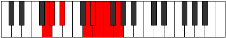 | [midi](https://github.com/edipermadi/music/blob/main/docs/ModeGNaturalStogian.mid?raw=true) |
| [G#](ModeGSharpStogian.md) | G#, A, B, **C###**, D##, **E#**, **F#**, G# | C | 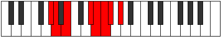 | [midi](https://github.com/edipermadi/music/blob/main/docs/ModeGSharpStogian.mid?raw=true) |
| [Ab](ModeAFlatStogian.md) | Ab, Bbb, Cb, **D#**, E, **F**, **Gb**, Ab | C | 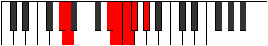 | [midi](https://github.com/edipermadi/music/blob/main/docs/ModeAFlatStogian.mid?raw=true) |
| [A](ModeANaturalStogian.md) | A, Bb, C, **D##**, E#, **F#**, **G**, A | C | 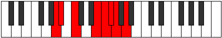 | [midi](https://github.com/edipermadi/music/blob/main/docs/ModeANaturalStogian.mid?raw=true) |
| [A#](ModeASharpStogian.md) | A#, B, C#, **D###**, E##, **F##**, **G#**, A# | C | 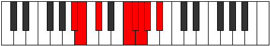 | [midi](https://github.com/edipermadi/music/blob/main/docs/ModeASharpStogian.mid?raw=true) |
| [Bb](ModeBFlatStogian.md) | Bb, Cb, Db, **E#**, F#, **G**, **Ab**, Bb | C |  | [midi](https://github.com/edipermadi/music/blob/main/docs/ModeBFlatStogian.mid?raw=true) |
| [B](ModeBNaturalStogian.md) | B, C, D, **E##**, F##, **G#**, **A**, B | C | 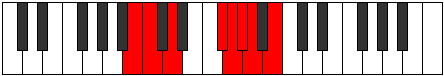 | [midi](https://github.com/edipermadi/music/blob/main/docs/ModeBNaturalStogian.mid?raw=true) |
