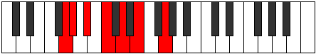
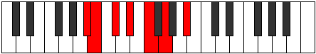

# Mode Stogimic

## Links

- [Documentation](README.md)
- [Scales Index](Scales.md)
- [Modes Index](Modes.md)
- [Chords Index](Chords.md)

## Parent Scale

[Boptimic](ScaleBoptimic.md)

## Number

[683](https://ianring.com/musictheory/scales/683)

## Luminosity

5

## Transposition

1, 2, 2, 2, 2, 3

## Chord Pattern

i, II⁺, IV⁺, VI⁺

## Perfection

- 2 Perfect notes
- 4 Perfect notes

## Perfection Profile

true, false, false, true, false, false

## Permutations

| Tonic | Notes | Signature | Illustration | Audio |
|-------|-------|-----------|--------------|-------|
| [C](ModeCNaturalStogimic.md) | C, **Db**, **Eb**, F, **G**, **A**, C | C |  | [midi](https://github.com/edipermadi/music/blob/main/docs/ModeCNaturalStogimic.mid?raw=true) |
| [C#](ModeCSharpStogimic.md) | C#, **D**, **E**, F#, **G#**, **A#**, C# | C |  | [midi](https://github.com/edipermadi/music/blob/main/docs/ModeCSharpStogimic.mid?raw=true) |
| [Db](ModeDFlatStogimic.md) | Db, **Ebb**, **Fb**, Gb, **Ab**, **Bb**, Db | C |  | [midi](https://github.com/edipermadi/music/blob/main/docs/ModeDFlatStogimic.mid?raw=true) |
| [D](ModeDNaturalStogimic.md) | D, **Eb**, **F**, G, **A**, **B**, D | C |  | [midi](https://github.com/edipermadi/music/blob/main/docs/ModeDNaturalStogimic.mid?raw=true) |
| [D#](ModeDSharpStogimic.md) | D#, **E**, **F#**, G#, **A#**, **B#**, D# | C |  | [midi](https://github.com/edipermadi/music/blob/main/docs/ModeDSharpStogimic.mid?raw=true) |
| [Eb](ModeEFlatStogimic.md) | Eb, **Fb**, **Gb**, Ab, **Bb**, **C**, Eb | C |  | [midi](https://github.com/edipermadi/music/blob/main/docs/ModeEFlatStogimic.mid?raw=true) |
| [E](ModeENaturalStogimic.md) | E, **F**, **G**, A, **B**, **C#**, E | C |  | [midi](https://github.com/edipermadi/music/blob/main/docs/ModeENaturalStogimic.mid?raw=true) |
| [F](ModeFNaturalStogimic.md) | F, **Gb**, **Ab**, Bb, **C**, **D**, F | C |  | [midi](https://github.com/edipermadi/music/blob/main/docs/ModeFNaturalStogimic.mid?raw=true) |
| [F#](ModeFSharpStogimic.md) | F#, **G**, **A**, B, **C#**, **D#**, F# | C |  | [midi](https://github.com/edipermadi/music/blob/main/docs/ModeFSharpStogimic.mid?raw=true) |
| [Gb](ModeGFlatStogimic.md) | Gb, **Abb**, **Bbb**, Cb, **Db**, **Eb**, Gb | C |  | [midi](https://github.com/edipermadi/music/blob/main/docs/ModeGFlatStogimic.mid?raw=true) |
| [G](ModeGNaturalStogimic.md) | G, **Ab**, **Bb**, C, **D**, **E**, G | C |  | [midi](https://github.com/edipermadi/music/blob/main/docs/ModeGNaturalStogimic.mid?raw=true) |
| [G#](ModeGSharpStogimic.md) | G#, **A**, **B**, C#, **D#**, **E#**, G# | C |  | [midi](https://github.com/edipermadi/music/blob/main/docs/ModeGSharpStogimic.mid?raw=true) |
| [Ab](ModeAFlatStogimic.md) | Ab, **Bbb**, **Cb**, Db, **Eb**, **F**, Ab | C |  | [midi](https://github.com/edipermadi/music/blob/main/docs/ModeAFlatStogimic.mid?raw=true) |
| [A](ModeANaturalStogimic.md) | A, **Bb**, **C**, D, **E**, **F#**, A | C |  | [midi](https://github.com/edipermadi/music/blob/main/docs/ModeANaturalStogimic.mid?raw=true) |
| [A#](ModeASharpStogimic.md) | A#, **B**, **C#**, D#, **E#**, **F##**, A# | C |  | [midi](https://github.com/edipermadi/music/blob/main/docs/ModeASharpStogimic.mid?raw=true) |
| [Bb](ModeBFlatStogimic.md) | Bb, **Cb**, **Db**, Eb, **F**, **G**, Bb | C |  | [midi](https://github.com/edipermadi/music/blob/main/docs/ModeBFlatStogimic.mid?raw=true) |
| [B](ModeBNaturalStogimic.md) | B, **C**, **D**, E, **F#**, **G#**, B | C |  | [midi](https://github.com/edipermadi/music/blob/main/docs/ModeBNaturalStogimic.mid?raw=true) |
