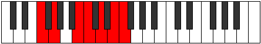

# Mode Stolimic

## Links

- [Documentation](index.md)
- [Scales Index](Scales.md)
- [Modes Index](Modes.md)
- [Chords Index](Chords.md)

## Parent Scale

[Garimic](ScaleGarimic.md)

## Number

[2757](https://ianring.com/musictheory/scales/2757)

## Perfection

- 4 Perfect notes
- 2 Perfect notes

## Perfection Profile

[true true false true false true]

## Permutations

| Tonic | Notes | Signature | Illustration | Audio |
|-------|-------|-----------|--------------|-------|
| [C](ModeCNaturalStolimic.md) | C, D, **E##**, F##, **G##**, A##, C | C |  | [midi](ModeCNaturalStolimic.mid) [ogg](ModeCNaturalStolimic.ogg) |
| [C#](ModeCSharpStolimic.md) | C#, D#, **E###**, F###, **G###**, A###, C# | C |  | [midi](ModeCSharpStolimic.mid) [ogg](ModeCSharpStolimic.ogg) |
| [Db](ModeDFlatStolimic.md) | Db, Eb, **F##**, G#, **A#**, B#, Db | C |  | [midi](ModeDFlatStolimic.mid) [ogg](ModeDFlatStolimic.ogg) |
| [D](ModeDNaturalStolimic.md) | D, E, **F###**, G##, **A##**, B##, D | C |  | [midi](ModeDNaturalStolimic.mid) [ogg](ModeDNaturalStolimic.ogg) |
| [D#](ModeDSharpStolimic.md) | D#, E#, **Cbbb**, Cbb, **Dbb**, Ebb, D# | C |  | [midi](ModeDSharpStolimic.mid) [ogg](ModeDSharpStolimic.ogg) |
| [Eb](ModeEFlatStolimic.md) | Eb, F, **G##**, A#, **B#**, C##, Eb | C |  | [midi](ModeEFlatStolimic.mid) [ogg](ModeEFlatStolimic.ogg) |
| [E](ModeENaturalStolimic.md) | E, F#, **G###**, A##, **B##**, C###, E | C |  | [midi](ModeENaturalStolimic.mid) [ogg](ModeENaturalStolimic.ogg) |
| [F](ModeFNaturalStolimic.md) | F, G, **A##**, B#, **C##**, D##, F | C |  | [midi](ModeFNaturalStolimic.mid) [ogg](ModeFNaturalStolimic.ogg) |
| [F#](ModeFSharpStolimic.md) | F#, G#, **A###**, B##, **C###**, D###, F# | C |  | [midi](ModeFSharpStolimic.mid) [ogg](ModeFSharpStolimic.ogg) |
| [Gb](ModeGFlatStolimic.md) | Gb, Ab, **B#**, C#, **D#**, E#, Gb | C |  | [midi](ModeGFlatStolimic.mid) [ogg](ModeGFlatStolimic.ogg) |
| [G](ModeGNaturalStolimic.md) | G, A, **B##**, C##, **D##**, E##, G | C |  | [midi](ModeGNaturalStolimic.mid) [ogg](ModeGNaturalStolimic.ogg) |
| [G#](ModeGSharpStolimic.md) | G#, A#, **B###**, C###, **D###**, E###, G# | C |  | [midi](ModeGSharpStolimic.mid) [ogg](ModeGSharpStolimic.ogg) |
| [Ab](ModeAFlatStolimic.md) | Ab, Bb, **C##**, D#, **E#**, F##, Ab | C |  | [midi](ModeAFlatStolimic.mid) [ogg](ModeAFlatStolimic.ogg) |
| [A](ModeANaturalStolimic.md) | A, B, **C###**, D##, **E##**, F###, A | C |  | [midi](ModeANaturalStolimic.mid) [ogg](ModeANaturalStolimic.ogg) |
| [A#](ModeASharpStolimic.md) | A#, B#, **D##**, E#, **F##**, G##, A# | C |  | [midi](ModeASharpStolimic.mid) [ogg](ModeASharpStolimic.ogg) |
| [Bb](ModeBFlatStolimic.md) | Bb, C, **D##**, E#, **F##**, G##, Bb | C |  | [midi](ModeBFlatStolimic.mid) [ogg](ModeBFlatStolimic.ogg) |
| [B](ModeBNaturalStolimic.md) | B, C#, **D###**, E##, **F###**, G###, B | C |  | [midi](ModeBNaturalStolimic.mid) [ogg](ModeBNaturalStolimic.ogg) |
