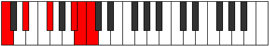
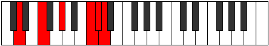

# Mode Stolitonic

## Links

- [Documentation](index.md)
- [Scales Index](Scales.md)
- [Modes Index](Modes.md)
- [Chords Index](Chords.md)

## Parent Scale

[Ionyptitonic](ScaleIonyptitonic.md)

## Number

[3145](https://ianring.com/musictheory/scales/3145)

## Perfection

- 2 Perfect notes
- 3 Perfect notes

## Interval Pattern

3, 3, 4, 1, 1

## Perfection Profile

[false true false false true]

## Permutations

| Tonic | Notes | Signature | Illustration | Audio |
|-------|-------|-----------|--------------|-------|
| [C](ModeCNaturalStolitonic.md) | **C**, D#, **F#**, **A#**, B, **C** | C |  | [midi](https://github.com/edipermadi/music/blob/main/docs/ModeCNaturalStolitonic.mid?raw=true) |
| [C#](ModeCSharpStolitonic.md) | **C#**, E, **G**, **B**, C, **C#** | C |  | [midi](https://github.com/edipermadi/music/blob/main/docs/ModeCSharpStolitonic.mid?raw=true) |
| [Db](ModeDFlatStolitonic.md) | **Db**, E, **G**, **B**, C, **Db** | C |  | [midi](https://github.com/edipermadi/music/blob/main/docs/ModeDFlatStolitonic.mid?raw=true) |
| [D](ModeDNaturalStolitonic.md) | **D**, F, **G#**, **C**, C#, **D** | C |  | [midi](https://github.com/edipermadi/music/blob/main/docs/ModeDNaturalStolitonic.mid?raw=true) |
| [D#](ModeDSharpStolitonic.md) | **D#**, F#, **A**, **C#**, D, **D#** | C |  | [midi](https://github.com/edipermadi/music/blob/main/docs/ModeDSharpStolitonic.mid?raw=true) |
| [Eb](ModeEFlatStolitonic.md) | **Eb**, Gb, **A**, **Db**, D, **Eb** | C |  | [midi](https://github.com/edipermadi/music/blob/main/docs/ModeEFlatStolitonic.mid?raw=true) |
| [E](ModeENaturalStolitonic.md) | **E**, G, **A#**, **D**, D#, **E** | C |  | [midi](https://github.com/edipermadi/music/blob/main/docs/ModeENaturalStolitonic.mid?raw=true) |
| [F](ModeFNaturalStolitonic.md) | **F**, G#, **B**, **D#**, E, **F** | C |  | [midi](https://github.com/edipermadi/music/blob/main/docs/ModeFNaturalStolitonic.mid?raw=true) |
| [F#](ModeFSharpStolitonic.md) | **F#**, A, **C**, **E**, F, **F#** | C |  | [midi](https://github.com/edipermadi/music/blob/main/docs/ModeFSharpStolitonic.mid?raw=true) |
| [Gb](ModeGFlatStolitonic.md) | **Gb**, A, **C**, **E**, F, **Gb** | C |  | [midi](https://github.com/edipermadi/music/blob/main/docs/ModeGFlatStolitonic.mid?raw=true) |
| [G](ModeGNaturalStolitonic.md) | **G**, A#, **C#**, **F**, F#, **G** | C |  | [midi](https://github.com/edipermadi/music/blob/main/docs/ModeGNaturalStolitonic.mid?raw=true) |
| [G#](ModeGSharpStolitonic.md) | **G#**, B, **D**, **F#**, G, **G#** | C |  | [midi](https://github.com/edipermadi/music/blob/main/docs/ModeGSharpStolitonic.mid?raw=true) |
| [Ab](ModeAFlatStolitonic.md) | **Ab**, B, **D**, **Gb**, G, **Ab** | C |  | [midi](https://github.com/edipermadi/music/blob/main/docs/ModeAFlatStolitonic.mid?raw=true) |
| [A](ModeANaturalStolitonic.md) | **A**, C, **D#**, **G**, G#, **A** | C |  | [midi](https://github.com/edipermadi/music/blob/main/docs/ModeANaturalStolitonic.mid?raw=true) |
| [A#](ModeASharpStolitonic.md) | **A#**, C#, **E**, **G#**, A, **A#** | C |  | [midi](https://github.com/edipermadi/music/blob/main/docs/ModeASharpStolitonic.mid?raw=true) |
| [Bb](ModeBFlatStolitonic.md) | **Bb**, Db, **E**, **Ab**, A, **Bb** | C |  | [midi](https://github.com/edipermadi/music/blob/main/docs/ModeBFlatStolitonic.mid?raw=true) |
| [B](ModeBNaturalStolitonic.md) | **B**, D, **F**, **A**, A#, **B** | C |  | [midi](https://github.com/edipermadi/music/blob/main/docs/ModeBNaturalStolitonic.mid?raw=true) |
