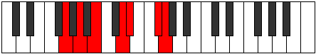

# Mode Stonimic

## Links

- [Documentation](index.md)
- [Scales Index](Scales.md)
- [Modes Index](Modes.md)
- [Chords Index](Chords.md)

## Parent Scale

[Dynimic](ScaleDynimic.md)

## Number

[2453](https://ianring.com/musictheory/scales/2453)

## Perfection

- 3 Perfect notes
- 3 Perfect notes

## Perfection Profile

[true false true true false false]

## Permutations

| Tonic | Notes | Signature | Illustration | Audio |
|-------|-------|-----------|--------------|-------|
| [C](ModeCNaturalStonimic.md) | C, **D**, E, F##, **G#**, **A##**, C | C |  | [midi](ModeCNaturalStonimic.mid) [ogg](ModeCNaturalStonimic.ogg) |
| [C#](ModeCSharpStonimic.md) | C#, **D#**, E#, F###, **G##**, **A###**, C# | C |  | [midi](ModeCSharpStonimic.mid) [ogg](ModeCSharpStonimic.ogg) |
| [Db](ModeDFlatStonimic.md) | Db, **Eb**, F, G#, **A**, **B#**, Db | C |  | [midi](ModeDFlatStonimic.mid) [ogg](ModeDFlatStonimic.ogg) |
| [D](ModeDNaturalStonimic.md) | D, **E**, F#, G##, **A#**, **B##**, D | C |  | [midi](ModeDNaturalStonimic.mid) [ogg](ModeDNaturalStonimic.ogg) |
| [D#](ModeDSharpStonimic.md) | D#, **E#**, F##, G###, **A##**, **B###**, D# | C |  | [midi](ModeDSharpStonimic.mid) [ogg](ModeDSharpStonimic.ogg) |
| [Eb](ModeEFlatStonimic.md) | Eb, **F**, G, A#, **B**, **C##**, Eb | C |  | [midi](ModeEFlatStonimic.mid) [ogg](ModeEFlatStonimic.ogg) |
| [E](ModeENaturalStonimic.md) | E, **F#**, G#, A##, **B#**, **C###**, E | C |  | [midi](ModeENaturalStonimic.mid) [ogg](ModeENaturalStonimic.ogg) |
| [F](ModeFNaturalStonimic.md) | F, **G**, A, B#, **C#**, **D##**, F | C |  | [midi](ModeFNaturalStonimic.mid) [ogg](ModeFNaturalStonimic.ogg) |
| [F#](ModeFSharpStonimic.md) | F#, **G#**, A#, B##, **C##**, **D###**, F# | C |  | [midi](ModeFSharpStonimic.mid) [ogg](ModeFSharpStonimic.ogg) |
| [Gb](ModeGFlatStonimic.md) | Gb, **Ab**, Bb, C#, **D**, **E#**, Gb | C |  | [midi](ModeGFlatStonimic.mid) [ogg](ModeGFlatStonimic.ogg) |
| [G](ModeGNaturalStonimic.md) | G, **A**, B, C##, **D#**, **E##**, G | C |  | [midi](ModeGNaturalStonimic.mid) [ogg](ModeGNaturalStonimic.ogg) |
| [G#](ModeGSharpStonimic.md) | G#, **A#**, B#, C###, **D##**, **E###**, G# | C |  | [midi](ModeGSharpStonimic.mid) [ogg](ModeGSharpStonimic.ogg) |
| [Ab](ModeAFlatStonimic.md) | Ab, **Bb**, C, D#, **E**, **F##**, Ab | C |  | [midi](ModeAFlatStonimic.mid) [ogg](ModeAFlatStonimic.ogg) |
| [A](ModeANaturalStonimic.md) | A, **B**, C#, D##, **E#**, **F###**, A | C |  | [midi](ModeANaturalStonimic.mid) [ogg](ModeANaturalStonimic.ogg) |
| [A#](ModeASharpStonimic.md) | A#, **B#**, C##, D###, **E##**, **Cbbb**, A# | C |  | [midi](ModeASharpStonimic.mid) [ogg](ModeASharpStonimic.ogg) |
| [Bb](ModeBFlatStonimic.md) | Bb, **C**, D, E#, **F#**, **G##**, Bb | C |  | [midi](ModeBFlatStonimic.mid) [ogg](ModeBFlatStonimic.ogg) |
| [B](ModeBNaturalStonimic.md) | B, **C#**, D#, E##, **F##**, **G###**, B | C |  | [midi](ModeBNaturalStonimic.mid) [ogg](ModeBNaturalStonimic.ogg) |
