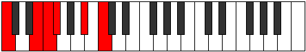

# Mode Stonitonic

## Links

- [Documentation](index.md)
- [Scales Index](Scales.md)
- [Modes Index](Modes.md)
- [Chords Index](Chords.md)

## Parent Scale

[Zathitonic](ScaleZathitonic.md)

## Number

[1137](https://ianring.com/musictheory/scales/1137)

## Perfection

- 2 Perfect notes
- 3 Perfect notes

## Perfection Profile

[false false true false true]

## Permutations

| Tonic | Notes | Signature | Illustration | Audio |
|-------|-------|-----------|--------------|-------|
| [C](ModeCNaturalStonitonic.md) | **C**, **E**, F, **F#**, A#, **C** | C |  | [midi](ModeCNaturalStonitonic.mid) [ogg](ModeCNaturalStonitonic.ogg) |
| [C#](ModeCSharpStonitonic.md) | **C#**, **F**, F#, **G**, B, **C#** | C |  | [midi](ModeCSharpStonitonic.mid) [ogg](ModeCSharpStonitonic.ogg) |
| [Db](ModeDFlatStonitonic.md) | **Db**, **F**, Gb, **G**, B, **Db** | C |  | [midi](ModeDFlatStonitonic.mid) [ogg](ModeDFlatStonitonic.ogg) |
| [D](ModeDNaturalStonitonic.md) | **D**, **F#**, G, **G#**, C, **D** | C |  | [midi](ModeDNaturalStonitonic.mid) [ogg](ModeDNaturalStonitonic.ogg) |
| [D#](ModeDSharpStonitonic.md) | **D#**, **G**, G#, **A**, C#, **D#** | C |  | [midi](ModeDSharpStonitonic.mid) [ogg](ModeDSharpStonitonic.ogg) |
| [Eb](ModeEFlatStonitonic.md) | **Eb**, **G**, Ab, **A**, Db, **Eb** | C |  | [midi](ModeEFlatStonitonic.mid) [ogg](ModeEFlatStonitonic.ogg) |
| [E](ModeENaturalStonitonic.md) | **E**, **G#**, A, **A#**, D, **E** | C |  | [midi](ModeENaturalStonitonic.mid) [ogg](ModeENaturalStonitonic.ogg) |
| [F](ModeFNaturalStonitonic.md) | **F**, **A**, A#, **B**, D#, **F** | C |  | [midi](ModeFNaturalStonitonic.mid) [ogg](ModeFNaturalStonitonic.ogg) |
| [F#](ModeFSharpStonitonic.md) | **F#**, **A#**, B, **C**, E, **F#** | C |  | [midi](ModeFSharpStonitonic.mid) [ogg](ModeFSharpStonitonic.ogg) |
| [Gb](ModeGFlatStonitonic.md) | **Gb**, **Bb**, B, **C**, E, **Gb** | C |  | [midi](ModeGFlatStonitonic.mid) [ogg](ModeGFlatStonitonic.ogg) |
| [G](ModeGNaturalStonitonic.md) | **G**, **B**, C, **C#**, F, **G** | C |  | [midi](ModeGNaturalStonitonic.mid) [ogg](ModeGNaturalStonitonic.ogg) |
| [G#](ModeGSharpStonitonic.md) | **G#**, **C**, C#, **D**, F#, **G#** | C |  | [midi](ModeGSharpStonitonic.mid) [ogg](ModeGSharpStonitonic.ogg) |
| [Ab](ModeAFlatStonitonic.md) | **Ab**, **C**, Db, **D**, Gb, **Ab** | C |  | [midi](ModeAFlatStonitonic.mid) [ogg](ModeAFlatStonitonic.ogg) |
| [A](ModeANaturalStonitonic.md) | **A**, **C#**, D, **D#**, G, **A** | C |  | [midi](ModeANaturalStonitonic.mid) [ogg](ModeANaturalStonitonic.ogg) |
| [A#](ModeASharpStonitonic.md) | **A#**, **D**, D#, **E**, G#, **A#** | C |  | [midi](ModeASharpStonitonic.mid) [ogg](ModeASharpStonitonic.ogg) |
| [Bb](ModeBFlatStonitonic.md) | **Bb**, **D**, Eb, **E**, Ab, **Bb** | C |  | [midi](ModeBFlatStonitonic.mid) [ogg](ModeBFlatStonitonic.ogg) |
| [B](ModeBNaturalStonitonic.md) | **B**, **D#**, E, **F**, A, **B** | C |  | [midi](ModeBNaturalStonitonic.mid) [ogg](ModeBNaturalStonitonic.ogg) |
