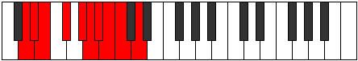

# Mode Stonygic

## Links

- [Documentation](README.md)
- [Scales Index](Scales.md)
- [Modes Index](Modes.md)
- [Chords Index](Chords.md)

## Parent Scale

[Kaptygic](ScaleKaptygic.md)

## Number

[2007](https://ianring.com/musictheory/scales/2007)

## Interval Pattern

1, 1, 2, 2, 1, 1, 1, 1, 2

## Chord Pattern

i⁰b3, ii⁰, IIIb5, ix⁰

## Perfection

- 6 Perfect notes
- 3 Perfect notes

## Perfection Profile

[true true true false true true false true false]

## Permutations

| Tonic | Notes | Signature | Illustration | Audio |
|-------|-------|-----------|--------------|-------|
| [C](ModeCNaturalStonygic.md) | C, C#, D, **E**, F#, G, **G#**, A, **A#**, C | C |  | [midi](https://github.com/edipermadi/music/blob/main/docs/ModeCNaturalStonygic.mid?raw=true) |
| [C#](ModeCSharpStonygic.md) | C#, D, D#, **F**, G, G#, **A**, A#, **B**, C# | C |  | [midi](https://github.com/edipermadi/music/blob/main/docs/ModeCSharpStonygic.mid?raw=true) |
| [Db](ModeDFlatStonygic.md) | Db, D, Eb, **F**, G, Ab, **A**, Bb, **B**, Db | C |  | [midi](https://github.com/edipermadi/music/blob/main/docs/ModeDFlatStonygic.mid?raw=true) |
| [D](ModeDNaturalStonygic.md) | D, D#, E, **F#**, G#, A, **A#**, B, **C**, D | C |  | [midi](https://github.com/edipermadi/music/blob/main/docs/ModeDNaturalStonygic.mid?raw=true) |
| [D#](ModeDSharpStonygic.md) | D#, E, F, **G**, A, A#, **B**, C, **C#**, D# | C |  | [midi](https://github.com/edipermadi/music/blob/main/docs/ModeDSharpStonygic.mid?raw=true) |
| [Eb](ModeEFlatStonygic.md) | Eb, E, F, **G**, A, Bb, **B**, C, **Db**, Eb | C |  | [midi](https://github.com/edipermadi/music/blob/main/docs/ModeEFlatStonygic.mid?raw=true) |
| [E](ModeENaturalStonygic.md) | E, F, F#, **G#**, A#, B, **C**, C#, **D**, E | C |  | [midi](https://github.com/edipermadi/music/blob/main/docs/ModeENaturalStonygic.mid?raw=true) |
| [F](ModeFNaturalStonygic.md) | F, F#, G, **A**, B, C, **C#**, D, **D#**, F | C |  | [midi](https://github.com/edipermadi/music/blob/main/docs/ModeFNaturalStonygic.mid?raw=true) |
| [F#](ModeFSharpStonygic.md) | F#, G, G#, **A#**, C, C#, **D**, D#, **E**, F# | C |  | [midi](https://github.com/edipermadi/music/blob/main/docs/ModeFSharpStonygic.mid?raw=true) |
| [Gb](ModeGFlatStonygic.md) | Gb, G, Ab, **Bb**, C, Db, **D**, Eb, **E**, Gb | C |  | [midi](https://github.com/edipermadi/music/blob/main/docs/ModeGFlatStonygic.mid?raw=true) |
| [G](ModeGNaturalStonygic.md) | G, G#, A, **B**, C#, D, **D#**, E, **F**, G | C |  | [midi](https://github.com/edipermadi/music/blob/main/docs/ModeGNaturalStonygic.mid?raw=true) |
| [G#](ModeGSharpStonygic.md) | G#, A, A#, **C**, D, D#, **E**, F, **F#**, G# | C |  | [midi](https://github.com/edipermadi/music/blob/main/docs/ModeGSharpStonygic.mid?raw=true) |
| [Ab](ModeAFlatStonygic.md) | Ab, A, Bb, **C**, D, Eb, **E**, F, **Gb**, Ab | C |  | [midi](https://github.com/edipermadi/music/blob/main/docs/ModeAFlatStonygic.mid?raw=true) |
| [A](ModeANaturalStonygic.md) | A, A#, B, **C#**, D#, E, **F**, F#, **G**, A | C |  | [midi](https://github.com/edipermadi/music/blob/main/docs/ModeANaturalStonygic.mid?raw=true) |
| [A#](ModeASharpStonygic.md) | A#, B, C, **D**, E, F, **F#**, G, **G#**, A# | C |  | [midi](https://github.com/edipermadi/music/blob/main/docs/ModeASharpStonygic.mid?raw=true) |
| [Bb](ModeBFlatStonygic.md) | Bb, B, C, **D**, E, F, **Gb**, G, **Ab**, Bb | C |  | [midi](https://github.com/edipermadi/music/blob/main/docs/ModeBFlatStonygic.mid?raw=true) |
| [B](ModeBNaturalStonygic.md) | B, C, C#, **D#**, F, F#, **G**, G#, **A**, B | C |  | [midi](https://github.com/edipermadi/music/blob/main/docs/ModeBNaturalStonygic.mid?raw=true) |
