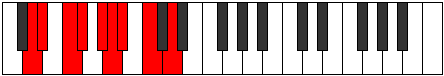
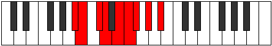

# Mode Stonyllic

## Links

- [Documentation](README.md)
- [Scales Index](Scales.md)
- [Modes Index](Modes.md)
- [Chords Index](Chords.md)

## Parent Scale

[Stogyllic](ScaleStogyllic.md)

## Number

[1499](https://ianring.com/musictheory/scales/1499)

## Transposition

1, 2, 1, 2, 1, 1, 2, 2

## Chord Pattern

i⁰, ii⁰, iv⁰, v⁰b3, vi⁰, VII, viii⁰

## Perfection

- 5 Perfect notes
- 3 Perfect notes

## Perfection Profile

[true true true false true false true false]

## Permutations

| Tonic | Notes | Signature | Illustration | Audio |
|-------|-------|-----------|--------------|-------|
| [C](ModeCNaturalStonyllic.md) | C, C#, D#, **E**, F#, **G**, G#, **A#**, C | C |  | [midi](https://github.com/edipermadi/music/blob/main/docs/ModeCNaturalStonyllic.mid?raw=true) |
| [C#](ModeCSharpStonyllic.md) | C#, D, E, **F**, G, **G#**, A, **B**, C# | C |  | [midi](https://github.com/edipermadi/music/blob/main/docs/ModeCSharpStonyllic.mid?raw=true) |
| [Db](ModeDFlatStonyllic.md) | Db, D, E, **F**, G, **Ab**, A, **B**, Db | C |  | [midi](https://github.com/edipermadi/music/blob/main/docs/ModeDFlatStonyllic.mid?raw=true) |
| [D](ModeDNaturalStonyllic.md) | D, D#, F, **F#**, G#, **A**, A#, **C**, D | C |  | [midi](https://github.com/edipermadi/music/blob/main/docs/ModeDNaturalStonyllic.mid?raw=true) |
| [D#](ModeDSharpStonyllic.md) | D#, E, F#, **G**, A, **A#**, B, **C#**, D# | C |  | [midi](https://github.com/edipermadi/music/blob/main/docs/ModeDSharpStonyllic.mid?raw=true) |
| [Eb](ModeEFlatStonyllic.md) | Eb, E, Gb, **G**, A, **Bb**, B, **Db**, Eb | C |  | [midi](https://github.com/edipermadi/music/blob/main/docs/ModeEFlatStonyllic.mid?raw=true) |
| [E](ModeENaturalStonyllic.md) | E, F, G, **G#**, A#, **B**, C, **D**, E | C |  | [midi](https://github.com/edipermadi/music/blob/main/docs/ModeENaturalStonyllic.mid?raw=true) |
| [F](ModeFNaturalStonyllic.md) | F, F#, G#, **A**, B, **C**, C#, **D#**, F | C |  | [midi](https://github.com/edipermadi/music/blob/main/docs/ModeFNaturalStonyllic.mid?raw=true) |
| [F#](ModeFSharpStonyllic.md) | F#, G, A, **A#**, C, **C#**, D, **E**, F# | C |  | [midi](https://github.com/edipermadi/music/blob/main/docs/ModeFSharpStonyllic.mid?raw=true) |
| [Gb](ModeGFlatStonyllic.md) | Gb, G, A, **Bb**, C, **Db**, D, **E**, Gb | C |  | [midi](https://github.com/edipermadi/music/blob/main/docs/ModeGFlatStonyllic.mid?raw=true) |
| [G](ModeGNaturalStonyllic.md) | G, G#, A#, **B**, C#, **D**, D#, **F**, G | C |  | [midi](https://github.com/edipermadi/music/blob/main/docs/ModeGNaturalStonyllic.mid?raw=true) |
| [G#](ModeGSharpStonyllic.md) | G#, A, B, **C**, D, **D#**, E, **F#**, G# | C |  | [midi](https://github.com/edipermadi/music/blob/main/docs/ModeGSharpStonyllic.mid?raw=true) |
| [Ab](ModeAFlatStonyllic.md) | Ab, A, B, **C**, D, **Eb**, E, **Gb**, Ab | C |  | [midi](https://github.com/edipermadi/music/blob/main/docs/ModeAFlatStonyllic.mid?raw=true) |
| [A](ModeANaturalStonyllic.md) | A, A#, C, **C#**, D#, **E**, F, **G**, A | C |  | [midi](https://github.com/edipermadi/music/blob/main/docs/ModeANaturalStonyllic.mid?raw=true) |
| [A#](ModeASharpStonyllic.md) | A#, B, C#, **D**, E, **F**, F#, **G#**, A# | C |  | [midi](https://github.com/edipermadi/music/blob/main/docs/ModeASharpStonyllic.mid?raw=true) |
| [Bb](ModeBFlatStonyllic.md) | Bb, B, Db, **D**, E, **F**, Gb, **Ab**, Bb | C |  | [midi](https://github.com/edipermadi/music/blob/main/docs/ModeBFlatStonyllic.mid?raw=true) |
| [B](ModeBNaturalStonyllic.md) | B, C, D, **D#**, F, **F#**, G, **A**, B | C |  | [midi](https://github.com/edipermadi/music/blob/main/docs/ModeBNaturalStonyllic.mid?raw=true) |
