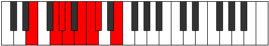

# Mode Stoptian

## Links

- [Documentation](README.md)
- [Scales Index](Scales.md)
- [Modes Index](Modes.md)
- [Chords Index](Chords.md)

## Parent Scale

[Stalian](ScaleStalian.md)

## Number

[953](https://ianring.com/musictheory/scales/953)

## Transposition

3, 1, 1, 2, 1, 1, 3

## Chord Pattern

I, iv, VI⁺

## Perfection

- 4 Perfect notes
- 3 Perfect notes

## Perfection Profile

[true false false true false true true]

## Permutations

| Tonic | Notes | Signature | Illustration | Audio |
|-------|-------|-----------|--------------|-------|
| [C](ModeCNaturalStoptian.md) | C, **D#**, **E**, F, **G**, Ab, Bbb, C | C |  | [midi](https://github.com/edipermadi/music/blob/main/docs/ModeCNaturalStoptian.mid?raw=true) |
| [C#](ModeCSharpStoptian.md) | C#, **D##**, **E#**, F#, **G#**, A, Bb, C# | C |  | [midi](https://github.com/edipermadi/music/blob/main/docs/ModeCSharpStoptian.mid?raw=true) |
| [Db](ModeDFlatStoptian.md) | Db, **E**, **F**, Gb, **Ab**, Bbb, Cbb, Db | C |  | [midi](https://github.com/edipermadi/music/blob/main/docs/ModeDFlatStoptian.mid?raw=true) |
| [D](ModeDNaturalStoptian.md) | D, **E#**, **F#**, G, **A**, Bb, Cb, D | C |  | [midi](https://github.com/edipermadi/music/blob/main/docs/ModeDNaturalStoptian.mid?raw=true) |
| [D#](ModeDSharpStoptian.md) | D#, **E##**, **F##**, G#, **A#**, B, C, D# | C |  | [midi](https://github.com/edipermadi/music/blob/main/docs/ModeDSharpStoptian.mid?raw=true) |
| [Eb](ModeEFlatStoptian.md) | Eb, **F#**, **G**, Ab, **Bb**, Cb, Dbb, Eb | C |  | [midi](https://github.com/edipermadi/music/blob/main/docs/ModeEFlatStoptian.mid?raw=true) |
| [E](ModeENaturalStoptian.md) | E, **F##**, **G#**, A, **B**, C, Db, E | C |  | [midi](https://github.com/edipermadi/music/blob/main/docs/ModeENaturalStoptian.mid?raw=true) |
| [F](ModeFNaturalStoptian.md) | F, **G#**, **A**, Bb, **C**, Db, Ebb, F | C |  | [midi](https://github.com/edipermadi/music/blob/main/docs/ModeFNaturalStoptian.mid?raw=true) |
| [F#](ModeFSharpStoptian.md) | F#, **G##**, **A#**, B, **C#**, D, Eb, F# | C |  | [midi](https://github.com/edipermadi/music/blob/main/docs/ModeFSharpStoptian.mid?raw=true) |
| [Gb](ModeGFlatStoptian.md) | Gb, **A**, **Bb**, Cb, **Db**, Ebb, Fbb, Gb | C |  | [midi](https://github.com/edipermadi/music/blob/main/docs/ModeGFlatStoptian.mid?raw=true) |
| [G](ModeGNaturalStoptian.md) | G, **A#**, **B**, C, **D**, Eb, Fb, G | C |  | [midi](https://github.com/edipermadi/music/blob/main/docs/ModeGNaturalStoptian.mid?raw=true) |
| [G#](ModeGSharpStoptian.md) | G#, **A##**, **B#**, C#, **D#**, E, F, G# | C |  | [midi](https://github.com/edipermadi/music/blob/main/docs/ModeGSharpStoptian.mid?raw=true) |
| [Ab](ModeAFlatStoptian.md) | Ab, **B**, **C**, Db, **Eb**, Fb, Gbb, Ab | C |  | [midi](https://github.com/edipermadi/music/blob/main/docs/ModeAFlatStoptian.mid?raw=true) |
| [A](ModeANaturalStoptian.md) | A, **B#**, **C#**, D, **E**, F, Gb, A | C |  | [midi](https://github.com/edipermadi/music/blob/main/docs/ModeANaturalStoptian.mid?raw=true) |
| [A#](ModeASharpStoptian.md) | A#, **B##**, **C##**, D#, **E#**, F#, G, A# | C |  | [midi](https://github.com/edipermadi/music/blob/main/docs/ModeASharpStoptian.mid?raw=true) |
| [Bb](ModeBFlatStoptian.md) | Bb, **C#**, **D**, Eb, **F**, Gb, Abb, Bb | C |  | [midi](https://github.com/edipermadi/music/blob/main/docs/ModeBFlatStoptian.mid?raw=true) |
| [B](ModeBNaturalStoptian.md) | B, **C##**, **D#**, E, **F#**, G, Ab, B | C |  | [midi](https://github.com/edipermadi/music/blob/main/docs/ModeBNaturalStoptian.mid?raw=true) |
