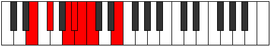

# Mode Stoptimic

## Links

- [Documentation](README.md)
- [Scales Index](Scales.md)
- [Modes Index](Modes.md)
- [Chords Index](Chords.md)

## Parent Scale

[Stalimic](ScaleStalimic.md)

## Number

[485](https://ianring.com/musictheory/scales/485)

## Transposition

2, 3, 1, 1, 1, 4

## Chord Pattern

IIb5

## Perfection

- 3 Perfect notes
- 3 Perfect notes

## Perfection Profile

[true false true false true false]

## Permutations

| Tonic | Notes | Signature | Illustration | Audio |
|-------|-------|-----------|--------------|-------|
| [C](ModeCNaturalStoptimic.md) | C, **D**, E#, **F#**, G, **Ab**, C | C |  | [midi](https://github.com/edipermadi/music/blob/main/docs/ModeCNaturalStoptimic.mid?raw=true) |
| [C#](ModeCSharpStoptimic.md) | C#, **D#**, E##, **F##**, G#, **A**, C# | C |  | [midi](https://github.com/edipermadi/music/blob/main/docs/ModeCSharpStoptimic.mid?raw=true) |
| [Db](ModeDFlatStoptimic.md) | Db, **Eb**, F#, **G**, Ab, **Bbb**, Db | C |  | [midi](https://github.com/edipermadi/music/blob/main/docs/ModeDFlatStoptimic.mid?raw=true) |
| [D](ModeDNaturalStoptimic.md) | D, **E**, F##, **G#**, A, **Bb**, D | C |  | [midi](https://github.com/edipermadi/music/blob/main/docs/ModeDNaturalStoptimic.mid?raw=true) |
| [D#](ModeDSharpStoptimic.md) | D#, **E#**, F###, **G##**, A#, **B**, D# | C |  | [midi](https://github.com/edipermadi/music/blob/main/docs/ModeDSharpStoptimic.mid?raw=true) |
| [Eb](ModeEFlatStoptimic.md) | Eb, **F**, G#, **A**, Bb, **Cb**, Eb | C |  | [midi](https://github.com/edipermadi/music/blob/main/docs/ModeEFlatStoptimic.mid?raw=true) |
| [E](ModeENaturalStoptimic.md) | E, **F#**, G##, **A#**, B, **C**, E | C |  | [midi](https://github.com/edipermadi/music/blob/main/docs/ModeENaturalStoptimic.mid?raw=true) |
| [F](ModeFNaturalStoptimic.md) | F, **G**, A#, **B**, C, **Db**, F | C |  | [midi](https://github.com/edipermadi/music/blob/main/docs/ModeFNaturalStoptimic.mid?raw=true) |
| [F#](ModeFSharpStoptimic.md) | F#, **G#**, A##, **B#**, C#, **D**, F# | C |  | [midi](https://github.com/edipermadi/music/blob/main/docs/ModeFSharpStoptimic.mid?raw=true) |
| [Gb](ModeGFlatStoptimic.md) | Gb, **Ab**, B, **C**, Db, **Ebb**, Gb | C |  | [midi](https://github.com/edipermadi/music/blob/main/docs/ModeGFlatStoptimic.mid?raw=true) |
| [G](ModeGNaturalStoptimic.md) | G, **A**, B#, **C#**, D, **Eb**, G | C |  | [midi](https://github.com/edipermadi/music/blob/main/docs/ModeGNaturalStoptimic.mid?raw=true) |
| [G#](ModeGSharpStoptimic.md) | G#, **A#**, B##, **C##**, D#, **E**, G# | C |  | [midi](https://github.com/edipermadi/music/blob/main/docs/ModeGSharpStoptimic.mid?raw=true) |
| [Ab](ModeAFlatStoptimic.md) | Ab, **Bb**, C#, **D**, Eb, **Fb**, Ab | C |  | [midi](https://github.com/edipermadi/music/blob/main/docs/ModeAFlatStoptimic.mid?raw=true) |
| [A](ModeANaturalStoptimic.md) | A, **B**, C##, **D#**, E, **F**, A | C |  | [midi](https://github.com/edipermadi/music/blob/main/docs/ModeANaturalStoptimic.mid?raw=true) |
| [A#](ModeASharpStoptimic.md) | A#, **B#**, C###, **D##**, E#, **F#**, A# | C |  | [midi](https://github.com/edipermadi/music/blob/main/docs/ModeASharpStoptimic.mid?raw=true) |
| [Bb](ModeBFlatStoptimic.md) | Bb, **C**, D#, **E**, F, **Gb**, Bb | C |  | [midi](https://github.com/edipermadi/music/blob/main/docs/ModeBFlatStoptimic.mid?raw=true) |
| [B](ModeBNaturalStoptimic.md) | B, **C#**, D##, **E#**, F#, **G**, B | C |  | [midi](https://github.com/edipermadi/music/blob/main/docs/ModeBNaturalStoptimic.mid?raw=true) |
