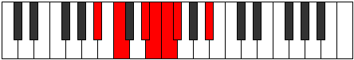

# Mode Stoptimic

## Links

- [Documentation](index.md)
- [Scales Index](Scales.md)
- [Modes Index](Modes.md)
- [Chords Index](Chords.md)

## Parent Scale

[Stalimic](ScaleStalimic.md)

## Number

[485](https://ianring.com/musictheory/scales/485)

## Perfection

- 3 Perfect notes
- 3 Perfect notes

## Perfection Profile

[true false true false true false]

## Permutations

| Tonic | Notes | Signature | Illustration | Audio |
|-------|-------|-----------|--------------|-------|
| [C](ModeCNaturalStoptimic.md) | C, **D**, E#, **F#**, G, **Ab**, C | C |  | [midi](ModeCNaturalStoptimic.mid) [ogg](ModeCNaturalStoptimic.ogg) |
| [C#](ModeCSharpStoptimic.md) | C#, **D#**, E##, **F##**, G#, **A**, C# | C |  | [midi](ModeCSharpStoptimic.mid) [ogg](ModeCSharpStoptimic.ogg) |
| [Db](ModeDFlatStoptimic.md) | Db, **Eb**, F#, **G**, Ab, **Bbb**, Db | C |  | [midi](ModeDFlatStoptimic.mid) [ogg](ModeDFlatStoptimic.ogg) |
| [D](ModeDNaturalStoptimic.md) | D, **E**, F##, **G#**, A, **Bb**, D | C |  | [midi](ModeDNaturalStoptimic.mid) [ogg](ModeDNaturalStoptimic.ogg) |
| [D#](ModeDSharpStoptimic.md) | D#, **E#**, F###, **G##**, A#, **B**, D# | C |  | [midi](ModeDSharpStoptimic.mid) [ogg](ModeDSharpStoptimic.ogg) |
| [Eb](ModeEFlatStoptimic.md) | Eb, **F**, G#, **A**, Bb, **Cb**, Eb | C |  | [midi](ModeEFlatStoptimic.mid) [ogg](ModeEFlatStoptimic.ogg) |
| [E](ModeENaturalStoptimic.md) | E, **F#**, G##, **A#**, B, **C**, E | C |  | [midi](ModeENaturalStoptimic.mid) [ogg](ModeENaturalStoptimic.ogg) |
| [F](ModeFNaturalStoptimic.md) | F, **G**, A#, **B**, C, **Db**, F | C |  | [midi](ModeFNaturalStoptimic.mid) [ogg](ModeFNaturalStoptimic.ogg) |
| [F#](ModeFSharpStoptimic.md) | F#, **G#**, A##, **B#**, C#, **D**, F# | C |  | [midi](ModeFSharpStoptimic.mid) [ogg](ModeFSharpStoptimic.ogg) |
| [Gb](ModeGFlatStoptimic.md) | Gb, **Ab**, B, **C**, Db, **Ebb**, Gb | C |  | [midi](ModeGFlatStoptimic.mid) [ogg](ModeGFlatStoptimic.ogg) |
| [G](ModeGNaturalStoptimic.md) | G, **A**, B#, **C#**, D, **Eb**, G | C |  | [midi](ModeGNaturalStoptimic.mid) [ogg](ModeGNaturalStoptimic.ogg) |
| [G#](ModeGSharpStoptimic.md) | G#, **A#**, B##, **C##**, D#, **E**, G# | C |  | [midi](ModeGSharpStoptimic.mid) [ogg](ModeGSharpStoptimic.ogg) |
| [Ab](ModeAFlatStoptimic.md) | Ab, **Bb**, C#, **D**, Eb, **Fb**, Ab | C |  | [midi](ModeAFlatStoptimic.mid) [ogg](ModeAFlatStoptimic.ogg) |
| [A](ModeANaturalStoptimic.md) | A, **B**, C##, **D#**, E, **F**, A | C |  | [midi](ModeANaturalStoptimic.mid) [ogg](ModeANaturalStoptimic.ogg) |
| [A#](ModeASharpStoptimic.md) | A#, **B#**, C###, **D##**, E#, **F#**, A# | C |  | [midi](ModeASharpStoptimic.mid) [ogg](ModeASharpStoptimic.ogg) |
| [Bb](ModeBFlatStoptimic.md) | Bb, **C**, D#, **E**, F, **Gb**, Bb | C |  | [midi](ModeBFlatStoptimic.mid) [ogg](ModeBFlatStoptimic.ogg) |
| [B](ModeBNaturalStoptimic.md) | B, **C#**, D##, **E#**, F#, **G**, B | C |  | [midi](ModeBNaturalStoptimic.mid) [ogg](ModeBNaturalStoptimic.ogg) |
