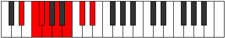
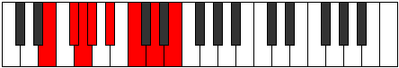
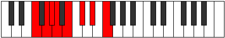

# Mode Storian

## Links

- [Documentation](README.md)
- [Scales Index](Scales.md)
- [Modes Index](Modes.md)
- [Chords Index](Chords.md)

## Parent Scale

[Aeolynian](ScaleAeolynian.md)

## Number

[1373](https://ianring.com/musictheory/scales/1373)

## Luminosity

-1

## Transposition

2, 1, 1, 2, 2, 2, 2

## Chord Pattern

i⁰, ii⁰b3, iii, IV⁺, V⁺, VI, VIIb5

## Perfection

- 2 Perfect notes
- 5 Perfect notes

## Perfection Profile

false, false, true, false, false, true, false

## Permutations

| Tonic | Notes | Signature | Illustration | Audio |
|-------|-------|-----------|--------------|-------|
| [C](ModeCNaturalStorian.md) | **C**, **D**, Eb, **Fb**, **Gb**, Ab, **Bb**, **C** | C |  | [midi](https://github.com/edipermadi/music/blob/main/docs/ModeCNaturalStorian.mid?raw=true) |
| [C#](ModeCSharpStorian.md) | **C#**, **D#**, E, **F**, **G**, A, **B**, **C#** | C |  | [midi](https://github.com/edipermadi/music/blob/main/docs/ModeCSharpStorian.mid?raw=true) |
| [Db](ModeDFlatStorian.md) | **Db**, **Eb**, Fb, **Gbb**, **Abb**, Bbb, **Cb**, **Db** | C |  | [midi](https://github.com/edipermadi/music/blob/main/docs/ModeDFlatStorian.mid?raw=true) |
| [D](ModeDNaturalStorian.md) | **D**, **E**, F, **Gb**, **Ab**, Bb, **C**, **D** | C |  | [midi](https://github.com/edipermadi/music/blob/main/docs/ModeDNaturalStorian.mid?raw=true) |
| [D#](ModeDSharpStorian.md) | **D#**, **E#**, F#, **G**, **A**, B, **C#**, **D#** | C |  | [midi](https://github.com/edipermadi/music/blob/main/docs/ModeDSharpStorian.mid?raw=true) |
| [Eb](ModeEFlatStorian.md) | **Eb**, **F**, Gb, **Abb**, **Bbb**, Cb, **Db**, **Eb** | C |  | [midi](https://github.com/edipermadi/music/blob/main/docs/ModeEFlatStorian.mid?raw=true) |
| [E](ModeENaturalStorian.md) | **E**, **F#**, G, **Ab**, **Bb**, C, **D**, **E** | C |  | [midi](https://github.com/edipermadi/music/blob/main/docs/ModeENaturalStorian.mid?raw=true) |
| [F](ModeFNaturalStorian.md) | **F**, **G**, Ab, **Bbb**, **Cb**, Db, **Eb**, **F** | C |  | [midi](https://github.com/edipermadi/music/blob/main/docs/ModeFNaturalStorian.mid?raw=true) |
| [F#](ModeFSharpStorian.md) | **F#**, **G#**, A, **Bb**, **C**, D, **E**, **F#** | C |  | [midi](https://github.com/edipermadi/music/blob/main/docs/ModeFSharpStorian.mid?raw=true) |
| [Gb](ModeGFlatStorian.md) | **Gb**, **Ab**, Bbb, **Cbb**, **Dbb**, Ebb, **Fb**, **Gb** | C |  | [midi](https://github.com/edipermadi/music/blob/main/docs/ModeGFlatStorian.mid?raw=true) |
| [G](ModeGNaturalStorian.md) | **G**, **A**, Bb, **Cb**, **Db**, Eb, **F**, **G** | C |  | [midi](https://github.com/edipermadi/music/blob/main/docs/ModeGNaturalStorian.mid?raw=true) |
| [G#](ModeGSharpStorian.md) | **G#**, **A#**, B, **C**, **D**, E, **F#**, **G#** | C |  | [midi](https://github.com/edipermadi/music/blob/main/docs/ModeGSharpStorian.mid?raw=true) |
| [Ab](ModeAFlatStorian.md) | **Ab**, **Bb**, Cb, **Dbb**, **Ebb**, Fb, **Gb**, **Ab** | C |  | [midi](https://github.com/edipermadi/music/blob/main/docs/ModeAFlatStorian.mid?raw=true) |
| [A](ModeANaturalStorian.md) | **A**, **B**, C, **Db**, **Eb**, F, **G**, **A** | C |  | [midi](https://github.com/edipermadi/music/blob/main/docs/ModeANaturalStorian.mid?raw=true) |
| [A#](ModeASharpStorian.md) | **A#**, **B#**, C#, **D**, **E**, F#, **G#**, **A#** | C |  | [midi](https://github.com/edipermadi/music/blob/main/docs/ModeASharpStorian.mid?raw=true) |
| [Bb](ModeBFlatStorian.md) | **Bb**, **C**, Db, **Ebb**, **Fb**, Gb, **Ab**, **Bb** | C |  | [midi](https://github.com/edipermadi/music/blob/main/docs/ModeBFlatStorian.mid?raw=true) |
| [B](ModeBNaturalStorian.md) | **B**, **C#**, D, **Eb**, **F**, G, **A**, **B** | C |  | [midi](https://github.com/edipermadi/music/blob/main/docs/ModeBNaturalStorian.mid?raw=true) |
