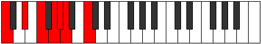
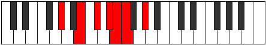

# Mode Stothimic

## Links

- [Documentation](README.md)
- [Scales Index](Scales.md)
- [Modes Index](Modes.md)
- [Chords Index](Chords.md)

## Parent Scale

[Palimic](ScalePalimic.md)

## Number

[937](https://ianring.com/musictheory/scales/937)

## Luminosity

5

## Transposition

3, 2, 2, 1, 1, 3

## Chord Pattern

IIb5, iii

## Perfection

- 3 Perfect notes
- 3 Perfect notes

## Perfection Profile

true, false, true, false, true, false

## Permutations

| Tonic | Notes | Signature | Illustration | Audio |
|-------|-------|-----------|--------------|-------|
| [C](ModeCNaturalStothimic.md) | C, **D#**, E#, **F##**, G#, **A**, C | C |  | [midi](https://github.com/edipermadi/music/blob/main/docs/ModeCNaturalStothimic.mid?raw=true) |
| [C#](ModeCSharpStothimic.md) | C#, **D##**, E##, **F###**, G##, **A#**, C# | C |  | [midi](https://github.com/edipermadi/music/blob/main/docs/ModeCSharpStothimic.mid?raw=true) |
| [Db](ModeDFlatStothimic.md) | Db, **E**, F#, **G#**, A, **Bb**, Db | C |  | [midi](https://github.com/edipermadi/music/blob/main/docs/ModeDFlatStothimic.mid?raw=true) |
| [D](ModeDNaturalStothimic.md) | D, **E#**, F##, **G##**, A#, **B**, D | C |  | [midi](https://github.com/edipermadi/music/blob/main/docs/ModeDNaturalStothimic.mid?raw=true) |
| [D#](ModeDSharpStothimic.md) | D#, **E##**, F###, **G###**, A##, **B#**, D# | C |  | [midi](https://github.com/edipermadi/music/blob/main/docs/ModeDSharpStothimic.mid?raw=true) |
| [Eb](ModeEFlatStothimic.md) | Eb, **F#**, G#, **A#**, B, **C**, Eb | C |  | [midi](https://github.com/edipermadi/music/blob/main/docs/ModeEFlatStothimic.mid?raw=true) |
| [E](ModeENaturalStothimic.md) | E, **F##**, G##, **A##**, B#, **C#**, E | C |  | [midi](https://github.com/edipermadi/music/blob/main/docs/ModeENaturalStothimic.mid?raw=true) |
| [F](ModeFNaturalStothimic.md) | F, **G#**, A#, **B#**, C#, **D**, F | C |  | [midi](https://github.com/edipermadi/music/blob/main/docs/ModeFNaturalStothimic.mid?raw=true) |
| [F#](ModeFSharpStothimic.md) | F#, **G##**, A##, **B##**, C##, **D#**, F# | C |  | [midi](https://github.com/edipermadi/music/blob/main/docs/ModeFSharpStothimic.mid?raw=true) |
| [Gb](ModeGFlatStothimic.md) | Gb, **A**, B, **C#**, D, **Eb**, Gb | C |  | [midi](https://github.com/edipermadi/music/blob/main/docs/ModeGFlatStothimic.mid?raw=true) |
| [G](ModeGNaturalStothimic.md) | G, **A#**, B#, **C##**, D#, **E**, G | C |  | [midi](https://github.com/edipermadi/music/blob/main/docs/ModeGNaturalStothimic.mid?raw=true) |
| [G#](ModeGSharpStothimic.md) | G#, **A##**, B##, **C###**, D##, **E#**, G# | C |  | [midi](https://github.com/edipermadi/music/blob/main/docs/ModeGSharpStothimic.mid?raw=true) |
| [Ab](ModeAFlatStothimic.md) | Ab, **B**, C#, **D#**, E, **F**, Ab | C |  | [midi](https://github.com/edipermadi/music/blob/main/docs/ModeAFlatStothimic.mid?raw=true) |
| [A](ModeANaturalStothimic.md) | A, **B#**, C##, **D##**, E#, **F#**, A | C |  | [midi](https://github.com/edipermadi/music/blob/main/docs/ModeANaturalStothimic.mid?raw=true) |
| [A#](ModeASharpStothimic.md) | A#, **B##**, C###, **D###**, E##, **F##**, A# | C |  | [midi](https://github.com/edipermadi/music/blob/main/docs/ModeASharpStothimic.mid?raw=true) |
| [Bb](ModeBFlatStothimic.md) | Bb, **C#**, D#, **E#**, F#, **G**, Bb | C |  | [midi](https://github.com/edipermadi/music/blob/main/docs/ModeBFlatStothimic.mid?raw=true) |
| [B](ModeBNaturalStothimic.md) | B, **C##**, D##, **E##**, F##, **G#**, B | C |  | [midi](https://github.com/edipermadi/music/blob/main/docs/ModeBNaturalStothimic.mid?raw=true) |
