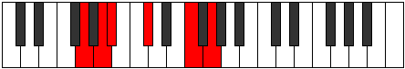

# Mode Stothitonic

## Links

- [Documentation](README.md)
- [Scales Index](Scales.md)
- [Modes Index](Modes.md)
- [Chords Index](Chords.md)

## Parent Scale

[Aerynitonic](ScaleAerynitonic.md)

## Number

[1101](https://ianring.com/musictheory/scales/1101)

## Transposition

2, 1, 3, 4, 2

## Chord Pattern

V⁺

## Perfection

- 1 Perfect notes
- 4 Perfect notes

## Perfection Profile

false, false, true, false, false

## Permutations

| Tonic | Notes | Signature | Illustration | Audio |
|-------|-------|-----------|--------------|-------|
| [C](ModeCNaturalStothitonic.md) | **C**, **D**, D#, **F#**, **A#**, **C** | C |  | [midi](https://github.com/edipermadi/music/blob/main/docs/ModeCNaturalStothitonic.mid?raw=true) |
| [C#](ModeCSharpStothitonic.md) | **C#**, **D#**, E, **G**, **B**, **C#** | C |  | [midi](https://github.com/edipermadi/music/blob/main/docs/ModeCSharpStothitonic.mid?raw=true) |
| [Db](ModeDFlatStothitonic.md) | **Db**, **Eb**, E, **G**, **B**, **Db** | C |  | [midi](https://github.com/edipermadi/music/blob/main/docs/ModeDFlatStothitonic.mid?raw=true) |
| [D](ModeDNaturalStothitonic.md) | **D**, **E**, F, **G#**, **C**, **D** | C |  | [midi](https://github.com/edipermadi/music/blob/main/docs/ModeDNaturalStothitonic.mid?raw=true) |
| [D#](ModeDSharpStothitonic.md) | **D#**, **F**, F#, **A**, **C#**, **D#** | C |  | [midi](https://github.com/edipermadi/music/blob/main/docs/ModeDSharpStothitonic.mid?raw=true) |
| [Eb](ModeEFlatStothitonic.md) | **Eb**, **F**, Gb, **A**, **Db**, **Eb** | C |  | [midi](https://github.com/edipermadi/music/blob/main/docs/ModeEFlatStothitonic.mid?raw=true) |
| [E](ModeENaturalStothitonic.md) | **E**, **F#**, G, **A#**, **D**, **E** | C |  | [midi](https://github.com/edipermadi/music/blob/main/docs/ModeENaturalStothitonic.mid?raw=true) |
| [F](ModeFNaturalStothitonic.md) | **F**, **G**, G#, **B**, **D#**, **F** | C |  | [midi](https://github.com/edipermadi/music/blob/main/docs/ModeFNaturalStothitonic.mid?raw=true) |
| [F#](ModeFSharpStothitonic.md) | **F#**, **G#**, A, **C**, **E**, **F#** | C |  | [midi](https://github.com/edipermadi/music/blob/main/docs/ModeFSharpStothitonic.mid?raw=true) |
| [Gb](ModeGFlatStothitonic.md) | **Gb**, **Ab**, A, **C**, **E**, **Gb** | C |  | [midi](https://github.com/edipermadi/music/blob/main/docs/ModeGFlatStothitonic.mid?raw=true) |
| [G](ModeGNaturalStothitonic.md) | **G**, **A**, A#, **C#**, **F**, **G** | C |  | [midi](https://github.com/edipermadi/music/blob/main/docs/ModeGNaturalStothitonic.mid?raw=true) |
| [G#](ModeGSharpStothitonic.md) | **G#**, **A#**, B, **D**, **F#**, **G#** | C |  | [midi](https://github.com/edipermadi/music/blob/main/docs/ModeGSharpStothitonic.mid?raw=true) |
| [Ab](ModeAFlatStothitonic.md) | **Ab**, **Bb**, B, **D**, **Gb**, **Ab** | C |  | [midi](https://github.com/edipermadi/music/blob/main/docs/ModeAFlatStothitonic.mid?raw=true) |
| [A](ModeANaturalStothitonic.md) | **A**, **B**, C, **D#**, **G**, **A** | C |  | [midi](https://github.com/edipermadi/music/blob/main/docs/ModeANaturalStothitonic.mid?raw=true) |
| [A#](ModeASharpStothitonic.md) | **A#**, **C**, C#, **E**, **G#**, **A#** | C |  | [midi](https://github.com/edipermadi/music/blob/main/docs/ModeASharpStothitonic.mid?raw=true) |
| [Bb](ModeBFlatStothitonic.md) | **Bb**, **C**, Db, **E**, **Ab**, **Bb** | C |  | [midi](https://github.com/edipermadi/music/blob/main/docs/ModeBFlatStothitonic.mid?raw=true) |
| [B](ModeBNaturalStothitonic.md) | **B**, **C#**, D, **F**, **A**, **B** | C |  | [midi](https://github.com/edipermadi/music/blob/main/docs/ModeBNaturalStothitonic.mid?raw=true) |
