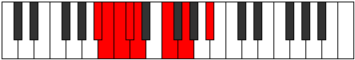

# Mode Stycrian

## Links

- [Documentation](index.md)
- [Scales Index](Scales.md)
- [Modes Index](Modes.md)
- [Chords Index](Chords.md)

## Parent Scale

[Morian](ScaleMorian.md)

## Number

[671](https://ianring.com/musictheory/scales/671)

## Perfection

- 4 Perfect notes
- 3 Perfect notes

## Perfection Profile

[true false true false false true true]

## Permutations

| Tonic | Notes | Signature | Illustration | Audio |
|-------|-------|-----------|--------------|-------|
| [C](ModeCNaturalStycrian.md) | C, **Db**, Ebb, **Fbb**, **Gbbb**, Abb, Bbb, C | C |  | [midi](ModeCNaturalStycrian.mid) [ogg](ModeCNaturalStycrian.ogg) |
| [C#](ModeCSharpStycrian.md) | C#, **D**, Eb, **Fb**, **Gbb**, Ab, Bb, C# | C |  | [midi](ModeCSharpStycrian.mid) [ogg](ModeCSharpStycrian.ogg) |
| [Db](ModeDFlatStycrian.md) | Db, **Ebb**, Fbb, **Gbbb**, **D###**, F###, G###, Db | C |  | [midi](ModeDFlatStycrian.mid) [ogg](ModeDFlatStycrian.ogg) |
| [D](ModeDNaturalStycrian.md) | D, **Eb**, Fb, **Gbb**, **Abbb**, Bbb, Cb, D | C |  | [midi](ModeDNaturalStycrian.mid) [ogg](ModeDNaturalStycrian.ogg) |
| [D#](ModeDSharpStycrian.md) | D#, **E**, F, **Gb**, **Abb**, Bb, C, D# | C |  | [midi](ModeDSharpStycrian.mid) [ogg](ModeDSharpStycrian.ogg) |
| [Eb](ModeEFlatStycrian.md) | Eb, **Fb**, Gbb, **Abbb**, **E###**, Cbb, Dbb, Eb | C |  | [midi](ModeEFlatStycrian.mid) [ogg](ModeEFlatStycrian.ogg) |
| [E](ModeENaturalStycrian.md) | E, **F**, Gb, **Abb**, **Bbbb**, Cb, Db, E | C |  | [midi](ModeENaturalStycrian.mid) [ogg](ModeENaturalStycrian.ogg) |
| [F](ModeFNaturalStycrian.md) | F, **Gb**, Abb, **Bbbb**, **Cbbb**, Dbb, Ebb, F | C |  | [midi](ModeFNaturalStycrian.mid) [ogg](ModeFNaturalStycrian.ogg) |
| [F#](ModeFSharpStycrian.md) | F#, **G**, Ab, **Bbb**, **Cbb**, Db, Eb, F# | C |  | [midi](ModeFSharpStycrian.mid) [ogg](ModeFSharpStycrian.ogg) |
| [Gb](ModeGFlatStycrian.md) | Gb, **Abb**, Bbbb, **Cbbb**, **Cbb**, Db, Eb, Gb | C |  | [midi](ModeGFlatStycrian.mid) [ogg](ModeGFlatStycrian.ogg) |
| [G](ModeGNaturalStycrian.md) | G, **Ab**, Bbb, **Cbb**, **Dbbb**, Ebb, Fb, G | C |  | [midi](ModeGNaturalStycrian.mid) [ogg](ModeGNaturalStycrian.ogg) |
| [G#](ModeGSharpStycrian.md) | G#, **A**, Bb, **Cb**, **Dbb**, Eb, F, G# | C |  | [midi](ModeGSharpStycrian.mid) [ogg](ModeGSharpStycrian.ogg) |
| [Ab](ModeAFlatStycrian.md) | Ab, **Bbb**, Cbb, **Dbbb**, **Dbb**, Eb, F, Ab | C |  | [midi](ModeAFlatStycrian.mid) [ogg](ModeAFlatStycrian.ogg) |
| [A](ModeANaturalStycrian.md) | A, **Bb**, Cb, **Dbb**, **Ebbb**, Fb, Gb, A | C |  | [midi](ModeANaturalStycrian.mid) [ogg](ModeANaturalStycrian.ogg) |
| [A#](ModeASharpStycrian.md) | A#, **B**, C, **Db**, **Ebb**, F, G, A# | C |  | [midi](ModeASharpStycrian.mid) [ogg](ModeASharpStycrian.ogg) |
| [Bb](ModeBFlatStycrian.md) | Bb, **Cb**, Dbb, **Ebbb**, **Fbbb**, Gbb, Abb, Bb | C |  | [midi](ModeBFlatStycrian.mid) [ogg](ModeBFlatStycrian.ogg) |
| [B](ModeBNaturalStycrian.md) | B, **C**, Db, **Ebb**, **Fbb**, Gb, Ab, B | C |  | [midi](ModeBNaturalStycrian.mid) [ogg](ModeBNaturalStycrian.ogg) |
