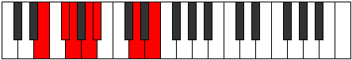
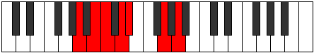

# Mode Stycrimic

## Links

- [Documentation](README.md)
- [Scales Index](Scales.md)
- [Modes Index](Modes.md)
- [Chords Index](Chords.md)

## Parent Scale

[Rycrimic](ScaleRycrimic.md)

## Number

[1133](https://ianring.com/musictheory/scales/1133)

## Luminosity

3

## Transposition

2, 1, 2, 1, 4, 2

## Chord Pattern

i⁰, VI

## Perfection

- 3 Perfect notes
- 3 Perfect notes

## Perfection Profile

false, false, true, true, false, true

## Permutations

| Tonic | Notes | Signature | Illustration | Audio |
|-------|-------|-----------|--------------|-------|
| [C](ModeCNaturalStycrimic.md) | **C**, **D**, Eb, F, **Gb**, A#, **C** | C |  | [midi](https://github.com/edipermadi/music/blob/main/docs/ModeCNaturalStycrimic.mid?raw=true) |
| [C#](ModeCSharpStycrimic.md) | **C#**, **D#**, E, F#, **G**, A##, **C#** | C |  | [midi](https://github.com/edipermadi/music/blob/main/docs/ModeCSharpStycrimic.mid?raw=true) |
| [Db](ModeDFlatStycrimic.md) | **Db**, **Eb**, Fb, Gb, **Abb**, B, **Db** | C |  | [midi](https://github.com/edipermadi/music/blob/main/docs/ModeDFlatStycrimic.mid?raw=true) |
| [D](ModeDNaturalStycrimic.md) | **D**, **E**, F, G, **Ab**, B#, **D** | C |  | [midi](https://github.com/edipermadi/music/blob/main/docs/ModeDNaturalStycrimic.mid?raw=true) |
| [D#](ModeDSharpStycrimic.md) | **D#**, **E#**, F#, G#, **A**, B##, **D#** | C |  | [midi](https://github.com/edipermadi/music/blob/main/docs/ModeDSharpStycrimic.mid?raw=true) |
| [Eb](ModeEFlatStycrimic.md) | **Eb**, **F**, Gb, Ab, **Bbb**, C#, **Eb** | C |  | [midi](https://github.com/edipermadi/music/blob/main/docs/ModeEFlatStycrimic.mid?raw=true) |
| [E](ModeENaturalStycrimic.md) | **E**, **F#**, G, A, **Bb**, C##, **E** | C |  | [midi](https://github.com/edipermadi/music/blob/main/docs/ModeENaturalStycrimic.mid?raw=true) |
| [F](ModeFNaturalStycrimic.md) | **F**, **G**, Ab, Bb, **Cb**, D#, **F** | C |  | [midi](https://github.com/edipermadi/music/blob/main/docs/ModeFNaturalStycrimic.mid?raw=true) |
| [F#](ModeFSharpStycrimic.md) | **F#**, **G#**, A, B, **C**, D##, **F#** | C |  | [midi](https://github.com/edipermadi/music/blob/main/docs/ModeFSharpStycrimic.mid?raw=true) |
| [Gb](ModeGFlatStycrimic.md) | **Gb**, **Ab**, Bbb, Cb, **Dbb**, E, **Gb** | C |  | [midi](https://github.com/edipermadi/music/blob/main/docs/ModeGFlatStycrimic.mid?raw=true) |
| [G](ModeGNaturalStycrimic.md) | **G**, **A**, Bb, C, **Db**, E#, **G** | C |  | [midi](https://github.com/edipermadi/music/blob/main/docs/ModeGNaturalStycrimic.mid?raw=true) |
| [G#](ModeGSharpStycrimic.md) | **G#**, **A#**, B, C#, **D**, E##, **G#** | C |  | [midi](https://github.com/edipermadi/music/blob/main/docs/ModeGSharpStycrimic.mid?raw=true) |
| [Ab](ModeAFlatStycrimic.md) | **Ab**, **Bb**, Cb, Db, **Ebb**, F#, **Ab** | C |  | [midi](https://github.com/edipermadi/music/blob/main/docs/ModeAFlatStycrimic.mid?raw=true) |
| [A](ModeANaturalStycrimic.md) | **A**, **B**, C, D, **Eb**, F##, **A** | C |  | [midi](https://github.com/edipermadi/music/blob/main/docs/ModeANaturalStycrimic.mid?raw=true) |
| [A#](ModeASharpStycrimic.md) | **A#**, **B#**, C#, D#, **E**, F###, **A#** | C |  | [midi](https://github.com/edipermadi/music/blob/main/docs/ModeASharpStycrimic.mid?raw=true) |
| [Bb](ModeBFlatStycrimic.md) | **Bb**, **C**, Db, Eb, **Fb**, G#, **Bb** | C |  | [midi](https://github.com/edipermadi/music/blob/main/docs/ModeBFlatStycrimic.mid?raw=true) |
| [B](ModeBNaturalStycrimic.md) | **B**, **C#**, D, E, **F**, G##, **B** | C |  | [midi](https://github.com/edipermadi/music/blob/main/docs/ModeBNaturalStycrimic.mid?raw=true) |
