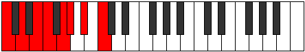
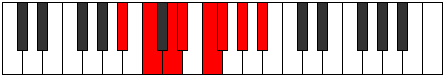

# Mode Stydian

## Links

- [Documentation](index.md)
- [Scales Index](Scales.md)
- [Modes Index](Modes.md)
- [Chords Index](Chords.md)

## Parent Scale

[Larian](ScaleLarian.md)

## Number

[1461](https://ianring.com/musictheory/scales/1461)

## Perfection

- 4 Perfect notes
- 3 Perfect notes

## Perfection Profile

[true false false true true false true]

## Permutations

| Tonic | Notes | Signature | Illustration | Audio |
|-------|-------|-----------|--------------|-------|
| [C](ModeCNaturalStydian.md) | C, **D**, **E**, F, G, **Ab**, Bb, C | C |  | [midi](ModeCNaturalStydian.mid) [ogg](ModeCNaturalStydian.ogg) |
| [C#](ModeCSharpStydian.md) | C#, **D#**, **E#**, F#, G#, **A**, B, C# | C |  | [midi](ModeCSharpStydian.mid) [ogg](ModeCSharpStydian.ogg) |
| [Db](ModeDFlatStydian.md) | Db, **Eb**, **F**, Gb, Ab, **Bbb**, Cb, Db | C |  | [midi](ModeDFlatStydian.mid) [ogg](ModeDFlatStydian.ogg) |
| [D](ModeDNaturalStydian.md) | D, **E**, **F#**, G, A, **Bb**, C, D | C |  | [midi](ModeDNaturalStydian.mid) [ogg](ModeDNaturalStydian.ogg) |
| [D#](ModeDSharpStydian.md) | D#, **E#**, **F##**, G#, A#, **B**, C#, D# | C |  | [midi](ModeDSharpStydian.mid) [ogg](ModeDSharpStydian.ogg) |
| [Eb](ModeEFlatStydian.md) | Eb, **F**, **G**, Ab, Bb, **Cb**, Db, Eb | C |  | [midi](ModeEFlatStydian.mid) [ogg](ModeEFlatStydian.ogg) |
| [E](ModeENaturalStydian.md) | E, **F#**, **G#**, A, B, **C**, D, E | C |  | [midi](ModeENaturalStydian.mid) [ogg](ModeENaturalStydian.ogg) |
| [F](ModeFNaturalStydian.md) | F, **G**, **A**, Bb, C, **Db**, Eb, F | C |  | [midi](ModeFNaturalStydian.mid) [ogg](ModeFNaturalStydian.ogg) |
| [F#](ModeFSharpStydian.md) | F#, **G#**, **A#**, B, C#, **D**, E, F# | C |  | [midi](ModeFSharpStydian.mid) [ogg](ModeFSharpStydian.ogg) |
| [Gb](ModeGFlatStydian.md) | Gb, **Ab**, **Bb**, Cb, Db, **Ebb**, Fb, Gb | C |  | [midi](ModeGFlatStydian.mid) [ogg](ModeGFlatStydian.ogg) |
| [G](ModeGNaturalStydian.md) | G, **A**, **B**, C, D, **Eb**, F, G | C |  | [midi](ModeGNaturalStydian.mid) [ogg](ModeGNaturalStydian.ogg) |
| [G#](ModeGSharpStydian.md) | G#, **A#**, **B#**, C#, D#, **E**, F#, G# | C |  | [midi](ModeGSharpStydian.mid) [ogg](ModeGSharpStydian.ogg) |
| [Ab](ModeAFlatStydian.md) | Ab, **Bb**, **C**, Db, Eb, **Fb**, Gb, Ab | C |  | [midi](ModeAFlatStydian.mid) [ogg](ModeAFlatStydian.ogg) |
| [A](ModeANaturalStydian.md) | A, **B**, **C#**, D, E, **F**, G, A | C |  | [midi](ModeANaturalStydian.mid) [ogg](ModeANaturalStydian.ogg) |
| [A#](ModeASharpStydian.md) | A#, **B#**, **C##**, D#, E#, **F#**, G#, A# | C |  | [midi](ModeASharpStydian.mid) [ogg](ModeASharpStydian.ogg) |
| [Bb](ModeBFlatStydian.md) | Bb, **C**, **D**, Eb, F, **Gb**, Ab, Bb | C |  | [midi](ModeBFlatStydian.mid) [ogg](ModeBFlatStydian.ogg) |
| [B](ModeBNaturalStydian.md) | B, **C#**, **D#**, E, F#, **G**, A, B | C |  | [midi](ModeBNaturalStydian.mid) [ogg](ModeBNaturalStydian.ogg) |
