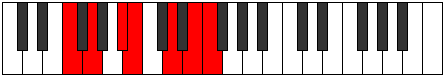
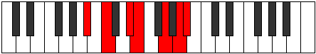

# Mode Stydimic

## Links

- [Documentation](index.md)
- [Scales Index](Scales.md)
- [Modes Index](Modes.md)
- [Chords Index](Chords.md)

## Parent Scale

[Zacrimic](ScaleZacrimic.md)

## Number

[2661](https://ianring.com/musictheory/scales/2661)

## Interval Pattern

2, 3, 1, 3, 2, 1

## Chord Pattern

III, vi

## Perfection

- 3 Perfect notes
- 3 Perfect notes

## Perfection Profile

[false true true false false true]

## Permutations

| Tonic | Notes | Signature | Illustration | Audio |
|-------|-------|-----------|--------------|-------|
| [C](ModeCNaturalStydimic.md) | **C**, D, E#, **F#**, **G##**, A##, **C** | C |  | [midi](https://github.com/edipermadi/music/blob/main/docs/ModeCNaturalStydimic.mid?raw=true) |
| [C#](ModeCSharpStydimic.md) | **C#**, D#, E##, **F##**, **G###**, A###, **C#** | C |  | [midi](https://github.com/edipermadi/music/blob/main/docs/ModeCSharpStydimic.mid?raw=true) |
| [Db](ModeDFlatStydimic.md) | **Db**, Eb, F#, **G**, **A#**, B#, **Db** | C |  | [midi](https://github.com/edipermadi/music/blob/main/docs/ModeDFlatStydimic.mid?raw=true) |
| [D](ModeDNaturalStydimic.md) | **D**, E, F##, **G#**, **A##**, B##, **D** | C |  | [midi](https://github.com/edipermadi/music/blob/main/docs/ModeDNaturalStydimic.mid?raw=true) |
| [D#](ModeDSharpStydimic.md) | **D#**, E#, F###, **G##**, **A###**, B###, **D#** | C |  | [midi](https://github.com/edipermadi/music/blob/main/docs/ModeDSharpStydimic.mid?raw=true) |
| [Eb](ModeEFlatStydimic.md) | **Eb**, F, G#, **A**, **B#**, C##, **Eb** | C |  | [midi](https://github.com/edipermadi/music/blob/main/docs/ModeEFlatStydimic.mid?raw=true) |
| [E](ModeENaturalStydimic.md) | **E**, F#, G##, **A#**, **B##**, C###, **E** | C |  | [midi](https://github.com/edipermadi/music/blob/main/docs/ModeENaturalStydimic.mid?raw=true) |
| [F](ModeFNaturalStydimic.md) | **F**, G, A#, **B**, **C##**, D##, **F** | C |  | [midi](https://github.com/edipermadi/music/blob/main/docs/ModeFNaturalStydimic.mid?raw=true) |
| [F#](ModeFSharpStydimic.md) | **F#**, G#, A##, **B#**, **C###**, D###, **F#** | C |  | [midi](https://github.com/edipermadi/music/blob/main/docs/ModeFSharpStydimic.mid?raw=true) |
| [Gb](ModeGFlatStydimic.md) | **Gb**, Ab, B, **C**, **D#**, E#, **Gb** | C |  | [midi](https://github.com/edipermadi/music/blob/main/docs/ModeGFlatStydimic.mid?raw=true) |
| [G](ModeGNaturalStydimic.md) | **G**, A, B#, **C#**, **D##**, E##, **G** | C |  | [midi](https://github.com/edipermadi/music/blob/main/docs/ModeGNaturalStydimic.mid?raw=true) |
| [G#](ModeGSharpStydimic.md) | **G#**, A#, B##, **C##**, **D###**, E###, **G#** | C |  | [midi](https://github.com/edipermadi/music/blob/main/docs/ModeGSharpStydimic.mid?raw=true) |
| [Ab](ModeAFlatStydimic.md) | **Ab**, Bb, C#, **D**, **E#**, F##, **Ab** | C |  | [midi](https://github.com/edipermadi/music/blob/main/docs/ModeAFlatStydimic.mid?raw=true) |
| [A](ModeANaturalStydimic.md) | **A**, B, C##, **D#**, **E##**, F###, **A** | C |  | [midi](https://github.com/edipermadi/music/blob/main/docs/ModeANaturalStydimic.mid?raw=true) |
| [A#](ModeASharpStydimic.md) | **A#**, B#, C###, **D##**, **E###**, Cbbb, **A#** | C |  | [midi](https://github.com/edipermadi/music/blob/main/docs/ModeASharpStydimic.mid?raw=true) |
| [Bb](ModeBFlatStydimic.md) | **Bb**, C, D#, **E**, **F##**, G##, **Bb** | C |  | [midi](https://github.com/edipermadi/music/blob/main/docs/ModeBFlatStydimic.mid?raw=true) |
| [B](ModeBNaturalStydimic.md) | **B**, C#, D##, **E#**, **F###**, G###, **B** | C |  | [midi](https://github.com/edipermadi/music/blob/main/docs/ModeBNaturalStydimic.mid?raw=true) |
