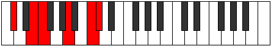
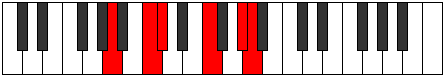

# Mode Styditonic

## Links

- [Documentation](README.md)
- [Scales Index](Scales.md)
- [Modes Index](Modes.md)
- [Chords Index](Chords.md)

## Parent Scale

[Zacritonic](ScaleZacritonic.md)

## Number

[2329](https://ianring.com/musictheory/scales/2329)

## Interval Pattern

3, 1, 4, 3, 1

## Chord Pattern

IV⁺

## Perfection

- 2 Perfect notes
- 3 Perfect notes

## Perfection Profile

[false false true true false]

## Permutations

| Tonic | Notes | Signature | Illustration | Audio |
|-------|-------|-----------|--------------|-------|
| [C](ModeCNaturalStyditonic.md) | **C**, **D#**, E, G#, **B**, **C** | C |  | [midi](https://github.com/edipermadi/music/blob/main/docs/ModeCNaturalStyditonic.mid?raw=true) |
| [C#](ModeCSharpStyditonic.md) | **C#**, **E**, F, A, **C**, **C#** | C |  | [midi](https://github.com/edipermadi/music/blob/main/docs/ModeCSharpStyditonic.mid?raw=true) |
| [Db](ModeDFlatStyditonic.md) | **Db**, **E**, F, A, **C**, **Db** | C |  | [midi](https://github.com/edipermadi/music/blob/main/docs/ModeDFlatStyditonic.mid?raw=true) |
| [D](ModeDNaturalStyditonic.md) | **D**, **F**, F#, A#, **C#**, **D** | C |  | [midi](https://github.com/edipermadi/music/blob/main/docs/ModeDNaturalStyditonic.mid?raw=true) |
| [D#](ModeDSharpStyditonic.md) | **D#**, **F#**, G, B, **D**, **D#** | C |  | [midi](https://github.com/edipermadi/music/blob/main/docs/ModeDSharpStyditonic.mid?raw=true) |
| [Eb](ModeEFlatStyditonic.md) | **Eb**, **Gb**, G, B, **D**, **Eb** | C |  | [midi](https://github.com/edipermadi/music/blob/main/docs/ModeEFlatStyditonic.mid?raw=true) |
| [E](ModeENaturalStyditonic.md) | **E**, **G**, G#, C, **D#**, **E** | C |  | [midi](https://github.com/edipermadi/music/blob/main/docs/ModeENaturalStyditonic.mid?raw=true) |
| [F](ModeFNaturalStyditonic.md) | **F**, **G#**, A, C#, **E**, **F** | C |  | [midi](https://github.com/edipermadi/music/blob/main/docs/ModeFNaturalStyditonic.mid?raw=true) |
| [F#](ModeFSharpStyditonic.md) | **F#**, **A**, A#, D, **F**, **F#** | C |  | [midi](https://github.com/edipermadi/music/blob/main/docs/ModeFSharpStyditonic.mid?raw=true) |
| [Gb](ModeGFlatStyditonic.md) | **Gb**, **A**, Bb, D, **F**, **Gb** | C |  | [midi](https://github.com/edipermadi/music/blob/main/docs/ModeGFlatStyditonic.mid?raw=true) |
| [G](ModeGNaturalStyditonic.md) | **G**, **A#**, B, D#, **F#**, **G** | C |  | [midi](https://github.com/edipermadi/music/blob/main/docs/ModeGNaturalStyditonic.mid?raw=true) |
| [G#](ModeGSharpStyditonic.md) | **G#**, **B**, C, E, **G**, **G#** | C |  | [midi](https://github.com/edipermadi/music/blob/main/docs/ModeGSharpStyditonic.mid?raw=true) |
| [Ab](ModeAFlatStyditonic.md) | **Ab**, **B**, C, E, **G**, **Ab** | C |  | [midi](https://github.com/edipermadi/music/blob/main/docs/ModeAFlatStyditonic.mid?raw=true) |
| [A](ModeANaturalStyditonic.md) | **A**, **C**, C#, F, **G#**, **A** | C |  | [midi](https://github.com/edipermadi/music/blob/main/docs/ModeANaturalStyditonic.mid?raw=true) |
| [A#](ModeASharpStyditonic.md) | **A#**, **C#**, D, F#, **A**, **A#** | C |  | [midi](https://github.com/edipermadi/music/blob/main/docs/ModeASharpStyditonic.mid?raw=true) |
| [Bb](ModeBFlatStyditonic.md) | **Bb**, **Db**, D, Gb, **A**, **Bb** | C |  | [midi](https://github.com/edipermadi/music/blob/main/docs/ModeBFlatStyditonic.mid?raw=true) |
| [B](ModeBNaturalStyditonic.md) | **B**, **D**, D#, G, **A#**, **B** | C |  | [midi](https://github.com/edipermadi/music/blob/main/docs/ModeBNaturalStyditonic.mid?raw=true) |
