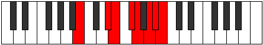

# Mode Stygian

## Links

- [Documentation](index.md)
- [Scales Index](Scales.md)
- [Modes Index](Modes.md)
- [Chords Index](Chords.md)

## Parent Scale

[Stygian](ScaleStygian.md)

## Number

[3505](https://ianring.com/musictheory/scales/3505)

## Perfection

- 4 Perfect notes
- 3 Perfect notes

## Perfection Profile

[true true true false false true false]

## Permutations

| Tonic | Notes | Signature | Illustration | Audio |
|-------|-------|-----------|--------------|-------|
| [C](ModeCNaturalStygian.md) | C, D##, E#, **F##**, **G#**, A#, **B**, C | C |  | [midi](ModeCNaturalStygian.mid) [ogg](ModeCNaturalStygian.ogg) |
| [C#](ModeCSharpStygian.md) | C#, D###, E##, **F###**, **G##**, A##, **B#**, C# | C |  | [midi](ModeCSharpStygian.mid) [ogg](ModeCSharpStygian.ogg) |
| [Db](ModeDFlatStygian.md) | Db, E#, F#, **G#**, **A**, B, **C**, Db | C |  | [midi](ModeDFlatStygian.mid) [ogg](ModeDFlatStygian.ogg) |
| [D](ModeDNaturalStygian.md) | D, E##, F##, **G##**, **A#**, B#, **C#**, D | C |  | [midi](ModeDNaturalStygian.mid) [ogg](ModeDNaturalStygian.ogg) |
| [D#](ModeDSharpStygian.md) | D#, E###, F###, **G###**, **A##**, B##, **C##**, D# | C |  | [midi](ModeDSharpStygian.mid) [ogg](ModeDSharpStygian.ogg) |
| [Eb](ModeEFlatStygian.md) | Eb, F##, G#, **A#**, **B**, C#, **D**, Eb | C |  | [midi](ModeEFlatStygian.mid) [ogg](ModeEFlatStygian.ogg) |
| [E](ModeENaturalStygian.md) | E, F###, G##, **A##**, **B#**, C##, **D#**, E | C |  | [midi](ModeENaturalStygian.mid) [ogg](ModeENaturalStygian.ogg) |
| [F](ModeFNaturalStygian.md) | F, G##, A#, **B#**, **C#**, D#, **E**, F | C |  | [midi](ModeFNaturalStygian.mid) [ogg](ModeFNaturalStygian.ogg) |
| [F#](ModeFSharpStygian.md) | F#, G###, A##, **B##**, **C##**, D##, **E#**, F# | C |  | [midi](ModeFSharpStygian.mid) [ogg](ModeFSharpStygian.ogg) |
| [Gb](ModeGFlatStygian.md) | Gb, A#, B, **C#**, **D**, E, **F**, Gb | C |  | [midi](ModeGFlatStygian.mid) [ogg](ModeGFlatStygian.ogg) |
| [G](ModeGNaturalStygian.md) | G, A##, B#, **C##**, **D#**, E#, **F#**, G | C |  | [midi](ModeGNaturalStygian.mid) [ogg](ModeGNaturalStygian.ogg) |
| [G#](ModeGSharpStygian.md) | G#, A###, B##, **C###**, **D##**, E##, **F##**, G# | C |  | [midi](ModeGSharpStygian.mid) [ogg](ModeGSharpStygian.ogg) |
| [Ab](ModeAFlatStygian.md) | Ab, B#, C#, **D#**, **E**, F#, **G**, Ab | C |  | [midi](ModeAFlatStygian.mid) [ogg](ModeAFlatStygian.ogg) |
| [A](ModeANaturalStygian.md) | A, B##, C##, **D##**, **E#**, F##, **G#**, A | C |  | [midi](ModeANaturalStygian.mid) [ogg](ModeANaturalStygian.ogg) |
| [A#](ModeASharpStygian.md) | A#, B###, C###, **D###**, **E##**, F###, **G##**, A# | C |  | [midi](ModeASharpStygian.mid) [ogg](ModeASharpStygian.ogg) |
| [Bb](ModeBFlatStygian.md) | Bb, C##, D#, **E#**, **F#**, G#, **A**, Bb | C |  | [midi](ModeBFlatStygian.mid) [ogg](ModeBFlatStygian.ogg) |
| [B](ModeBNaturalStygian.md) | B, C###, D##, **E##**, **F##**, G##, **A#**, B | C |  | [midi](ModeBNaturalStygian.mid) [ogg](ModeBNaturalStygian.ogg) |
