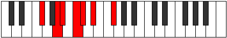

# Mode Stygimic

## Links

- [Documentation](index.md)
- [Scales Index](Scales.md)
- [Modes Index](Modes.md)
- [Chords Index](Chords.md)

## Parent Scale

[Thalimic](ScaleThalimic.md)

## Number

[729](https://ianring.com/musictheory/scales/729)

## Perfection

- 2 Perfect notes
- 4 Perfect notes

## Perfection Profile

[true false false false false true]

## Permutations

| Tonic | Notes | Signature | Illustration | Audio |
|-------|-------|-----------|--------------|-------|
| [C](ModeCNaturalStygimic.md) | C, **D#**, **E**, **F#**, **G**, A, C | C |  | [midi](ModeCNaturalStygimic.mid) [ogg](ModeCNaturalStygimic.ogg) |
| [C#](ModeCSharpStygimic.md) | C#, **D##**, **E#**, **F##**, **G#**, A#, C# | C |  | [midi](ModeCSharpStygimic.mid) [ogg](ModeCSharpStygimic.ogg) |
| [Db](ModeDFlatStygimic.md) | Db, **E**, **F**, **G**, **Ab**, Bb, Db | C |  | [midi](ModeDFlatStygimic.mid) [ogg](ModeDFlatStygimic.ogg) |
| [D](ModeDNaturalStygimic.md) | D, **E#**, **F#**, **G#**, **A**, B, D | C |  | [midi](ModeDNaturalStygimic.mid) [ogg](ModeDNaturalStygimic.ogg) |
| [D#](ModeDSharpStygimic.md) | D#, **E##**, **F##**, **G##**, **A#**, B#, D# | C |  | [midi](ModeDSharpStygimic.mid) [ogg](ModeDSharpStygimic.ogg) |
| [Eb](ModeEFlatStygimic.md) | Eb, **F#**, **G**, **A**, **Bb**, C, Eb | C |  | [midi](ModeEFlatStygimic.mid) [ogg](ModeEFlatStygimic.ogg) |
| [E](ModeENaturalStygimic.md) | E, **F##**, **G#**, **A#**, **B**, C#, E | C |  | [midi](ModeENaturalStygimic.mid) [ogg](ModeENaturalStygimic.ogg) |
| [F](ModeFNaturalStygimic.md) | F, **G#**, **A**, **B**, **C**, D, F | C |  | [midi](ModeFNaturalStygimic.mid) [ogg](ModeFNaturalStygimic.ogg) |
| [F#](ModeFSharpStygimic.md) | F#, **G##**, **A#**, **B#**, **C#**, D#, F# | C |  | [midi](ModeFSharpStygimic.mid) [ogg](ModeFSharpStygimic.ogg) |
| [Gb](ModeGFlatStygimic.md) | Gb, **A**, **Bb**, **C**, **Db**, Eb, Gb | C |  | [midi](ModeGFlatStygimic.mid) [ogg](ModeGFlatStygimic.ogg) |
| [G](ModeGNaturalStygimic.md) | G, **A#**, **B**, **C#**, **D**, E, G | C |  | [midi](ModeGNaturalStygimic.mid) [ogg](ModeGNaturalStygimic.ogg) |
| [G#](ModeGSharpStygimic.md) | G#, **A##**, **B#**, **C##**, **D#**, E#, G# | C |  | [midi](ModeGSharpStygimic.mid) [ogg](ModeGSharpStygimic.ogg) |
| [Ab](ModeAFlatStygimic.md) | Ab, **B**, **C**, **D**, **Eb**, F, Ab | C |  | [midi](ModeAFlatStygimic.mid) [ogg](ModeAFlatStygimic.ogg) |
| [A](ModeANaturalStygimic.md) | A, **B#**, **C#**, **D#**, **E**, F#, A | C |  | [midi](ModeANaturalStygimic.mid) [ogg](ModeANaturalStygimic.ogg) |
| [A#](ModeASharpStygimic.md) | A#, **B##**, **C##**, **D##**, **E#**, F##, A# | C |  | [midi](ModeASharpStygimic.mid) [ogg](ModeASharpStygimic.ogg) |
| [Bb](ModeBFlatStygimic.md) | Bb, **C#**, **D**, **E**, **F**, G, Bb | C |  | [midi](ModeBFlatStygimic.mid) [ogg](ModeBFlatStygimic.ogg) |
| [B](ModeBNaturalStygimic.md) | B, **C##**, **D#**, **E#**, **F#**, G#, B | C |  | [midi](ModeBNaturalStygimic.mid) [ogg](ModeBNaturalStygimic.ogg) |
