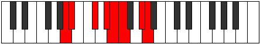

# Mode Stylian

## Links

- [Documentation](README.md)
- [Scales Index](Scales.md)
- [Modes Index](Modes.md)
- [Chords Index](Chords.md)

## Parent Scale

[Epathian](ScaleEpathian.md)

## Number

[2515](https://ianring.com/musictheory/scales/2515)

## Interval Pattern

1, 3, 2, 1, 1, 3, 1

## Chord Pattern

I, iii, iv⁰b3, Vb5, VI⁺

## Perfection

- 5 Perfect notes
- 2 Perfect notes

## Perfection Profile

[true true true true false false true]

## Permutations

| Tonic | Notes | Signature | Illustration | Audio |
|-------|-------|-----------|--------------|-------|
| [C](ModeCNaturalStylian.md) | C, Db, E, F#, **G**, **Ab**, B, C | C |  | [midi](https://github.com/edipermadi/music/blob/main/docs/ModeCNaturalStylian.mid?raw=true) |
| [C#](ModeCSharpStylian.md) | C#, D, E#, F##, **G#**, **A**, B#, C# | C |  | [midi](https://github.com/edipermadi/music/blob/main/docs/ModeCSharpStylian.mid?raw=true) |
| [Db](ModeDFlatStylian.md) | Db, Ebb, F, G, **Ab**, **Bbb**, C, Db | C |  | [midi](https://github.com/edipermadi/music/blob/main/docs/ModeDFlatStylian.mid?raw=true) |
| [D](ModeDNaturalStylian.md) | D, Eb, F#, G#, **A**, **Bb**, C#, D | C |  | [midi](https://github.com/edipermadi/music/blob/main/docs/ModeDNaturalStylian.mid?raw=true) |
| [D#](ModeDSharpStylian.md) | D#, E, F##, G##, **A#**, **B**, C##, D# | C |  | [midi](https://github.com/edipermadi/music/blob/main/docs/ModeDSharpStylian.mid?raw=true) |
| [Eb](ModeEFlatStylian.md) | Eb, Fb, G, A, **Bb**, **Cb**, D, Eb | C |  | [midi](https://github.com/edipermadi/music/blob/main/docs/ModeEFlatStylian.mid?raw=true) |
| [E](ModeENaturalStylian.md) | E, F, G#, A#, **B**, **C**, D#, E | C |  | [midi](https://github.com/edipermadi/music/blob/main/docs/ModeENaturalStylian.mid?raw=true) |
| [F](ModeFNaturalStylian.md) | F, Gb, A, B, **C**, **Db**, E, F | C |  | [midi](https://github.com/edipermadi/music/blob/main/docs/ModeFNaturalStylian.mid?raw=true) |
| [F#](ModeFSharpStylian.md) | F#, G, A#, B#, **C#**, **D**, E#, F# | C |  | [midi](https://github.com/edipermadi/music/blob/main/docs/ModeFSharpStylian.mid?raw=true) |
| [Gb](ModeGFlatStylian.md) | Gb, Abb, Bb, C, **Db**, **Ebb**, F, Gb | C |  | [midi](https://github.com/edipermadi/music/blob/main/docs/ModeGFlatStylian.mid?raw=true) |
| [G](ModeGNaturalStylian.md) | G, Ab, B, C#, **D**, **Eb**, F#, G | C |  | [midi](https://github.com/edipermadi/music/blob/main/docs/ModeGNaturalStylian.mid?raw=true) |
| [G#](ModeGSharpStylian.md) | G#, A, B#, C##, **D#**, **E**, F##, G# | C |  | [midi](https://github.com/edipermadi/music/blob/main/docs/ModeGSharpStylian.mid?raw=true) |
| [Ab](ModeAFlatStylian.md) | Ab, Bbb, C, D, **Eb**, **Fb**, G, Ab | C |  | [midi](https://github.com/edipermadi/music/blob/main/docs/ModeAFlatStylian.mid?raw=true) |
| [A](ModeANaturalStylian.md) | A, Bb, C#, D#, **E**, **F**, G#, A | C |  | [midi](https://github.com/edipermadi/music/blob/main/docs/ModeANaturalStylian.mid?raw=true) |
| [A#](ModeASharpStylian.md) | A#, B, C##, D##, **E#**, **F#**, G##, A# | C |  | [midi](https://github.com/edipermadi/music/blob/main/docs/ModeASharpStylian.mid?raw=true) |
| [Bb](ModeBFlatStylian.md) | Bb, Cb, D, E, **F**, **Gb**, A, Bb | C |  | [midi](https://github.com/edipermadi/music/blob/main/docs/ModeBFlatStylian.mid?raw=true) |
| [B](ModeBNaturalStylian.md) | B, C, D#, E#, **F#**, **G**, A#, B | C |  | [midi](https://github.com/edipermadi/music/blob/main/docs/ModeBNaturalStylian.mid?raw=true) |
