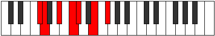

# Mode Stylimic

## Links

- [Documentation](README.md)
- [Scales Index](Scales.md)
- [Modes Index](Modes.md)
- [Chords Index](Chords.md)

## Parent Scale

[Aeradimic](ScaleAeradimic.md)

## Number

[1235](https://ianring.com/musictheory/scales/1235)

## Interval Pattern

1, 3, 2, 1, 3, 2

## Chord Pattern

I, IV

## Perfection

- 2 Perfect notes
- 4 Perfect notes

## Perfection Profile

[true false false true false false]

## Permutations

| Tonic | Notes | Signature | Illustration | Audio |
|-------|-------|-----------|--------------|-------|
| [C](ModeCNaturalStylimic.md) | C, **Db**, **E**, F#, **G**, **A#**, C | C |  | [midi](https://github.com/edipermadi/music/blob/main/docs/ModeCNaturalStylimic.mid?raw=true) |
| [C#](ModeCSharpStylimic.md) | C#, **D**, **E#**, F##, **G#**, **A##**, C# | C |  | [midi](https://github.com/edipermadi/music/blob/main/docs/ModeCSharpStylimic.mid?raw=true) |
| [Db](ModeDFlatStylimic.md) | Db, **Ebb**, **F**, G, **Ab**, **B**, Db | C |  | [midi](https://github.com/edipermadi/music/blob/main/docs/ModeDFlatStylimic.mid?raw=true) |
| [D](ModeDNaturalStylimic.md) | D, **Eb**, **F#**, G#, **A**, **B#**, D | C |  | [midi](https://github.com/edipermadi/music/blob/main/docs/ModeDNaturalStylimic.mid?raw=true) |
| [D#](ModeDSharpStylimic.md) | D#, **E**, **F##**, G##, **A#**, **B##**, D# | C |  | [midi](https://github.com/edipermadi/music/blob/main/docs/ModeDSharpStylimic.mid?raw=true) |
| [Eb](ModeEFlatStylimic.md) | Eb, **Fb**, **G**, A, **Bb**, **C#**, Eb | C |  | [midi](https://github.com/edipermadi/music/blob/main/docs/ModeEFlatStylimic.mid?raw=true) |
| [E](ModeENaturalStylimic.md) | E, **F**, **G#**, A#, **B**, **C##**, E | C |  | [midi](https://github.com/edipermadi/music/blob/main/docs/ModeENaturalStylimic.mid?raw=true) |
| [F](ModeFNaturalStylimic.md) | F, **Gb**, **A**, B, **C**, **D#**, F | C |  | [midi](https://github.com/edipermadi/music/blob/main/docs/ModeFNaturalStylimic.mid?raw=true) |
| [F#](ModeFSharpStylimic.md) | F#, **G**, **A#**, B#, **C#**, **D##**, F# | C |  | [midi](https://github.com/edipermadi/music/blob/main/docs/ModeFSharpStylimic.mid?raw=true) |
| [Gb](ModeGFlatStylimic.md) | Gb, **Abb**, **Bb**, C, **Db**, **E**, Gb | C |  | [midi](https://github.com/edipermadi/music/blob/main/docs/ModeGFlatStylimic.mid?raw=true) |
| [G](ModeGNaturalStylimic.md) | G, **Ab**, **B**, C#, **D**, **E#**, G | C |  | [midi](https://github.com/edipermadi/music/blob/main/docs/ModeGNaturalStylimic.mid?raw=true) |
| [G#](ModeGSharpStylimic.md) | G#, **A**, **B#**, C##, **D#**, **E##**, G# | C |  | [midi](https://github.com/edipermadi/music/blob/main/docs/ModeGSharpStylimic.mid?raw=true) |
| [Ab](ModeAFlatStylimic.md) | Ab, **Bbb**, **C**, D, **Eb**, **F#**, Ab | C |  | [midi](https://github.com/edipermadi/music/blob/main/docs/ModeAFlatStylimic.mid?raw=true) |
| [A](ModeANaturalStylimic.md) | A, **Bb**, **C#**, D#, **E**, **F##**, A | C |  | [midi](https://github.com/edipermadi/music/blob/main/docs/ModeANaturalStylimic.mid?raw=true) |
| [A#](ModeASharpStylimic.md) | A#, **B**, **C##**, D##, **E#**, **F###**, A# | C |  | [midi](https://github.com/edipermadi/music/blob/main/docs/ModeASharpStylimic.mid?raw=true) |
| [Bb](ModeBFlatStylimic.md) | Bb, **Cb**, **D**, E, **F**, **G#**, Bb | C |  | [midi](https://github.com/edipermadi/music/blob/main/docs/ModeBFlatStylimic.mid?raw=true) |
| [B](ModeBNaturalStylimic.md) | B, **C**, **D#**, E#, **F#**, **G##**, B | C |  | [midi](https://github.com/edipermadi/music/blob/main/docs/ModeBNaturalStylimic.mid?raw=true) |
