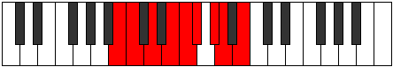

# Mode Stylyllic

## Links

- [Documentation](index.md)
- [Scales Index](Scales.md)
- [Modes Index](Modes.md)
- [Chords Index](Chords.md)

## Parent Scale

[Dalyllic](ScaleDalyllic.md)

## Number

[1771](https://ianring.com/musictheory/scales/1771)

## Perfection

- 5 Perfect notes
- 3 Perfect notes

## Perfection Profile

[true false true true true false false true]

## Permutations

| Tonic | Notes | Signature | Illustration | Audio |
|-------|-------|-----------|--------------|-------|
| [C](ModeCNaturalStylyllic.md) | C, **C#**, D#, F, F#, **G**, **A**, A#, C | C |  | [midi](ModeCNaturalStylyllic.mid) [ogg](ModeCNaturalStylyllic.ogg) |
| [C#](ModeCSharpStylyllic.md) | C#, **D**, E, F#, G, **G#**, **A#**, B, C# | C |  | [midi](ModeCSharpStylyllic.mid) [ogg](ModeCSharpStylyllic.ogg) |
| [Db](ModeDFlatStylyllic.md) | Db, **D**, E, Gb, G, **Ab**, **Bb**, B, Db | C |  | [midi](ModeDFlatStylyllic.mid) [ogg](ModeDFlatStylyllic.ogg) |
| [D](ModeDNaturalStylyllic.md) | D, **D#**, F, G, G#, **A**, **B**, C, D | C |  | [midi](ModeDNaturalStylyllic.mid) [ogg](ModeDNaturalStylyllic.ogg) |
| [D#](ModeDSharpStylyllic.md) | D#, **E**, F#, G#, A, **A#**, **C**, C#, D# | C |  | [midi](ModeDSharpStylyllic.mid) [ogg](ModeDSharpStylyllic.ogg) |
| [Eb](ModeEFlatStylyllic.md) | Eb, **E**, Gb, Ab, A, **Bb**, **C**, Db, Eb | C |  | [midi](ModeEFlatStylyllic.mid) [ogg](ModeEFlatStylyllic.ogg) |
| [E](ModeENaturalStylyllic.md) | E, **F**, G, A, A#, **B**, **C#**, D, E | C |  | [midi](ModeENaturalStylyllic.mid) [ogg](ModeENaturalStylyllic.ogg) |
| [F](ModeFNaturalStylyllic.md) | F, **F#**, G#, A#, B, **C**, **D**, D#, F | C |  | [midi](ModeFNaturalStylyllic.mid) [ogg](ModeFNaturalStylyllic.ogg) |
| [F#](ModeFSharpStylyllic.md) | F#, **G**, A, B, C, **C#**, **D#**, E, F# | C |  | [midi](ModeFSharpStylyllic.mid) [ogg](ModeFSharpStylyllic.ogg) |
| [Gb](ModeGFlatStylyllic.md) | Gb, **G**, A, B, C, **Db**, **Eb**, E, Gb | C |  | [midi](ModeGFlatStylyllic.mid) [ogg](ModeGFlatStylyllic.ogg) |
| [G](ModeGNaturalStylyllic.md) | G, **G#**, A#, C, C#, **D**, **E**, F, G | C |  | [midi](ModeGNaturalStylyllic.mid) [ogg](ModeGNaturalStylyllic.ogg) |
| [G#](ModeGSharpStylyllic.md) | G#, **A**, B, C#, D, **D#**, **F**, F#, G# | C |  | [midi](ModeGSharpStylyllic.mid) [ogg](ModeGSharpStylyllic.ogg) |
| [Ab](ModeAFlatStylyllic.md) | Ab, **A**, B, Db, D, **Eb**, **F**, Gb, Ab | C |  | [midi](ModeAFlatStylyllic.mid) [ogg](ModeAFlatStylyllic.ogg) |
| [A](ModeANaturalStylyllic.md) | A, **A#**, C, D, D#, **E**, **F#**, G, A | C |  | [midi](ModeANaturalStylyllic.mid) [ogg](ModeANaturalStylyllic.ogg) |
| [A#](ModeASharpStylyllic.md) | A#, **B**, C#, D#, E, **F**, **G**, G#, A# | C |  | [midi](ModeASharpStylyllic.mid) [ogg](ModeASharpStylyllic.ogg) |
| [Bb](ModeBFlatStylyllic.md) | Bb, **B**, Db, Eb, E, **F**, **G**, Ab, Bb | C |  | [midi](ModeBFlatStylyllic.mid) [ogg](ModeBFlatStylyllic.ogg) |
| [B](ModeBNaturalStylyllic.md) | B, **C**, D, E, F, **F#**, **G#**, A, B | C |  | [midi](ModeBNaturalStylyllic.mid) [ogg](ModeBNaturalStylyllic.ogg) |
