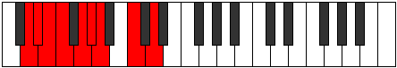

# Mode Stynyllic

## Links

- [Documentation](index.md)
- [Scales Index](Scales.md)
- [Modes Index](Modes.md)
- [Chords Index](Chords.md)

## Parent Scale

[Pothyllic](ScalePothyllic.md)

## Number

[1263](https://ianring.com/musictheory/scales/1263)

## Perfection

- 6 Perfect notes
- 2 Perfect notes

## Interval Pattern

1, 1, 1, 2, 1, 1, 3, 2

## Perfection Profile

[true false false true true true true true]

## Permutations

| Tonic | Notes | Signature | Illustration | Audio |
|-------|-------|-----------|--------------|-------|
| [C](ModeCNaturalStynyllic.md) | C, **C#**, **D**, D#, F, F#, G, A#, C | C |  | [midi](https://github.com/edipermadi/music/blob/main/docs/ModeCNaturalStynyllic.mid?raw=true) |
| [C#](ModeCSharpStynyllic.md) | C#, **D**, **D#**, E, F#, G, G#, B, C# | C |  | [midi](https://github.com/edipermadi/music/blob/main/docs/ModeCSharpStynyllic.mid?raw=true) |
| [Db](ModeDFlatStynyllic.md) | Db, **D**, **Eb**, E, Gb, G, Ab, B, Db | C |  | [midi](https://github.com/edipermadi/music/blob/main/docs/ModeDFlatStynyllic.mid?raw=true) |
| [D](ModeDNaturalStynyllic.md) | D, **D#**, **E**, F, G, G#, A, C, D | C |  | [midi](https://github.com/edipermadi/music/blob/main/docs/ModeDNaturalStynyllic.mid?raw=true) |
| [D#](ModeDSharpStynyllic.md) | D#, **E**, **F**, F#, G#, A, A#, C#, D# | C |  | [midi](https://github.com/edipermadi/music/blob/main/docs/ModeDSharpStynyllic.mid?raw=true) |
| [Eb](ModeEFlatStynyllic.md) | Eb, **E**, **F**, Gb, Ab, A, Bb, Db, Eb | C |  | [midi](https://github.com/edipermadi/music/blob/main/docs/ModeEFlatStynyllic.mid?raw=true) |
| [E](ModeENaturalStynyllic.md) | E, **F**, **F#**, G, A, A#, B, D, E | C |  | [midi](https://github.com/edipermadi/music/blob/main/docs/ModeENaturalStynyllic.mid?raw=true) |
| [F](ModeFNaturalStynyllic.md) | F, **F#**, **G**, G#, A#, B, C, D#, F | C |  | [midi](https://github.com/edipermadi/music/blob/main/docs/ModeFNaturalStynyllic.mid?raw=true) |
| [F#](ModeFSharpStynyllic.md) | F#, **G**, **G#**, A, B, C, C#, E, F# | C |  | [midi](https://github.com/edipermadi/music/blob/main/docs/ModeFSharpStynyllic.mid?raw=true) |
| [Gb](ModeGFlatStynyllic.md) | Gb, **G**, **Ab**, A, B, C, Db, E, Gb | C |  | [midi](https://github.com/edipermadi/music/blob/main/docs/ModeGFlatStynyllic.mid?raw=true) |
| [G](ModeGNaturalStynyllic.md) | G, **G#**, **A**, A#, C, C#, D, F, G | C |  | [midi](https://github.com/edipermadi/music/blob/main/docs/ModeGNaturalStynyllic.mid?raw=true) |
| [G#](ModeGSharpStynyllic.md) | G#, **A**, **A#**, B, C#, D, D#, F#, G# | C |  | [midi](https://github.com/edipermadi/music/blob/main/docs/ModeGSharpStynyllic.mid?raw=true) |
| [Ab](ModeAFlatStynyllic.md) | Ab, **A**, **Bb**, B, Db, D, Eb, Gb, Ab | C |  | [midi](https://github.com/edipermadi/music/blob/main/docs/ModeAFlatStynyllic.mid?raw=true) |
| [A](ModeANaturalStynyllic.md) | A, **A#**, **B**, C, D, D#, E, G, A | C |  | [midi](https://github.com/edipermadi/music/blob/main/docs/ModeANaturalStynyllic.mid?raw=true) |
| [A#](ModeASharpStynyllic.md) | A#, **B**, **C**, C#, D#, E, F, G#, A# | C |  | [midi](https://github.com/edipermadi/music/blob/main/docs/ModeASharpStynyllic.mid?raw=true) |
| [Bb](ModeBFlatStynyllic.md) | Bb, **B**, **C**, Db, Eb, E, F, Ab, Bb | C |  | [midi](https://github.com/edipermadi/music/blob/main/docs/ModeBFlatStynyllic.mid?raw=true) |
| [B](ModeBNaturalStynyllic.md) | B, **C**, **C#**, D, E, F, F#, A, B | C |  | [midi](https://github.com/edipermadi/music/blob/main/docs/ModeBNaturalStynyllic.mid?raw=true) |
