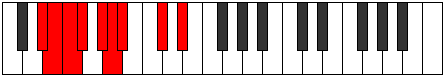

# Mode Stynyllic

## Links

- [Documentation](index.md)
- [Scales Index](Scales.md)
- [Modes Index](Modes.md)
- [Chords Index](Chords.md)

## Parent Scale

[Pothyllic](ScalePothyllic.md)

## Number

[1263](https://ianring.com/musictheory/scales/1263)

## Perfection

- 6 Perfect notes
- 2 Perfect notes

## Perfection Profile

[true false false true true true true true]

## Permutations

| Tonic | Notes | Signature | Illustration | Audio |
|-------|-------|-----------|--------------|-------|
| [C](ModeCNaturalStynyllic.md) | C, **C#**, **D**, D#, F, F#, G, A#, C | C |  | [midi](ModeCNaturalStynyllic.mid) [ogg](ModeCNaturalStynyllic.ogg) |
| [C#](ModeCSharpStynyllic.md) | C#, **D**, **D#**, E, F#, G, G#, B, C# | C |  | [midi](ModeCSharpStynyllic.mid) [ogg](ModeCSharpStynyllic.ogg) |
| [Db](ModeDFlatStynyllic.md) | Db, **D**, **Eb**, E, Gb, G, Ab, B, Db | C |  | [midi](ModeDFlatStynyllic.mid) [ogg](ModeDFlatStynyllic.ogg) |
| [D](ModeDNaturalStynyllic.md) | D, **D#**, **E**, F, G, G#, A, C, D | C |  | [midi](ModeDNaturalStynyllic.mid) [ogg](ModeDNaturalStynyllic.ogg) |
| [D#](ModeDSharpStynyllic.md) | D#, **E**, **F**, F#, G#, A, A#, C#, D# | C |  | [midi](ModeDSharpStynyllic.mid) [ogg](ModeDSharpStynyllic.ogg) |
| [Eb](ModeEFlatStynyllic.md) | Eb, **E**, **F**, Gb, Ab, A, Bb, Db, Eb | C |  | [midi](ModeEFlatStynyllic.mid) [ogg](ModeEFlatStynyllic.ogg) |
| [E](ModeENaturalStynyllic.md) | E, **F**, **F#**, G, A, A#, B, D, E | C |  | [midi](ModeENaturalStynyllic.mid) [ogg](ModeENaturalStynyllic.ogg) |
| [F](ModeFNaturalStynyllic.md) | F, **F#**, **G**, G#, A#, B, C, D#, F | C |  | [midi](ModeFNaturalStynyllic.mid) [ogg](ModeFNaturalStynyllic.ogg) |
| [F#](ModeFSharpStynyllic.md) | F#, **G**, **G#**, A, B, C, C#, E, F# | C |  | [midi](ModeFSharpStynyllic.mid) [ogg](ModeFSharpStynyllic.ogg) |
| [Gb](ModeGFlatStynyllic.md) | Gb, **G**, **Ab**, A, B, C, Db, E, Gb | C |  | [midi](ModeGFlatStynyllic.mid) [ogg](ModeGFlatStynyllic.ogg) |
| [G](ModeGNaturalStynyllic.md) | G, **G#**, **A**, A#, C, C#, D, F, G | C |  | [midi](ModeGNaturalStynyllic.mid) [ogg](ModeGNaturalStynyllic.ogg) |
| [G#](ModeGSharpStynyllic.md) | G#, **A**, **A#**, B, C#, D, D#, F#, G# | C |  | [midi](ModeGSharpStynyllic.mid) [ogg](ModeGSharpStynyllic.ogg) |
| [Ab](ModeAFlatStynyllic.md) | Ab, **A**, **Bb**, B, Db, D, Eb, Gb, Ab | C |  | [midi](ModeAFlatStynyllic.mid) [ogg](ModeAFlatStynyllic.ogg) |
| [A](ModeANaturalStynyllic.md) | A, **A#**, **B**, C, D, D#, E, G, A | C |  | [midi](ModeANaturalStynyllic.mid) [ogg](ModeANaturalStynyllic.ogg) |
| [A#](ModeASharpStynyllic.md) | A#, **B**, **C**, C#, D#, E, F, G#, A# | C |  | [midi](ModeASharpStynyllic.mid) [ogg](ModeASharpStynyllic.ogg) |
| [Bb](ModeBFlatStynyllic.md) | Bb, **B**, **C**, Db, Eb, E, F, Ab, Bb | C |  | [midi](ModeBFlatStynyllic.mid) [ogg](ModeBFlatStynyllic.ogg) |
| [B](ModeBNaturalStynyllic.md) | B, **C**, **C#**, D, E, F, F#, A, B | C |  | [midi](ModeBNaturalStynyllic.mid) [ogg](ModeBNaturalStynyllic.ogg) |
