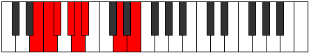

# Mode Styrian

## Links

- [Documentation](index.md)
- [Scales Index](Scales.md)
- [Modes Index](Modes.md)
- [Chords Index](Chords.md)

## Parent Scale

[Katogian](ScaleKatogian.md)

## Number

[1143](https://ianring.com/musictheory/scales/1143)

## Interval Pattern

1, 1, 2, 1, 1, 4, 2

## Chord Pattern

III⁺, VI, VI⁺, vii⁰, vii, VII, VII⁺

## Perfection

- 3 Perfect notes
- 4 Perfect notes

## Perfection Profile

[false false false false true true true]

## Permutations

| Tonic | Notes | Signature | Illustration | Audio |
|-------|-------|-----------|--------------|-------|
| [C](ModeCNaturalStyrian.md) | **C**, **Db**, **Ebb**, **Fb**, Gbb, Abbb, Bb, **C** | C |  | [midi](https://github.com/edipermadi/music/blob/main/docs/ModeCNaturalStyrian.mid?raw=true) |
| [C#](ModeCSharpStyrian.md) | **C#**, **D**, **Eb**, **F**, Gb, Abb, B, **C#** | C |  | [midi](https://github.com/edipermadi/music/blob/main/docs/ModeCSharpStyrian.mid?raw=true) |
| [Db](ModeDFlatStyrian.md) | **Db**, **Ebb**, **Fbb**, **Gbb**, Abbb, E###, Cb, **Db** | C |  | [midi](https://github.com/edipermadi/music/blob/main/docs/ModeDFlatStyrian.mid?raw=true) |
| [D](ModeDNaturalStyrian.md) | **D**, **Eb**, **Fb**, **Gb**, Abb, Bbbb, C, **D** | C |  | [midi](https://github.com/edipermadi/music/blob/main/docs/ModeDNaturalStyrian.mid?raw=true) |
| [D#](ModeDSharpStyrian.md) | **D#**, **E**, **F**, **G**, Ab, Bbb, C#, **D#** | C |  | [midi](https://github.com/edipermadi/music/blob/main/docs/ModeDSharpStyrian.mid?raw=true) |
| [Eb](ModeEFlatStyrian.md) | **Eb**, **Fb**, **Gbb**, **Abb**, Bbbb, Cbbb, Db, **Eb** | C |  | [midi](https://github.com/edipermadi/music/blob/main/docs/ModeEFlatStyrian.mid?raw=true) |
| [E](ModeENaturalStyrian.md) | **E**, **F**, **Gb**, **Ab**, Bbb, Cbb, D, **E** | C |  | [midi](https://github.com/edipermadi/music/blob/main/docs/ModeENaturalStyrian.mid?raw=true) |
| [F](ModeFNaturalStyrian.md) | **F**, **Gb**, **Abb**, **Bbb**, Cbb, Dbbb, Eb, **F** | C |  | [midi](https://github.com/edipermadi/music/blob/main/docs/ModeFNaturalStyrian.mid?raw=true) |
| [F#](ModeFSharpStyrian.md) | **F#**, **G**, **Ab**, **Bb**, Cb, Dbb, E, **F#** | C |  | [midi](https://github.com/edipermadi/music/blob/main/docs/ModeFSharpStyrian.mid?raw=true) |
| [Gb](ModeGFlatStyrian.md) | **Gb**, **Abb**, **Bbbb**, **Cbb**, Dbbb, Dbb, E, **Gb** | C |  | [midi](https://github.com/edipermadi/music/blob/main/docs/ModeGFlatStyrian.mid?raw=true) |
| [G](ModeGNaturalStyrian.md) | **G**, **Ab**, **Bbb**, **Cb**, Dbb, Ebbb, F, **G** | C |  | [midi](https://github.com/edipermadi/music/blob/main/docs/ModeGNaturalStyrian.mid?raw=true) |
| [G#](ModeGSharpStyrian.md) | **G#**, **A**, **Bb**, **C**, Db, Ebb, F#, **G#** | C |  | [midi](https://github.com/edipermadi/music/blob/main/docs/ModeGSharpStyrian.mid?raw=true) |
| [Ab](ModeAFlatStyrian.md) | **Ab**, **Bbb**, **Cbb**, **Dbb**, Ebbb, Fbbb, Gb, **Ab** | C |  | [midi](https://github.com/edipermadi/music/blob/main/docs/ModeAFlatStyrian.mid?raw=true) |
| [A](ModeANaturalStyrian.md) | **A**, **Bb**, **Cb**, **Db**, Ebb, Fbb, G, **A** | C |  | [midi](https://github.com/edipermadi/music/blob/main/docs/ModeANaturalStyrian.mid?raw=true) |
| [A#](ModeASharpStyrian.md) | **A#**, **B**, **C**, **D**, Eb, Fb, G#, **A#** | C |  | [midi](https://github.com/edipermadi/music/blob/main/docs/ModeASharpStyrian.mid?raw=true) |
| [Bb](ModeBFlatStyrian.md) | **Bb**, **Cb**, **Dbb**, **Ebb**, Fbb, Gbbb, Ab, **Bb** | C |  | [midi](https://github.com/edipermadi/music/blob/main/docs/ModeBFlatStyrian.mid?raw=true) |
| [B](ModeBNaturalStyrian.md) | **B**, **C**, **Db**, **Eb**, Fb, Gbb, A, **B** | C |  | [midi](https://github.com/edipermadi/music/blob/main/docs/ModeBNaturalStyrian.mid?raw=true) |
