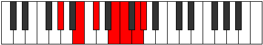

# Mode Stythimic

## Links

- [Documentation](README.md)
- [Scales Index](Scales.md)
- [Modes Index](Modes.md)
- [Chords Index](Chords.md)

## Parent Scale

[Stythimic](ScaleStythimic.md)

## Number

[2857](https://ianring.com/musictheory/scales/2857)

## Transposition

3, 2, 3, 1, 2, 1

## Chord Pattern

III, iv

## Perfection

- 2 Perfect notes
- 4 Perfect notes

## Perfection Profile

false, false, true, true, false, false

## Permutations

| Tonic | Notes | Signature | Illustration | Audio |
|-------|-------|-----------|--------------|-------|
| [C](ModeCNaturalStythimic.md) | **C**, **D#**, E#, F###, **G##**, **A##**, **C** | C |  | [midi](https://github.com/edipermadi/music/blob/main/docs/ModeCNaturalStythimic.mid?raw=true) |
| [C#](ModeCSharpStythimic.md) | **C#**, **D##**, E##, Cbbb, **Cbb**, **Dbb**, **C#** | C |  | [midi](https://github.com/edipermadi/music/blob/main/docs/ModeCSharpStythimic.mid?raw=true) |
| [Db](ModeDFlatStythimic.md) | **Db**, **E**, F#, G##, **A#**, **B#**, **Db** | C |  | [midi](https://github.com/edipermadi/music/blob/main/docs/ModeDFlatStythimic.mid?raw=true) |
| [D](ModeDNaturalStythimic.md) | **D**, **E#**, F##, G###, **A##**, **B##**, **D** | C |  | [midi](https://github.com/edipermadi/music/blob/main/docs/ModeDNaturalStythimic.mid?raw=true) |
| [D#](ModeDSharpStythimic.md) | **D#**, **E##**, F###, Cb, **Dbb**, **Ebb**, **D#** | C |  | [midi](https://github.com/edipermadi/music/blob/main/docs/ModeDSharpStythimic.mid?raw=true) |
| [Eb](ModeEFlatStythimic.md) | **Eb**, **F#**, G#, A##, **B#**, **C##**, **Eb** | C |  | [midi](https://github.com/edipermadi/music/blob/main/docs/ModeEFlatStythimic.mid?raw=true) |
| [E](ModeENaturalStythimic.md) | **E**, **F##**, G##, A###, **B##**, **C###**, **E** | C |  | [midi](https://github.com/edipermadi/music/blob/main/docs/ModeENaturalStythimic.mid?raw=true) |
| [F](ModeFNaturalStythimic.md) | **F**, **G#**, A#, B##, **C##**, **D##**, **F** | C |  | [midi](https://github.com/edipermadi/music/blob/main/docs/ModeFNaturalStythimic.mid?raw=true) |
| [F#](ModeFSharpStythimic.md) | **F#**, **G##**, A##, B###, **C###**, **D###**, **F#** | C |  | [midi](https://github.com/edipermadi/music/blob/main/docs/ModeFSharpStythimic.mid?raw=true) |
| [Gb](ModeGFlatStythimic.md) | **Gb**, **A**, B, C##, **D#**, **E#**, **Gb** | C |  | [midi](https://github.com/edipermadi/music/blob/main/docs/ModeGFlatStythimic.mid?raw=true) |
| [G](ModeGNaturalStythimic.md) | **G**, **A#**, B#, C###, **D##**, **E##**, **G** | C |  | [midi](https://github.com/edipermadi/music/blob/main/docs/ModeGNaturalStythimic.mid?raw=true) |
| [G#](ModeGSharpStythimic.md) | **G#**, **A##**, B##, D##, **E#**, **F##**, **G#** | C |  | [midi](https://github.com/edipermadi/music/blob/main/docs/ModeGSharpStythimic.mid?raw=true) |
| [Ab](ModeAFlatStythimic.md) | **Ab**, **B**, C#, D##, **E#**, **F##**, **Ab** | C |  | [midi](https://github.com/edipermadi/music/blob/main/docs/ModeAFlatStythimic.mid?raw=true) |
| [A](ModeANaturalStythimic.md) | **A**, **B#**, C##, D###, **E##**, **F###**, **A** | C |  | [midi](https://github.com/edipermadi/music/blob/main/docs/ModeANaturalStythimic.mid?raw=true) |
| [A#](ModeASharpStythimic.md) | **A#**, **B##**, C###, E##, **F##**, **G##**, **A#** | C |  | [midi](https://github.com/edipermadi/music/blob/main/docs/ModeASharpStythimic.mid?raw=true) |
| [Bb](ModeBFlatStythimic.md) | **Bb**, **C#**, D#, E##, **F##**, **G##**, **Bb** | C |  | [midi](https://github.com/edipermadi/music/blob/main/docs/ModeBFlatStythimic.mid?raw=true) |
| [B](ModeBNaturalStythimic.md) | **B**, **C##**, D##, E###, **F###**, **G###**, **B** | C |  | [midi](https://github.com/edipermadi/music/blob/main/docs/ModeBNaturalStythimic.mid?raw=true) |
