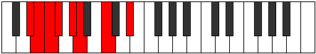

# Mode Sycrian

## Links

- [Documentation](README.md)
- [Scales Index](Scales.md)
- [Modes Index](Modes.md)
- [Chords Index](Chords.md)

## Parent Scale

[Gacrian](ScaleGacrian.md)

## Number

[623](https://ianring.com/musictheory/scales/623)

## Interval Pattern

1, 1, 1, 2, 1, 3, 3

## Chord Pattern

iii, V⁺

## Perfection

- 3 Perfect notes
- 4 Perfect notes

## Perfection Profile

[false false true false true true false]

## Permutations

| Tonic | Notes | Signature | Illustration | Audio |
|-------|-------|-----------|--------------|-------|
| [C](ModeCNaturalSycrian.md) | **C**, **Db**, Ebb, **Fbb**, Gbb, Abbb, **Bbb**, **C** | C |  | [midi](https://github.com/edipermadi/music/blob/main/docs/ModeCNaturalSycrian.mid?raw=true) |
| [C#](ModeCSharpSycrian.md) | **C#**, **D**, Eb, **Fb**, Gb, Abb, **Bb**, **C#** | C |  | [midi](https://github.com/edipermadi/music/blob/main/docs/ModeCSharpSycrian.mid?raw=true) |
| [Db](ModeDFlatSycrian.md) | **Db**, **Ebb**, Fbb, **Gbbb**, Abbb, E###, **Cbb**, **Db** | C |  | [midi](https://github.com/edipermadi/music/blob/main/docs/ModeDFlatSycrian.mid?raw=true) |
| [D](ModeDNaturalSycrian.md) | **D**, **Eb**, Fb, **Gbb**, Abb, Bbbb, **Cb**, **D** | C |  | [midi](https://github.com/edipermadi/music/blob/main/docs/ModeDNaturalSycrian.mid?raw=true) |
| [D#](ModeDSharpSycrian.md) | **D#**, **E**, F, **Gb**, Ab, Bbb, **C**, **D#** | C |  | [midi](https://github.com/edipermadi/music/blob/main/docs/ModeDSharpSycrian.mid?raw=true) |
| [Eb](ModeEFlatSycrian.md) | **Eb**, **Fb**, Gbb, **Abbb**, Bbbb, Cbbb, **Dbb**, **Eb** | C |  | [midi](https://github.com/edipermadi/music/blob/main/docs/ModeEFlatSycrian.mid?raw=true) |
| [E](ModeENaturalSycrian.md) | **E**, **F**, Gb, **Abb**, Bbb, Cbb, **Db**, **E** | C |  | [midi](https://github.com/edipermadi/music/blob/main/docs/ModeENaturalSycrian.mid?raw=true) |
| [F](ModeFNaturalSycrian.md) | **F**, **Gb**, Abb, **Bbbb**, Cbb, Dbbb, **Ebb**, **F** | C |  | [midi](https://github.com/edipermadi/music/blob/main/docs/ModeFNaturalSycrian.mid?raw=true) |
| [F#](ModeFSharpSycrian.md) | **F#**, **G**, Ab, **Bbb**, Cb, Dbb, **Eb**, **F#** | C |  | [midi](https://github.com/edipermadi/music/blob/main/docs/ModeFSharpSycrian.mid?raw=true) |
| [Gb](ModeGFlatSycrian.md) | **Gb**, **Abb**, Bbbb, **Cbbb**, Dbbb, Dbb, **Eb**, **Gb** | C |  | [midi](https://github.com/edipermadi/music/blob/main/docs/ModeGFlatSycrian.mid?raw=true) |
| [G](ModeGNaturalSycrian.md) | **G**, **Ab**, Bbb, **Cbb**, Dbb, Ebbb, **Fb**, **G** | C |  | [midi](https://github.com/edipermadi/music/blob/main/docs/ModeGNaturalSycrian.mid?raw=true) |
| [G#](ModeGSharpSycrian.md) | **G#**, **A**, Bb, **Cb**, Db, Ebb, **F**, **G#** | C |  | [midi](https://github.com/edipermadi/music/blob/main/docs/ModeGSharpSycrian.mid?raw=true) |
| [Ab](ModeAFlatSycrian.md) | **Ab**, **Bbb**, Cbb, **Dbbb**, Ebbb, Fbbb, **Gbb**, **Ab** | C |  | [midi](https://github.com/edipermadi/music/blob/main/docs/ModeAFlatSycrian.mid?raw=true) |
| [A](ModeANaturalSycrian.md) | **A**, **Bb**, Cb, **Dbb**, Ebb, Fbb, **Gb**, **A** | C |  | [midi](https://github.com/edipermadi/music/blob/main/docs/ModeANaturalSycrian.mid?raw=true) |
| [A#](ModeASharpSycrian.md) | **A#**, **B**, C, **Db**, Eb, Fb, **G**, **A#** | C |  | [midi](https://github.com/edipermadi/music/blob/main/docs/ModeASharpSycrian.mid?raw=true) |
| [Bb](ModeBFlatSycrian.md) | **Bb**, **Cb**, Dbb, **Ebbb**, Fbb, Gbbb, **Abb**, **Bb** | C |  | [midi](https://github.com/edipermadi/music/blob/main/docs/ModeBFlatSycrian.mid?raw=true) |
| [B](ModeBNaturalSycrian.md) | **B**, **C**, Db, **Ebb**, Fb, Gbb, **Ab**, **B** | C |  | [midi](https://github.com/edipermadi/music/blob/main/docs/ModeBNaturalSycrian.mid?raw=true) |
