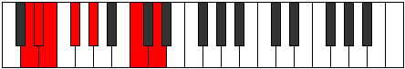

# Mode Sycrimic

## Links

- [Documentation](index.md)
- [Scales Index](Scales.md)
- [Modes Index](Modes.md)
- [Chords Index](Chords.md)

## Parent Scale

[Gacrimic](ScaleGacrimic.md)

## Number

[1111](https://ianring.com/musictheory/scales/1111)

## Perfection

- 1 Perfect notes
- 5 Perfect notes

## Perfection Profile

[false false false false true false]

## Permutations

| Tonic | Notes | Signature | Illustration | Audio |
|-------|-------|-----------|--------------|-------|
| [C](ModeCNaturalSycrimic.md) | **C**, **Db**, **Ebb**, **Fb**, Gb, **A#**, **C** | C |  | [midi](ModeCNaturalSycrimic.mid) [ogg](ModeCNaturalSycrimic.ogg) |
| [C#](ModeCSharpSycrimic.md) | **C#**, **D**, **Eb**, **F**, G, **A##**, **C#** | C |  | [midi](ModeCSharpSycrimic.mid) [ogg](ModeCSharpSycrimic.ogg) |
| [Db](ModeDFlatSycrimic.md) | **Db**, **Ebb**, **Fbb**, **Gbb**, Abb, **B**, **Db** | C |  | [midi](ModeDFlatSycrimic.mid) [ogg](ModeDFlatSycrimic.ogg) |
| [D](ModeDNaturalSycrimic.md) | **D**, **Eb**, **Fb**, **Gb**, Ab, **B#**, **D** | C |  | [midi](ModeDNaturalSycrimic.mid) [ogg](ModeDNaturalSycrimic.ogg) |
| [D#](ModeDSharpSycrimic.md) | **D#**, **E**, **F**, **G**, A, **B##**, **D#** | C |  | [midi](ModeDSharpSycrimic.mid) [ogg](ModeDSharpSycrimic.ogg) |
| [Eb](ModeEFlatSycrimic.md) | **Eb**, **Fb**, **Gbb**, **Abb**, Bbb, **C#**, **Eb** | C |  | [midi](ModeEFlatSycrimic.mid) [ogg](ModeEFlatSycrimic.ogg) |
| [E](ModeENaturalSycrimic.md) | **E**, **F**, **Gb**, **Ab**, Bb, **C##**, **E** | C |  | [midi](ModeENaturalSycrimic.mid) [ogg](ModeENaturalSycrimic.ogg) |
| [F](ModeFNaturalSycrimic.md) | **F**, **Gb**, **Abb**, **Bbb**, Cb, **D#**, **F** | C |  | [midi](ModeFNaturalSycrimic.mid) [ogg](ModeFNaturalSycrimic.ogg) |
| [F#](ModeFSharpSycrimic.md) | **F#**, **G**, **Ab**, **Bb**, C, **D##**, **F#** | C |  | [midi](ModeFSharpSycrimic.mid) [ogg](ModeFSharpSycrimic.ogg) |
| [Gb](ModeGFlatSycrimic.md) | **Gb**, **Abb**, **Bbbb**, **Cbb**, Dbb, **E**, **Gb** | C |  | [midi](ModeGFlatSycrimic.mid) [ogg](ModeGFlatSycrimic.ogg) |
| [G](ModeGNaturalSycrimic.md) | **G**, **Ab**, **Bbb**, **Cb**, Db, **E#**, **G** | C |  | [midi](ModeGNaturalSycrimic.mid) [ogg](ModeGNaturalSycrimic.ogg) |
| [G#](ModeGSharpSycrimic.md) | **G#**, **A**, **Bb**, **C**, D, **E##**, **G#** | C |  | [midi](ModeGSharpSycrimic.mid) [ogg](ModeGSharpSycrimic.ogg) |
| [Ab](ModeAFlatSycrimic.md) | **Ab**, **Bbb**, **Cbb**, **Dbb**, Ebb, **F#**, **Ab** | C |  | [midi](ModeAFlatSycrimic.mid) [ogg](ModeAFlatSycrimic.ogg) |
| [A](ModeANaturalSycrimic.md) | **A**, **Bb**, **Cb**, **Db**, Eb, **F##**, **A** | C |  | [midi](ModeANaturalSycrimic.mid) [ogg](ModeANaturalSycrimic.ogg) |
| [A#](ModeASharpSycrimic.md) | **A#**, **B**, **C**, **D**, E, **F###**, **A#** | C |  | [midi](ModeASharpSycrimic.mid) [ogg](ModeASharpSycrimic.ogg) |
| [Bb](ModeBFlatSycrimic.md) | **Bb**, **Cb**, **Dbb**, **Ebb**, Fb, **G#**, **Bb** | C |  | [midi](ModeBFlatSycrimic.mid) [ogg](ModeBFlatSycrimic.ogg) |
| [B](ModeBNaturalSycrimic.md) | **B**, **C**, **Db**, **Eb**, F, **G##**, **B** | C |  | [midi](ModeBNaturalSycrimic.mid) [ogg](ModeBNaturalSycrimic.ogg) |
