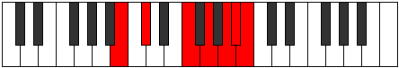

# Mode Sydimic

## Links

- [Documentation](index.md)
- [Scales Index](Scales.md)
- [Modes Index](Modes.md)
- [Chords Index](Chords.md)

## Parent Scale

[Dathimic](ScaleDathimic.md)

## Number

[3397](https://ianring.com/musictheory/scales/3397)

## Interval Pattern

2, 4, 2, 2, 1, 1

## Chord Pattern

iv⁰

## Perfection

- 1 Perfect notes
- 5 Perfect notes

## Perfection Profile

[false false false false false true]

## Permutations

| Tonic | Notes | Signature | Illustration | Audio |
|-------|-------|-----------|--------------|-------|
| [C](ModeCNaturalSydimic.md) | **C**, **D**, **E##**, **F###**, **G###**, A##, **C** | C |  | [midi](https://github.com/edipermadi/music/blob/main/docs/ModeCNaturalSydimic.mid?raw=true) |
| [C#](ModeCSharpSydimic.md) | **C#**, **D#**, **E###**, **Cbbb**, **Dbbb**, Dbb, **C#** | C |  | [midi](https://github.com/edipermadi/music/blob/main/docs/ModeCSharpSydimic.mid?raw=true) |
| [Db](ModeDFlatSydimic.md) | **Db**, **Eb**, **F##**, **G##**, **A##**, B#, **Db** | C |  | [midi](https://github.com/edipermadi/music/blob/main/docs/ModeDFlatSydimic.mid?raw=true) |
| [D](ModeDNaturalSydimic.md) | **D**, **E**, **F###**, **G###**, **A###**, B##, **D** | C |  | [midi](https://github.com/edipermadi/music/blob/main/docs/ModeDNaturalSydimic.mid?raw=true) |
| [D#](ModeDSharpSydimic.md) | **D#**, **E#**, **Cbbb**, **Dbbb**, **Ebbb**, Fbbb, **D#** | C |  | [midi](https://github.com/edipermadi/music/blob/main/docs/ModeDSharpSydimic.mid?raw=true) |
| [Eb](ModeEFlatSydimic.md) | **Eb**, **F**, **G##**, **A##**, **B##**, C##, **Eb** | C |  | [midi](https://github.com/edipermadi/music/blob/main/docs/ModeEFlatSydimic.mid?raw=true) |
| [E](ModeENaturalSydimic.md) | **E**, **F#**, **G###**, **A###**, **B###**, C###, **E** | C |  | [midi](https://github.com/edipermadi/music/blob/main/docs/ModeENaturalSydimic.mid?raw=true) |
| [F](ModeFNaturalSydimic.md) | **F**, **G**, **A##**, **B##**, **C###**, D##, **F** | C |  | [midi](https://github.com/edipermadi/music/blob/main/docs/ModeFNaturalSydimic.mid?raw=true) |
| [F#](ModeFSharpSydimic.md) | **F#**, **G#**, **A###**, **B###**, **D##**, E#, **F#** | C |  | [midi](https://github.com/edipermadi/music/blob/main/docs/ModeFSharpSydimic.mid?raw=true) |
| [Gb](ModeGFlatSydimic.md) | **Gb**, **Ab**, **B#**, **C##**, **D##**, E#, **Gb** | C |  | [midi](https://github.com/edipermadi/music/blob/main/docs/ModeGFlatSydimic.mid?raw=true) |
| [G](ModeGNaturalSydimic.md) | **G**, **A**, **B##**, **C###**, **D###**, E##, **G** | C |  | [midi](https://github.com/edipermadi/music/blob/main/docs/ModeGNaturalSydimic.mid?raw=true) |
| [G#](ModeGSharpSydimic.md) | **G#**, **A#**, **B###**, **D##**, **E##**, F##, **G#** | C |  | [midi](https://github.com/edipermadi/music/blob/main/docs/ModeGSharpSydimic.mid?raw=true) |
| [Ab](ModeAFlatSydimic.md) | **Ab**, **Bb**, **C##**, **D##**, **E##**, F##, **Ab** | C |  | [midi](https://github.com/edipermadi/music/blob/main/docs/ModeAFlatSydimic.mid?raw=true) |
| [A](ModeANaturalSydimic.md) | **A**, **B**, **C###**, **D###**, **E###**, F###, **A** | C |  | [midi](https://github.com/edipermadi/music/blob/main/docs/ModeANaturalSydimic.mid?raw=true) |
| [A#](ModeASharpSydimic.md) | **A#**, **B#**, **D##**, **E##**, **F###**, G##, **A#** | C |  | [midi](https://github.com/edipermadi/music/blob/main/docs/ModeASharpSydimic.mid?raw=true) |
| [Bb](ModeBFlatSydimic.md) | **Bb**, **C**, **D##**, **E##**, **F###**, G##, **Bb** | C |  | [midi](https://github.com/edipermadi/music/blob/main/docs/ModeBFlatSydimic.mid?raw=true) |
| [B](ModeBNaturalSydimic.md) | **B**, **C#**, **D###**, **E###**, **Cbbb**, Cbb, **B** | C |  | [midi](https://github.com/edipermadi/music/blob/main/docs/ModeBNaturalSydimic.mid?raw=true) |
