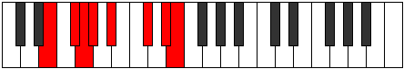

# Mode Sygian

## Links

- [Documentation](index.md)
- [Scales Index](Scales.md)
- [Modes Index](Modes.md)
- [Chords Index](Chords.md)

## Parent Scale

[Ionopian](ScaleIonopian.md)

## Number

[2653](https://ianring.com/musictheory/scales/2653)

## Interval Pattern

2, 1, 1, 2, 3, 2, 1

## Chord Pattern

i⁰, II, iii⁰, v⁰, vi⁰, vi, vii, VII

## Perfection

- 4 Perfect notes
- 3 Perfect notes

## Perfection Profile

[false true false true false true true]

## Permutations

| Tonic | Notes | Signature | Illustration | Audio |
|-------|-------|-----------|--------------|-------|
| [C](ModeCNaturalSygian.md) | **C**, D, **Eb**, Fb, **Gb**, A, B, **C** | C |  | [midi](https://github.com/edipermadi/music/blob/main/docs/ModeCNaturalSygian.mid?raw=true) |
| [C#](ModeCSharpSygian.md) | **C#**, D#, **E**, F, **G**, A#, B#, **C#** | C |  | [midi](https://github.com/edipermadi/music/blob/main/docs/ModeCSharpSygian.mid?raw=true) |
| [Db](ModeDFlatSygian.md) | **Db**, Eb, **Fb**, Gbb, **Abb**, Bb, C, **Db** | C |  | [midi](https://github.com/edipermadi/music/blob/main/docs/ModeDFlatSygian.mid?raw=true) |
| [D](ModeDNaturalSygian.md) | **D**, E, **F**, Gb, **Ab**, B, C#, **D** | C |  | [midi](https://github.com/edipermadi/music/blob/main/docs/ModeDNaturalSygian.mid?raw=true) |
| [D#](ModeDSharpSygian.md) | **D#**, E#, **F#**, G, **A**, B#, C##, **D#** | C |  | [midi](https://github.com/edipermadi/music/blob/main/docs/ModeDSharpSygian.mid?raw=true) |
| [Eb](ModeEFlatSygian.md) | **Eb**, F, **Gb**, Abb, **Bbb**, C, D, **Eb** | C |  | [midi](https://github.com/edipermadi/music/blob/main/docs/ModeEFlatSygian.mid?raw=true) |
| [E](ModeENaturalSygian.md) | **E**, F#, **G**, Ab, **Bb**, C#, D#, **E** | C |  | [midi](https://github.com/edipermadi/music/blob/main/docs/ModeENaturalSygian.mid?raw=true) |
| [F](ModeFNaturalSygian.md) | **F**, G, **Ab**, Bbb, **Cb**, D, E, **F** | C |  | [midi](https://github.com/edipermadi/music/blob/main/docs/ModeFNaturalSygian.mid?raw=true) |
| [F#](ModeFSharpSygian.md) | **F#**, G#, **A**, Bb, **C**, D#, E#, **F#** | C |  | [midi](https://github.com/edipermadi/music/blob/main/docs/ModeFSharpSygian.mid?raw=true) |
| [Gb](ModeGFlatSygian.md) | **Gb**, Ab, **Bbb**, Cbb, **Dbb**, Eb, F, **Gb** | C |  | [midi](https://github.com/edipermadi/music/blob/main/docs/ModeGFlatSygian.mid?raw=true) |
| [G](ModeGNaturalSygian.md) | **G**, A, **Bb**, Cb, **Db**, E, F#, **G** | C |  | [midi](https://github.com/edipermadi/music/blob/main/docs/ModeGNaturalSygian.mid?raw=true) |
| [G#](ModeGSharpSygian.md) | **G#**, A#, **B**, C, **D**, E#, F##, **G#** | C |  | [midi](https://github.com/edipermadi/music/blob/main/docs/ModeGSharpSygian.mid?raw=true) |
| [Ab](ModeAFlatSygian.md) | **Ab**, Bb, **Cb**, Dbb, **Ebb**, F, G, **Ab** | C |  | [midi](https://github.com/edipermadi/music/blob/main/docs/ModeAFlatSygian.mid?raw=true) |
| [A](ModeANaturalSygian.md) | **A**, B, **C**, Db, **Eb**, F#, G#, **A** | C |  | [midi](https://github.com/edipermadi/music/blob/main/docs/ModeANaturalSygian.mid?raw=true) |
| [A#](ModeASharpSygian.md) | **A#**, B#, **C#**, D, **E**, F##, G##, **A#** | C |  | [midi](https://github.com/edipermadi/music/blob/main/docs/ModeASharpSygian.mid?raw=true) |
| [Bb](ModeBFlatSygian.md) | **Bb**, C, **Db**, Ebb, **Fb**, G, A, **Bb** | C |  | [midi](https://github.com/edipermadi/music/blob/main/docs/ModeBFlatSygian.mid?raw=true) |
| [B](ModeBNaturalSygian.md) | **B**, C#, **D**, Eb, **F**, G#, A#, **B** | C |  | [midi](https://github.com/edipermadi/music/blob/main/docs/ModeBNaturalSygian.mid?raw=true) |
