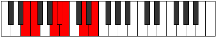

# Mode Sylimic

## Links

- [Documentation](index.md)
- [Scales Index](Scales.md)
- [Modes Index](Modes.md)
- [Chords Index](Chords.md)

## Parent Scale

[Mythimic](ScaleMythimic.md)

## Number

[1251](https://ianring.com/musictheory/scales/1251)

## Perfection

- 4 Perfect notes
- 2 Perfect notes

## Perfection Profile

[true false true true false true]

## Permutations

| Tonic | Notes | Signature | Illustration | Audio |
|-------|-------|-----------|--------------|-------|
| [C](ModeCNaturalSylimic.md) | C, **Db**, E#, F#, **G**, A#, C | C |  | [midi](ModeCNaturalSylimic.mid) [ogg](ModeCNaturalSylimic.ogg) |
| [C#](ModeCSharpSylimic.md) | C#, **D**, E##, F##, **G#**, A##, C# | C |  | [midi](ModeCSharpSylimic.mid) [ogg](ModeCSharpSylimic.ogg) |
| [Db](ModeDFlatSylimic.md) | Db, **Ebb**, F#, G, **Ab**, B, Db | C |  | [midi](ModeDFlatSylimic.mid) [ogg](ModeDFlatSylimic.ogg) |
| [D](ModeDNaturalSylimic.md) | D, **Eb**, F##, G#, **A**, B#, D | C |  | [midi](ModeDNaturalSylimic.mid) [ogg](ModeDNaturalSylimic.ogg) |
| [D#](ModeDSharpSylimic.md) | D#, **E**, F###, G##, **A#**, B##, D# | C |  | [midi](ModeDSharpSylimic.mid) [ogg](ModeDSharpSylimic.ogg) |
| [Eb](ModeEFlatSylimic.md) | Eb, **Fb**, G#, A, **Bb**, C#, Eb | C |  | [midi](ModeEFlatSylimic.mid) [ogg](ModeEFlatSylimic.ogg) |
| [E](ModeENaturalSylimic.md) | E, **F**, G##, A#, **B**, C##, E | C |  | [midi](ModeENaturalSylimic.mid) [ogg](ModeENaturalSylimic.ogg) |
| [F](ModeFNaturalSylimic.md) | F, **Gb**, A#, B, **C**, D#, F | C |  | [midi](ModeFNaturalSylimic.mid) [ogg](ModeFNaturalSylimic.ogg) |
| [F#](ModeFSharpSylimic.md) | F#, **G**, A##, B#, **C#**, D##, F# | C |  | [midi](ModeFSharpSylimic.mid) [ogg](ModeFSharpSylimic.ogg) |
| [Gb](ModeGFlatSylimic.md) | Gb, **Abb**, B, C, **Db**, E, Gb | C |  | [midi](ModeGFlatSylimic.mid) [ogg](ModeGFlatSylimic.ogg) |
| [G](ModeGNaturalSylimic.md) | G, **Ab**, B#, C#, **D**, E#, G | C |  | [midi](ModeGNaturalSylimic.mid) [ogg](ModeGNaturalSylimic.ogg) |
| [G#](ModeGSharpSylimic.md) | G#, **A**, B##, C##, **D#**, E##, G# | C |  | [midi](ModeGSharpSylimic.mid) [ogg](ModeGSharpSylimic.ogg) |
| [Ab](ModeAFlatSylimic.md) | Ab, **Bbb**, C#, D, **Eb**, F#, Ab | C |  | [midi](ModeAFlatSylimic.mid) [ogg](ModeAFlatSylimic.ogg) |
| [A](ModeANaturalSylimic.md) | A, **Bb**, C##, D#, **E**, F##, A | C |  | [midi](ModeANaturalSylimic.mid) [ogg](ModeANaturalSylimic.ogg) |
| [A#](ModeASharpSylimic.md) | A#, **B**, C###, D##, **E#**, F###, A# | C |  | [midi](ModeASharpSylimic.mid) [ogg](ModeASharpSylimic.ogg) |
| [Bb](ModeBFlatSylimic.md) | Bb, **Cb**, D#, E, **F**, G#, Bb | C |  | [midi](ModeBFlatSylimic.mid) [ogg](ModeBFlatSylimic.ogg) |
| [B](ModeBNaturalSylimic.md) | B, **C**, D##, E#, **F#**, G##, B | C |  | [midi](ModeBNaturalSylimic.mid) [ogg](ModeBNaturalSylimic.ogg) |
