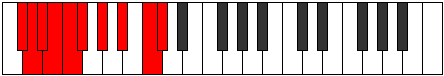
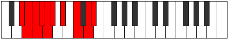
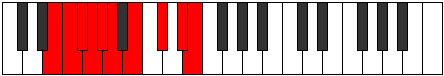
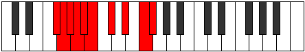
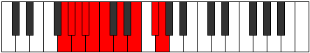
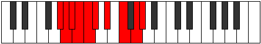
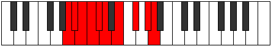
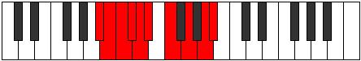
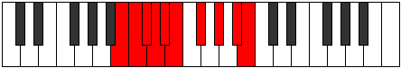

# Mode Sylygic

## Links

- [Documentation](README.md)
- [Scales Index](Scales.md)
- [Modes Index](Modes.md)
- [Chords Index](Chords.md)

## Parent Scale

[Kyrygic](ScaleKyrygic.md)

## Number

[2751](https://ianring.com/musictheory/scales/2751)

## Transposition

1, 1, 1, 1, 1, 2, 2, 2, 1

## Chord Pattern

iv⁰b3, v, VI, VIIb5

## Perfection

- 6 Perfect notes
- 3 Perfect notes

## Perfection Profile

true, false, true, false, true, true, true, true, false

## Permutations

| Tonic | Notes | Signature | Illustration | Audio |
|-------|-------|-----------|--------------|-------|
| [C](ModeCNaturalSylygic.md) | C, **C#**, D, **D#**, E, F, G, A, **B**, C | C |  | [midi](https://github.com/edipermadi/music/blob/main/docs/ModeCNaturalSylygic.mid?raw=true) |
| [C#](ModeCSharpSylygic.md) | C#, **D**, D#, **E**, F, F#, G#, A#, **C**, C# | C |  | [midi](https://github.com/edipermadi/music/blob/main/docs/ModeCSharpSylygic.mid?raw=true) |
| [Db](ModeDFlatSylygic.md) | Db, **D**, Eb, **E**, F, Gb, Ab, Bb, **C**, Db | C |  | [midi](https://github.com/edipermadi/music/blob/main/docs/ModeDFlatSylygic.mid?raw=true) |
| [D](ModeDNaturalSylygic.md) | D, **D#**, E, **F**, F#, G, A, B, **C#**, D | C |  | [midi](https://github.com/edipermadi/music/blob/main/docs/ModeDNaturalSylygic.mid?raw=true) |
| [D#](ModeDSharpSylygic.md) | D#, **E**, F, **F#**, G, G#, A#, C, **D**, D# | C |  | [midi](https://github.com/edipermadi/music/blob/main/docs/ModeDSharpSylygic.mid?raw=true) |
| [Eb](ModeEFlatSylygic.md) | Eb, **E**, F, **Gb**, G, Ab, Bb, C, **D**, Eb | C |  | [midi](https://github.com/edipermadi/music/blob/main/docs/ModeEFlatSylygic.mid?raw=true) |
| [E](ModeENaturalSylygic.md) | E, **F**, F#, **G**, G#, A, B, C#, **D#**, E | C |  | [midi](https://github.com/edipermadi/music/blob/main/docs/ModeENaturalSylygic.mid?raw=true) |
| [F](ModeFNaturalSylygic.md) | F, **F#**, G, **G#**, A, A#, C, D, **E**, F | C |  | [midi](https://github.com/edipermadi/music/blob/main/docs/ModeFNaturalSylygic.mid?raw=true) |
| [F#](ModeFSharpSylygic.md) | F#, **G**, G#, **A**, A#, B, C#, D#, **F**, F# | C |  | [midi](https://github.com/edipermadi/music/blob/main/docs/ModeFSharpSylygic.mid?raw=true) |
| [Gb](ModeGFlatSylygic.md) | Gb, **G**, Ab, **A**, Bb, B, Db, Eb, **F**, Gb | C |  | [midi](https://github.com/edipermadi/music/blob/main/docs/ModeGFlatSylygic.mid?raw=true) |
| [G](ModeGNaturalSylygic.md) | G, **G#**, A, **A#**, B, C, D, E, **F#**, G | C |  | [midi](https://github.com/edipermadi/music/blob/main/docs/ModeGNaturalSylygic.mid?raw=true) |
| [G#](ModeGSharpSylygic.md) | G#, **A**, A#, **B**, C, C#, D#, F, **G**, G# | C |  | [midi](https://github.com/edipermadi/music/blob/main/docs/ModeGSharpSylygic.mid?raw=true) |
| [Ab](ModeAFlatSylygic.md) | Ab, **A**, Bb, **B**, C, Db, Eb, F, **G**, Ab | C |  | [midi](https://github.com/edipermadi/music/blob/main/docs/ModeAFlatSylygic.mid?raw=true) |
| [A](ModeANaturalSylygic.md) | A, **A#**, B, **C**, C#, D, E, F#, **G#**, A | C |  | [midi](https://github.com/edipermadi/music/blob/main/docs/ModeANaturalSylygic.mid?raw=true) |
| [A#](ModeASharpSylygic.md) | A#, **B**, C, **C#**, D, D#, F, G, **A**, A# | C |  | [midi](https://github.com/edipermadi/music/blob/main/docs/ModeASharpSylygic.mid?raw=true) |
| [Bb](ModeBFlatSylygic.md) | Bb, **B**, C, **Db**, D, Eb, F, G, **A**, Bb | C |  | [midi](https://github.com/edipermadi/music/blob/main/docs/ModeBFlatSylygic.mid?raw=true) |
| [B](ModeBNaturalSylygic.md) | B, **C**, C#, **D**, D#, E, F#, G#, **A#**, B | C |  | [midi](https://github.com/edipermadi/music/blob/main/docs/ModeBNaturalSylygic.mid?raw=true) |
