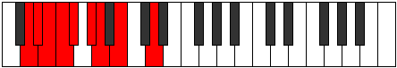
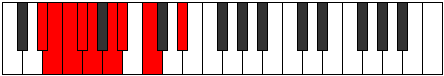
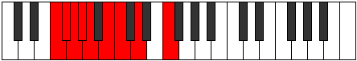

# Mode Sylyllic

## Links

- [Documentation](index.md)
- [Scales Index](Scales.md)
- [Modes Index](Modes.md)
- [Chords Index](Chords.md)

## Parent Scale

[Tharyllic](ScaleTharyllic.md)

## Number

[735](https://ianring.com/musictheory/scales/735)

## Perfection

- 5 Perfect notes
- 3 Perfect notes

## Perfection Profile

[true false true false false true true true]

## Permutations

| Tonic | Notes | Signature | Illustration | Audio |
|-------|-------|-----------|--------------|-------|
| [C](ModeCNaturalSylyllic.md) | C, **C#**, D, **D#**, **E**, F#, G, A, C | C |  | [midi](ModeCNaturalSylyllic.mid) [ogg](ModeCNaturalSylyllic.ogg) |
| [C#](ModeCSharpSylyllic.md) | C#, **D**, D#, **E**, **F**, G, G#, A#, C# | C |  | [midi](ModeCSharpSylyllic.mid) [ogg](ModeCSharpSylyllic.ogg) |
| [Db](ModeDFlatSylyllic.md) | Db, **D**, Eb, **E**, **F**, G, Ab, Bb, Db | C |  | [midi](ModeDFlatSylyllic.mid) [ogg](ModeDFlatSylyllic.ogg) |
| [D](ModeDNaturalSylyllic.md) | D, **D#**, E, **F**, **F#**, G#, A, B, D | C |  | [midi](ModeDNaturalSylyllic.mid) [ogg](ModeDNaturalSylyllic.ogg) |
| [D#](ModeDSharpSylyllic.md) | D#, **E**, F, **F#**, **G**, A, A#, C, D# | C |  | [midi](ModeDSharpSylyllic.mid) [ogg](ModeDSharpSylyllic.ogg) |
| [Eb](ModeEFlatSylyllic.md) | Eb, **E**, F, **Gb**, **G**, A, Bb, C, Eb | C |  | [midi](ModeEFlatSylyllic.mid) [ogg](ModeEFlatSylyllic.ogg) |
| [E](ModeENaturalSylyllic.md) | E, **F**, F#, **G**, **G#**, A#, B, C#, E | C |  | [midi](ModeENaturalSylyllic.mid) [ogg](ModeENaturalSylyllic.ogg) |
| [F](ModeFNaturalSylyllic.md) | F, **F#**, G, **G#**, **A**, B, C, D, F | C |  | [midi](ModeFNaturalSylyllic.mid) [ogg](ModeFNaturalSylyllic.ogg) |
| [F#](ModeFSharpSylyllic.md) | F#, **G**, G#, **A**, **A#**, C, C#, D#, F# | C |  | [midi](ModeFSharpSylyllic.mid) [ogg](ModeFSharpSylyllic.ogg) |
| [Gb](ModeGFlatSylyllic.md) | Gb, **G**, Ab, **A**, **Bb**, C, Db, Eb, Gb | C |  | [midi](ModeGFlatSylyllic.mid) [ogg](ModeGFlatSylyllic.ogg) |
| [G](ModeGNaturalSylyllic.md) | G, **G#**, A, **A#**, **B**, C#, D, E, G | C |  | [midi](ModeGNaturalSylyllic.mid) [ogg](ModeGNaturalSylyllic.ogg) |
| [G#](ModeGSharpSylyllic.md) | G#, **A**, A#, **B**, **C**, D, D#, F, G# | C |  | [midi](ModeGSharpSylyllic.mid) [ogg](ModeGSharpSylyllic.ogg) |
| [Ab](ModeAFlatSylyllic.md) | Ab, **A**, Bb, **B**, **C**, D, Eb, F, Ab | C |  | [midi](ModeAFlatSylyllic.mid) [ogg](ModeAFlatSylyllic.ogg) |
| [A](ModeANaturalSylyllic.md) | A, **A#**, B, **C**, **C#**, D#, E, F#, A | C |  | [midi](ModeANaturalSylyllic.mid) [ogg](ModeANaturalSylyllic.ogg) |
| [A#](ModeASharpSylyllic.md) | A#, **B**, C, **C#**, **D**, E, F, G, A# | C |  | [midi](ModeASharpSylyllic.mid) [ogg](ModeASharpSylyllic.ogg) |
| [Bb](ModeBFlatSylyllic.md) | Bb, **B**, C, **Db**, **D**, E, F, G, Bb | C |  | [midi](ModeBFlatSylyllic.mid) [ogg](ModeBFlatSylyllic.ogg) |
| [B](ModeBNaturalSylyllic.md) | B, **C**, C#, **D**, **D#**, F, F#, G#, B | C |  | [midi](ModeBNaturalSylyllic.mid) [ogg](ModeBNaturalSylyllic.ogg) |
