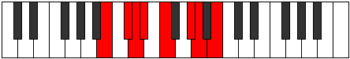

# Mode Synian

## Links

- [Documentation](index.md)
- [Scales Index](Scales.md)
- [Modes Index](Modes.md)
- [Chords Index](Chords.md)

## Parent Scale

[Korian](ScaleKorian.md)

## Number

[1629](https://ianring.com/musictheory/scales/1629)

## Perfection

- 3 Perfect notes
- 4 Perfect notes

## Perfection Profile

[false true true false false true false]

## Permutations

| Tonic | Notes | Signature | Illustration | Audio |
|-------|-------|-----------|--------------|-------|
| [C](ModeCNaturalSynian.md) | **C**, D, Eb, **Fb**, **Gb**, A, **Bb**, **C** | C |  | [midi](ModeCNaturalSynian.mid) [ogg](ModeCNaturalSynian.ogg) |
| [C#](ModeCSharpSynian.md) | **C#**, D#, E, **F**, **G**, A#, **B**, **C#** | C |  | [midi](ModeCSharpSynian.mid) [ogg](ModeCSharpSynian.ogg) |
| [Db](ModeDFlatSynian.md) | **Db**, Eb, Fb, **Gbb**, **Abb**, Bb, **Cb**, **Db** | C |  | [midi](ModeDFlatSynian.mid) [ogg](ModeDFlatSynian.ogg) |
| [D](ModeDNaturalSynian.md) | **D**, E, F, **Gb**, **Ab**, B, **C**, **D** | C |  | [midi](ModeDNaturalSynian.mid) [ogg](ModeDNaturalSynian.ogg) |
| [D#](ModeDSharpSynian.md) | **D#**, E#, F#, **G**, **A**, B#, **C#**, **D#** | C |  | [midi](ModeDSharpSynian.mid) [ogg](ModeDSharpSynian.ogg) |
| [Eb](ModeEFlatSynian.md) | **Eb**, F, Gb, **Abb**, **Bbb**, C, **Db**, **Eb** | C |  | [midi](ModeEFlatSynian.mid) [ogg](ModeEFlatSynian.ogg) |
| [E](ModeENaturalSynian.md) | **E**, F#, G, **Ab**, **Bb**, C#, **D**, **E** | C |  | [midi](ModeENaturalSynian.mid) [ogg](ModeENaturalSynian.ogg) |
| [F](ModeFNaturalSynian.md) | **F**, G, Ab, **Bbb**, **Cb**, D, **Eb**, **F** | C |  | [midi](ModeFNaturalSynian.mid) [ogg](ModeFNaturalSynian.ogg) |
| [F#](ModeFSharpSynian.md) | **F#**, G#, A, **Bb**, **C**, D#, **E**, **F#** | C |  | [midi](ModeFSharpSynian.mid) [ogg](ModeFSharpSynian.ogg) |
| [Gb](ModeGFlatSynian.md) | **Gb**, Ab, Bbb, **Cbb**, **Dbb**, Eb, **Fb**, **Gb** | C |  | [midi](ModeGFlatSynian.mid) [ogg](ModeGFlatSynian.ogg) |
| [G](ModeGNaturalSynian.md) | **G**, A, Bb, **Cb**, **Db**, E, **F**, **G** | C |  | [midi](ModeGNaturalSynian.mid) [ogg](ModeGNaturalSynian.ogg) |
| [G#](ModeGSharpSynian.md) | **G#**, A#, B, **C**, **D**, E#, **F#**, **G#** | C |  | [midi](ModeGSharpSynian.mid) [ogg](ModeGSharpSynian.ogg) |
| [Ab](ModeAFlatSynian.md) | **Ab**, Bb, Cb, **Dbb**, **Ebb**, F, **Gb**, **Ab** | C |  | [midi](ModeAFlatSynian.mid) [ogg](ModeAFlatSynian.ogg) |
| [A](ModeANaturalSynian.md) | **A**, B, C, **Db**, **Eb**, F#, **G**, **A** | C |  | [midi](ModeANaturalSynian.mid) [ogg](ModeANaturalSynian.ogg) |
| [A#](ModeASharpSynian.md) | **A#**, B#, C#, **D**, **E**, F##, **G#**, **A#** | C |  | [midi](ModeASharpSynian.mid) [ogg](ModeASharpSynian.ogg) |
| [Bb](ModeBFlatSynian.md) | **Bb**, C, Db, **Ebb**, **Fb**, G, **Ab**, **Bb** | C |  | [midi](ModeBFlatSynian.mid) [ogg](ModeBFlatSynian.ogg) |
| [B](ModeBNaturalSynian.md) | **B**, C#, D, **Eb**, **F**, G#, **A**, **B** | C |  | [midi](ModeBNaturalSynian.mid) [ogg](ModeBNaturalSynian.ogg) |
