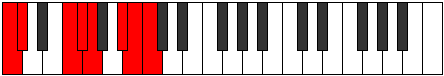
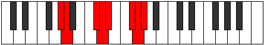
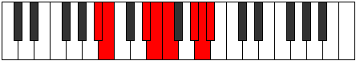

# Mode Syptian

## Links

- [Documentation](index.md)
- [Scales Index](Scales.md)
- [Modes Index](Modes.md)
- [Chords Index](Chords.md)

## Parent Scale

[Ionarian](ScaleIonarian.md)

## Number

[3299](https://ianring.com/musictheory/scales/3299)

## Perfection

- 5 Perfect notes
- 2 Perfect notes

## Perfection Profile

[true false true true false true true]

## Permutations

| Tonic | Notes | Signature | Illustration | Audio |
|-------|-------|-----------|--------------|-------|
| [C](ModeCNaturalSyptian.md) | C, **Db**, E#, F#, **G**, A#, B, C | C |  | [midi](ModeCNaturalSyptian.mid) [ogg](ModeCNaturalSyptian.ogg) |
| [C#](ModeCSharpSyptian.md) | C#, **D**, E##, F##, **G#**, A##, B#, C# | C |  | [midi](ModeCSharpSyptian.mid) [ogg](ModeCSharpSyptian.ogg) |
| [Db](ModeDFlatSyptian.md) | Db, **Ebb**, F#, G, **Ab**, B, C, Db | C |  | [midi](ModeDFlatSyptian.mid) [ogg](ModeDFlatSyptian.ogg) |
| [D](ModeDNaturalSyptian.md) | D, **Eb**, F##, G#, **A**, B#, C#, D | C |  | [midi](ModeDNaturalSyptian.mid) [ogg](ModeDNaturalSyptian.ogg) |
| [D#](ModeDSharpSyptian.md) | D#, **E**, F###, G##, **A#**, B##, C##, D# | C |  | [midi](ModeDSharpSyptian.mid) [ogg](ModeDSharpSyptian.ogg) |
| [Eb](ModeEFlatSyptian.md) | Eb, **Fb**, G#, A, **Bb**, C#, D, Eb | C |  | [midi](ModeEFlatSyptian.mid) [ogg](ModeEFlatSyptian.ogg) |
| [E](ModeENaturalSyptian.md) | E, **F**, G##, A#, **B**, C##, D#, E | C |  | [midi](ModeENaturalSyptian.mid) [ogg](ModeENaturalSyptian.ogg) |
| [F](ModeFNaturalSyptian.md) | F, **Gb**, A#, B, **C**, D#, E, F | C |  | [midi](ModeFNaturalSyptian.mid) [ogg](ModeFNaturalSyptian.ogg) |
| [F#](ModeFSharpSyptian.md) | F#, **G**, A##, B#, **C#**, D##, E#, F# | C |  | [midi](ModeFSharpSyptian.mid) [ogg](ModeFSharpSyptian.ogg) |
| [Gb](ModeGFlatSyptian.md) | Gb, **Abb**, B, C, **Db**, E, F, Gb | C |  | [midi](ModeGFlatSyptian.mid) [ogg](ModeGFlatSyptian.ogg) |
| [G](ModeGNaturalSyptian.md) | G, **Ab**, B#, C#, **D**, E#, F#, G | C |  | [midi](ModeGNaturalSyptian.mid) [ogg](ModeGNaturalSyptian.ogg) |
| [G#](ModeGSharpSyptian.md) | G#, **A**, B##, C##, **D#**, E##, F##, G# | C |  | [midi](ModeGSharpSyptian.mid) [ogg](ModeGSharpSyptian.ogg) |
| [Ab](ModeAFlatSyptian.md) | Ab, **Bbb**, C#, D, **Eb**, F#, G, Ab | C |  | [midi](ModeAFlatSyptian.mid) [ogg](ModeAFlatSyptian.ogg) |
| [A](ModeANaturalSyptian.md) | A, **Bb**, C##, D#, **E**, F##, G#, A | C |  | [midi](ModeANaturalSyptian.mid) [ogg](ModeANaturalSyptian.ogg) |
| [A#](ModeASharpSyptian.md) | A#, **B**, C###, D##, **E#**, F###, G##, A# | C |  | [midi](ModeASharpSyptian.mid) [ogg](ModeASharpSyptian.ogg) |
| [Bb](ModeBFlatSyptian.md) | Bb, **Cb**, D#, E, **F**, G#, A, Bb | C |  | [midi](ModeBFlatSyptian.mid) [ogg](ModeBFlatSyptian.ogg) |
| [B](ModeBNaturalSyptian.md) | B, **C**, D##, E#, **F#**, G##, A#, B | C |  | [midi](ModeBNaturalSyptian.mid) [ogg](ModeBNaturalSyptian.ogg) |
