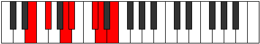

# Mode Syptimic

## Links

- [Documentation](index.md)
- [Scales Index](Scales.md)
- [Modes Index](Modes.md)
- [Chords Index](Chords.md)

## Parent Scale

[Dynimic](ScaleDynimic.md)

## Number

[1637](https://ianring.com/musictheory/scales/1637)

## Perfection

- 3 Perfect notes
- 3 Perfect notes

## Perfection Profile

[false true true false false true]

## Permutations

| Tonic | Notes | Signature | Illustration | Audio |
|-------|-------|-----------|--------------|-------|
| [C](ModeCNaturalSyptimic.md) | **C**, D, E#, **F#**, **G##**, A#, **C** | C |  | [midi](ModeCNaturalSyptimic.mid) [ogg](ModeCNaturalSyptimic.ogg) |
| [C#](ModeCSharpSyptimic.md) | **C#**, D#, E##, **F##**, **G###**, A##, **C#** | C |  | [midi](ModeCSharpSyptimic.mid) [ogg](ModeCSharpSyptimic.ogg) |
| [Db](ModeDFlatSyptimic.md) | **Db**, Eb, F#, **G**, **A#**, B, **Db** | C |  | [midi](ModeDFlatSyptimic.mid) [ogg](ModeDFlatSyptimic.ogg) |
| [D](ModeDNaturalSyptimic.md) | **D**, E, F##, **G#**, **A##**, B#, **D** | C |  | [midi](ModeDNaturalSyptimic.mid) [ogg](ModeDNaturalSyptimic.ogg) |
| [D#](ModeDSharpSyptimic.md) | **D#**, E#, F###, **G##**, **A###**, B##, **D#** | C |  | [midi](ModeDSharpSyptimic.mid) [ogg](ModeDSharpSyptimic.ogg) |
| [Eb](ModeEFlatSyptimic.md) | **Eb**, F, G#, **A**, **B#**, C#, **Eb** | C |  | [midi](ModeEFlatSyptimic.mid) [ogg](ModeEFlatSyptimic.ogg) |
| [E](ModeENaturalSyptimic.md) | **E**, F#, G##, **A#**, **B##**, C##, **E** | C |  | [midi](ModeENaturalSyptimic.mid) [ogg](ModeENaturalSyptimic.ogg) |
| [F](ModeFNaturalSyptimic.md) | **F**, G, A#, **B**, **C##**, D#, **F** | C |  | [midi](ModeFNaturalSyptimic.mid) [ogg](ModeFNaturalSyptimic.ogg) |
| [F#](ModeFSharpSyptimic.md) | **F#**, G#, A##, **B#**, **C###**, D##, **F#** | C |  | [midi](ModeFSharpSyptimic.mid) [ogg](ModeFSharpSyptimic.ogg) |
| [Gb](ModeGFlatSyptimic.md) | **Gb**, Ab, B, **C**, **D#**, E, **Gb** | C |  | [midi](ModeGFlatSyptimic.mid) [ogg](ModeGFlatSyptimic.ogg) |
| [G](ModeGNaturalSyptimic.md) | **G**, A, B#, **C#**, **D##**, E#, **G** | C |  | [midi](ModeGNaturalSyptimic.mid) [ogg](ModeGNaturalSyptimic.ogg) |
| [G#](ModeGSharpSyptimic.md) | **G#**, A#, B##, **C##**, **D###**, E##, **G#** | C |  | [midi](ModeGSharpSyptimic.mid) [ogg](ModeGSharpSyptimic.ogg) |
| [Ab](ModeAFlatSyptimic.md) | **Ab**, Bb, C#, **D**, **E#**, F#, **Ab** | C |  | [midi](ModeAFlatSyptimic.mid) [ogg](ModeAFlatSyptimic.ogg) |
| [A](ModeANaturalSyptimic.md) | **A**, B, C##, **D#**, **E##**, F##, **A** | C |  | [midi](ModeANaturalSyptimic.mid) [ogg](ModeANaturalSyptimic.ogg) |
| [A#](ModeASharpSyptimic.md) | **A#**, B#, C###, **D##**, **E###**, F###, **A#** | C |  | [midi](ModeASharpSyptimic.mid) [ogg](ModeASharpSyptimic.ogg) |
| [Bb](ModeBFlatSyptimic.md) | **Bb**, C, D#, **E**, **F##**, G#, **Bb** | C |  | [midi](ModeBFlatSyptimic.mid) [ogg](ModeBFlatSyptimic.ogg) |
| [B](ModeBNaturalSyptimic.md) | **B**, C#, D##, **E#**, **F###**, G##, **B** | C |  | [midi](ModeBNaturalSyptimic.mid) [ogg](ModeBNaturalSyptimic.ogg) |
