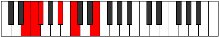
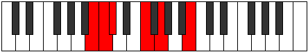

# Mode Syptitonic

## Links

- [Documentation](index.md)
- [Scales Index](Scales.md)
- [Modes Index](Modes.md)
- [Chords Index](Chords.md)

## Parent Scale

[Zathitonic](ScaleZathitonic.md)

## Number

[327](https://ianring.com/musictheory/scales/327)

## Perfection

- 2 Perfect notes
- 3 Perfect notes

## Perfection Profile

[false true false true false]

## Permutations

| Tonic | Notes | Signature | Illustration | Audio |
|-------|-------|-----------|--------------|-------|
| [C](ModeCNaturalSyptitonic.md) | **C**, C#, **D**, F#, **G#**, **C** | C |  | [midi](ModeCNaturalSyptitonic.mid) [ogg](ModeCNaturalSyptitonic.ogg) |
| [C#](ModeCSharpSyptitonic.md) | **C#**, D, **D#**, G, **A**, **C#** | C |  | [midi](ModeCSharpSyptitonic.mid) [ogg](ModeCSharpSyptitonic.ogg) |
| [Db](ModeDFlatSyptitonic.md) | **Db**, D, **Eb**, G, **A**, **Db** | C |  | [midi](ModeDFlatSyptitonic.mid) [ogg](ModeDFlatSyptitonic.ogg) |
| [D](ModeDNaturalSyptitonic.md) | **D**, D#, **E**, G#, **A#**, **D** | C |  | [midi](ModeDNaturalSyptitonic.mid) [ogg](ModeDNaturalSyptitonic.ogg) |
| [D#](ModeDSharpSyptitonic.md) | **D#**, E, **F**, A, **B**, **D#** | C |  | [midi](ModeDSharpSyptitonic.mid) [ogg](ModeDSharpSyptitonic.ogg) |
| [Eb](ModeEFlatSyptitonic.md) | **Eb**, E, **F**, A, **B**, **Eb** | C |  | [midi](ModeEFlatSyptitonic.mid) [ogg](ModeEFlatSyptitonic.ogg) |
| [E](ModeENaturalSyptitonic.md) | **E**, F, **F#**, A#, **C**, **E** | C |  | [midi](ModeENaturalSyptitonic.mid) [ogg](ModeENaturalSyptitonic.ogg) |
| [F](ModeFNaturalSyptitonic.md) | **F**, F#, **G**, B, **C#**, **F** | C |  | [midi](ModeFNaturalSyptitonic.mid) [ogg](ModeFNaturalSyptitonic.ogg) |
| [F#](ModeFSharpSyptitonic.md) | **F#**, G, **G#**, C, **D**, **F#** | C |  | [midi](ModeFSharpSyptitonic.mid) [ogg](ModeFSharpSyptitonic.ogg) |
| [Gb](ModeGFlatSyptitonic.md) | **Gb**, G, **Ab**, C, **D**, **Gb** | C |  | [midi](ModeGFlatSyptitonic.mid) [ogg](ModeGFlatSyptitonic.ogg) |
| [G](ModeGNaturalSyptitonic.md) | **G**, G#, **A**, C#, **D#**, **G** | C |  | [midi](ModeGNaturalSyptitonic.mid) [ogg](ModeGNaturalSyptitonic.ogg) |
| [G#](ModeGSharpSyptitonic.md) | **G#**, A, **A#**, D, **E**, **G#** | C |  | [midi](ModeGSharpSyptitonic.mid) [ogg](ModeGSharpSyptitonic.ogg) |
| [Ab](ModeAFlatSyptitonic.md) | **Ab**, A, **Bb**, D, **E**, **Ab** | C |  | [midi](ModeAFlatSyptitonic.mid) [ogg](ModeAFlatSyptitonic.ogg) |
| [A](ModeANaturalSyptitonic.md) | **A**, A#, **B**, D#, **F**, **A** | C |  | [midi](ModeANaturalSyptitonic.mid) [ogg](ModeANaturalSyptitonic.ogg) |
| [A#](ModeASharpSyptitonic.md) | **A#**, B, **C**, E, **F#**, **A#** | C |  | [midi](ModeASharpSyptitonic.mid) [ogg](ModeASharpSyptitonic.ogg) |
| [Bb](ModeBFlatSyptitonic.md) | **Bb**, B, **C**, E, **Gb**, **Bb** | C |  | [midi](ModeBFlatSyptitonic.mid) [ogg](ModeBFlatSyptitonic.ogg) |
| [B](ModeBNaturalSyptitonic.md) | **B**, C, **C#**, F, **G**, **B** | C |  | [midi](ModeBNaturalSyptitonic.mid) [ogg](ModeBNaturalSyptitonic.ogg) |
