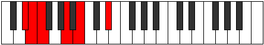

# Mode Syptitonic

## Links

- [Documentation](README.md)
- [Scales Index](Scales.md)
- [Modes Index](Modes.md)
- [Chords Index](Chords.md)

## Parent Scale

[Zathitonic](ScaleZathitonic.md)

## Number

[327](https://ianring.com/musictheory/scales/327)

## Transposition

1, 1, 4, 2, 4

## Chord Pattern

## Perfection

- 2 Perfect notes
- 3 Perfect notes

## Perfection Profile

[false true false true false]

## Permutations

| Tonic | Notes | Signature | Illustration | Audio |
|-------|-------|-----------|--------------|-------|
| [C](ModeCNaturalSyptitonic.md) | **C**, C#, **D**, F#, **G#**, **C** | C |  | [midi](https://github.com/edipermadi/music/blob/main/docs/ModeCNaturalSyptitonic.mid?raw=true) |
| [C#](ModeCSharpSyptitonic.md) | **C#**, D, **D#**, G, **A**, **C#** | C |  | [midi](https://github.com/edipermadi/music/blob/main/docs/ModeCSharpSyptitonic.mid?raw=true) |
| [Db](ModeDFlatSyptitonic.md) | **Db**, D, **Eb**, G, **A**, **Db** | C |  | [midi](https://github.com/edipermadi/music/blob/main/docs/ModeDFlatSyptitonic.mid?raw=true) |
| [D](ModeDNaturalSyptitonic.md) | **D**, D#, **E**, G#, **A#**, **D** | C |  | [midi](https://github.com/edipermadi/music/blob/main/docs/ModeDNaturalSyptitonic.mid?raw=true) |
| [D#](ModeDSharpSyptitonic.md) | **D#**, E, **F**, A, **B**, **D#** | C |  | [midi](https://github.com/edipermadi/music/blob/main/docs/ModeDSharpSyptitonic.mid?raw=true) |
| [Eb](ModeEFlatSyptitonic.md) | **Eb**, E, **F**, A, **B**, **Eb** | C |  | [midi](https://github.com/edipermadi/music/blob/main/docs/ModeEFlatSyptitonic.mid?raw=true) |
| [E](ModeENaturalSyptitonic.md) | **E**, F, **F#**, A#, **C**, **E** | C |  | [midi](https://github.com/edipermadi/music/blob/main/docs/ModeENaturalSyptitonic.mid?raw=true) |
| [F](ModeFNaturalSyptitonic.md) | **F**, F#, **G**, B, **C#**, **F** | C |  | [midi](https://github.com/edipermadi/music/blob/main/docs/ModeFNaturalSyptitonic.mid?raw=true) |
| [F#](ModeFSharpSyptitonic.md) | **F#**, G, **G#**, C, **D**, **F#** | C |  | [midi](https://github.com/edipermadi/music/blob/main/docs/ModeFSharpSyptitonic.mid?raw=true) |
| [Gb](ModeGFlatSyptitonic.md) | **Gb**, G, **Ab**, C, **D**, **Gb** | C |  | [midi](https://github.com/edipermadi/music/blob/main/docs/ModeGFlatSyptitonic.mid?raw=true) |
| [G](ModeGNaturalSyptitonic.md) | **G**, G#, **A**, C#, **D#**, **G** | C |  | [midi](https://github.com/edipermadi/music/blob/main/docs/ModeGNaturalSyptitonic.mid?raw=true) |
| [G#](ModeGSharpSyptitonic.md) | **G#**, A, **A#**, D, **E**, **G#** | C |  | [midi](https://github.com/edipermadi/music/blob/main/docs/ModeGSharpSyptitonic.mid?raw=true) |
| [Ab](ModeAFlatSyptitonic.md) | **Ab**, A, **Bb**, D, **E**, **Ab** | C |  | [midi](https://github.com/edipermadi/music/blob/main/docs/ModeAFlatSyptitonic.mid?raw=true) |
| [A](ModeANaturalSyptitonic.md) | **A**, A#, **B**, D#, **F**, **A** | C |  | [midi](https://github.com/edipermadi/music/blob/main/docs/ModeANaturalSyptitonic.mid?raw=true) |
| [A#](ModeASharpSyptitonic.md) | **A#**, B, **C**, E, **F#**, **A#** | C |  | [midi](https://github.com/edipermadi/music/blob/main/docs/ModeASharpSyptitonic.mid?raw=true) |
| [Bb](ModeBFlatSyptitonic.md) | **Bb**, B, **C**, E, **Gb**, **Bb** | C |  | [midi](https://github.com/edipermadi/music/blob/main/docs/ModeBFlatSyptitonic.mid?raw=true) |
| [B](ModeBNaturalSyptitonic.md) | **B**, C, **C#**, F, **G**, **B** | C |  | [midi](https://github.com/edipermadi/music/blob/main/docs/ModeBNaturalSyptitonic.mid?raw=true) |
