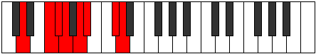

# Mode Syrian

## Links

- [Documentation](README.md)
- [Scales Index](Scales.md)
- [Modes Index](Modes.md)
- [Chords Index](Chords.md)

## Parent Scale

[Tholian](ScaleTholian.md)

## Number

[2489](https://ianring.com/musictheory/scales/2489)

## Transposition

3, 1, 1, 2, 1, 3, 1

## Chord Pattern

I, iii, iv, V⁺, VI⁺, VI⁺, VIIb5

## Perfection

- 4 Perfect notes
- 3 Perfect notes

## Perfection Profile

[true false true true false true false]

## Permutations

| Tonic | Notes | Signature | Illustration | Audio |
|-------|-------|-----------|--------------|-------|
| [C](ModeCNaturalSyrian.md) | C, **D#**, E, F, **G**, Ab, **B**, C | C |  | [midi](https://github.com/edipermadi/music/blob/main/docs/ModeCNaturalSyrian.mid?raw=true) |
| [C#](ModeCSharpSyrian.md) | C#, **D##**, E#, F#, **G#**, A, **B#**, C# | C |  | [midi](https://github.com/edipermadi/music/blob/main/docs/ModeCSharpSyrian.mid?raw=true) |
| [Db](ModeDFlatSyrian.md) | Db, **E**, F, Gb, **Ab**, Bbb, **C**, Db | C |  | [midi](https://github.com/edipermadi/music/blob/main/docs/ModeDFlatSyrian.mid?raw=true) |
| [D](ModeDNaturalSyrian.md) | D, **E#**, F#, G, **A**, Bb, **C#**, D | C |  | [midi](https://github.com/edipermadi/music/blob/main/docs/ModeDNaturalSyrian.mid?raw=true) |
| [D#](ModeDSharpSyrian.md) | D#, **E##**, F##, G#, **A#**, B, **C##**, D# | C |  | [midi](https://github.com/edipermadi/music/blob/main/docs/ModeDSharpSyrian.mid?raw=true) |
| [Eb](ModeEFlatSyrian.md) | Eb, **F#**, G, Ab, **Bb**, Cb, **D**, Eb | C |  | [midi](https://github.com/edipermadi/music/blob/main/docs/ModeEFlatSyrian.mid?raw=true) |
| [E](ModeENaturalSyrian.md) | E, **F##**, G#, A, **B**, C, **D#**, E | C |  | [midi](https://github.com/edipermadi/music/blob/main/docs/ModeENaturalSyrian.mid?raw=true) |
| [F](ModeFNaturalSyrian.md) | F, **G#**, A, Bb, **C**, Db, **E**, F | C |  | [midi](https://github.com/edipermadi/music/blob/main/docs/ModeFNaturalSyrian.mid?raw=true) |
| [F#](ModeFSharpSyrian.md) | F#, **G##**, A#, B, **C#**, D, **E#**, F# | C |  | [midi](https://github.com/edipermadi/music/blob/main/docs/ModeFSharpSyrian.mid?raw=true) |
| [Gb](ModeGFlatSyrian.md) | Gb, **A**, Bb, Cb, **Db**, Ebb, **F**, Gb | C |  | [midi](https://github.com/edipermadi/music/blob/main/docs/ModeGFlatSyrian.mid?raw=true) |
| [G](ModeGNaturalSyrian.md) | G, **A#**, B, C, **D**, Eb, **F#**, G | C |  | [midi](https://github.com/edipermadi/music/blob/main/docs/ModeGNaturalSyrian.mid?raw=true) |
| [G#](ModeGSharpSyrian.md) | G#, **A##**, B#, C#, **D#**, E, **F##**, G# | C |  | [midi](https://github.com/edipermadi/music/blob/main/docs/ModeGSharpSyrian.mid?raw=true) |
| [Ab](ModeAFlatSyrian.md) | Ab, **B**, C, Db, **Eb**, Fb, **G**, Ab | C |  | [midi](https://github.com/edipermadi/music/blob/main/docs/ModeAFlatSyrian.mid?raw=true) |
| [A](ModeANaturalSyrian.md) | A, **B#**, C#, D, **E**, F, **G#**, A | C |  | [midi](https://github.com/edipermadi/music/blob/main/docs/ModeANaturalSyrian.mid?raw=true) |
| [A#](ModeASharpSyrian.md) | A#, **B##**, C##, D#, **E#**, F#, **G##**, A# | C |  | [midi](https://github.com/edipermadi/music/blob/main/docs/ModeASharpSyrian.mid?raw=true) |
| [Bb](ModeBFlatSyrian.md) | Bb, **C#**, D, Eb, **F**, Gb, **A**, Bb | C |  | [midi](https://github.com/edipermadi/music/blob/main/docs/ModeBFlatSyrian.mid?raw=true) |
| [B](ModeBNaturalSyrian.md) | B, **C##**, D#, E, **F#**, G, **A#**, B | C |  | [midi](https://github.com/edipermadi/music/blob/main/docs/ModeBNaturalSyrian.mid?raw=true) |
