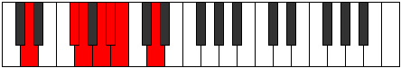

# Mode Syrimic

## Links

- [Documentation](index.md)
- [Scales Index](Scales.md)
- [Modes Index](Modes.md)
- [Chords Index](Chords.md)

## Parent Scale

[Syrimic](ScaleSyrimic.md)

## Number

[945](https://ianring.com/musictheory/scales/945)

## Perfection

- 3 Perfect notes
- 3 Perfect notes

## Perfection Profile

[true false true false false true]

## Permutations

| Tonic | Notes | Signature | Illustration | Audio |
|-------|-------|-----------|--------------|-------|
| [C](ModeCNaturalSyrimic.md) | C, **D##**, E#, **F##**, **G#**, A, C | C |  | [midi](ModeCNaturalSyrimic.mid) [ogg](ModeCNaturalSyrimic.ogg) |
| [C#](ModeCSharpSyrimic.md) | C#, **D###**, E##, **F###**, **G##**, A#, C# | C |  | [midi](ModeCSharpSyrimic.mid) [ogg](ModeCSharpSyrimic.ogg) |
| [Db](ModeDFlatSyrimic.md) | Db, **E#**, F#, **G#**, **A**, Bb, Db | C |  | [midi](ModeDFlatSyrimic.mid) [ogg](ModeDFlatSyrimic.ogg) |
| [D](ModeDNaturalSyrimic.md) | D, **E##**, F##, **G##**, **A#**, B, D | C |  | [midi](ModeDNaturalSyrimic.mid) [ogg](ModeDNaturalSyrimic.ogg) |
| [D#](ModeDSharpSyrimic.md) | D#, **E###**, F###, **G###**, **A##**, B#, D# | C |  | [midi](ModeDSharpSyrimic.mid) [ogg](ModeDSharpSyrimic.ogg) |
| [Eb](ModeEFlatSyrimic.md) | Eb, **F##**, G#, **A#**, **B**, C, Eb | C |  | [midi](ModeEFlatSyrimic.mid) [ogg](ModeEFlatSyrimic.ogg) |
| [E](ModeENaturalSyrimic.md) | E, **F###**, G##, **A##**, **B#**, C#, E | C |  | [midi](ModeENaturalSyrimic.mid) [ogg](ModeENaturalSyrimic.ogg) |
| [F](ModeFNaturalSyrimic.md) | F, **G##**, A#, **B#**, **C#**, D, F | C |  | [midi](ModeFNaturalSyrimic.mid) [ogg](ModeFNaturalSyrimic.ogg) |
| [F#](ModeFSharpSyrimic.md) | F#, **G###**, A##, **B##**, **C##**, D#, F# | C |  | [midi](ModeFSharpSyrimic.mid) [ogg](ModeFSharpSyrimic.ogg) |
| [Gb](ModeGFlatSyrimic.md) | Gb, **A#**, B, **C#**, **D**, Eb, Gb | C |  | [midi](ModeGFlatSyrimic.mid) [ogg](ModeGFlatSyrimic.ogg) |
| [G](ModeGNaturalSyrimic.md) | G, **A##**, B#, **C##**, **D#**, E, G | C |  | [midi](ModeGNaturalSyrimic.mid) [ogg](ModeGNaturalSyrimic.ogg) |
| [G#](ModeGSharpSyrimic.md) | G#, **A###**, B##, **C###**, **D##**, E#, G# | C |  | [midi](ModeGSharpSyrimic.mid) [ogg](ModeGSharpSyrimic.ogg) |
| [Ab](ModeAFlatSyrimic.md) | Ab, **B#**, C#, **D#**, **E**, F, Ab | C |  | [midi](ModeAFlatSyrimic.mid) [ogg](ModeAFlatSyrimic.ogg) |
| [A](ModeANaturalSyrimic.md) | A, **B##**, C##, **D##**, **E#**, F#, A | C |  | [midi](ModeANaturalSyrimic.mid) [ogg](ModeANaturalSyrimic.ogg) |
| [A#](ModeASharpSyrimic.md) | A#, **B###**, C###, **D###**, **E##**, F##, A# | C |  | [midi](ModeASharpSyrimic.mid) [ogg](ModeASharpSyrimic.ogg) |
| [Bb](ModeBFlatSyrimic.md) | Bb, **C##**, D#, **E#**, **F#**, G, Bb | C |  | [midi](ModeBFlatSyrimic.mid) [ogg](ModeBFlatSyrimic.ogg) |
| [B](ModeBNaturalSyrimic.md) | B, **C###**, D##, **E##**, **F##**, G#, B | C |  | [midi](ModeBNaturalSyrimic.mid) [ogg](ModeBNaturalSyrimic.ogg) |
