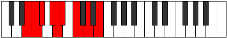

# Mode Syryllic

## Links

- [Documentation](index.md)
- [Scales Index](Scales.md)
- [Modes Index](Modes.md)
- [Chords Index](Chords.md)

## Parent Scale

[Racryllic](ScaleRacryllic.md)

## Number

[1399](https://ianring.com/musictheory/scales/1399)

## Perfection

- 4 Perfect notes
- 4 Perfect notes

## Perfection Profile

[false true false false true true false true]

## Permutations

| Tonic | Notes | Signature | Illustration | Audio |
|-------|-------|-----------|--------------|-------|
| [C](ModeCNaturalSyryllic.md) | **C**, C#, **D**, **E**, F, F#, **G#**, A#, **C** | C |  | [midi](https://github.com/edipermadi/music/blob/main/docs/ModeCNaturalSyryllic.mid?raw=true) |
| [C#](ModeCSharpSyryllic.md) | **C#**, D, **D#**, **F**, F#, G, **A**, B, **C#** | C |  | [midi](https://github.com/edipermadi/music/blob/main/docs/ModeCSharpSyryllic.mid?raw=true) |
| [Db](ModeDFlatSyryllic.md) | **Db**, D, **Eb**, **F**, Gb, G, **A**, B, **Db** | C |  | [midi](https://github.com/edipermadi/music/blob/main/docs/ModeDFlatSyryllic.mid?raw=true) |
| [D](ModeDNaturalSyryllic.md) | **D**, D#, **E**, **F#**, G, G#, **A#**, C, **D** | C |  | [midi](https://github.com/edipermadi/music/blob/main/docs/ModeDNaturalSyryllic.mid?raw=true) |
| [D#](ModeDSharpSyryllic.md) | **D#**, E, **F**, **G**, G#, A, **B**, C#, **D#** | C |  | [midi](https://github.com/edipermadi/music/blob/main/docs/ModeDSharpSyryllic.mid?raw=true) |
| [Eb](ModeEFlatSyryllic.md) | **Eb**, E, **F**, **G**, Ab, A, **B**, Db, **Eb** | C |  | [midi](https://github.com/edipermadi/music/blob/main/docs/ModeEFlatSyryllic.mid?raw=true) |
| [E](ModeENaturalSyryllic.md) | **E**, F, **F#**, **G#**, A, A#, **C**, D, **E** | C |  | [midi](https://github.com/edipermadi/music/blob/main/docs/ModeENaturalSyryllic.mid?raw=true) |
| [F](ModeFNaturalSyryllic.md) | **F**, F#, **G**, **A**, A#, B, **C#**, D#, **F** | C |  | [midi](https://github.com/edipermadi/music/blob/main/docs/ModeFNaturalSyryllic.mid?raw=true) |
| [F#](ModeFSharpSyryllic.md) | **F#**, G, **G#**, **A#**, B, C, **D**, E, **F#** | C |  | [midi](https://github.com/edipermadi/music/blob/main/docs/ModeFSharpSyryllic.mid?raw=true) |
| [Gb](ModeGFlatSyryllic.md) | **Gb**, G, **Ab**, **Bb**, B, C, **D**, E, **Gb** | C |  | [midi](https://github.com/edipermadi/music/blob/main/docs/ModeGFlatSyryllic.mid?raw=true) |
| [G](ModeGNaturalSyryllic.md) | **G**, G#, **A**, **B**, C, C#, **D#**, F, **G** | C |  | [midi](https://github.com/edipermadi/music/blob/main/docs/ModeGNaturalSyryllic.mid?raw=true) |
| [G#](ModeGSharpSyryllic.md) | **G#**, A, **A#**, **C**, C#, D, **E**, F#, **G#** | C |  | [midi](https://github.com/edipermadi/music/blob/main/docs/ModeGSharpSyryllic.mid?raw=true) |
| [Ab](ModeAFlatSyryllic.md) | **Ab**, A, **Bb**, **C**, Db, D, **E**, Gb, **Ab** | C |  | [midi](https://github.com/edipermadi/music/blob/main/docs/ModeAFlatSyryllic.mid?raw=true) |
| [A](ModeANaturalSyryllic.md) | **A**, A#, **B**, **C#**, D, D#, **F**, G, **A** | C |  | [midi](https://github.com/edipermadi/music/blob/main/docs/ModeANaturalSyryllic.mid?raw=true) |
| [A#](ModeASharpSyryllic.md) | **A#**, B, **C**, **D**, D#, E, **F#**, G#, **A#** | C |  | [midi](https://github.com/edipermadi/music/blob/main/docs/ModeASharpSyryllic.mid?raw=true) |
| [Bb](ModeBFlatSyryllic.md) | **Bb**, B, **C**, **D**, Eb, E, **Gb**, Ab, **Bb** | C |  | [midi](https://github.com/edipermadi/music/blob/main/docs/ModeBFlatSyryllic.mid?raw=true) |
| [B](ModeBNaturalSyryllic.md) | **B**, C, **C#**, **D#**, E, F, **G**, A, **B** | C |  | [midi](https://github.com/edipermadi/music/blob/main/docs/ModeBNaturalSyryllic.mid?raw=true) |
